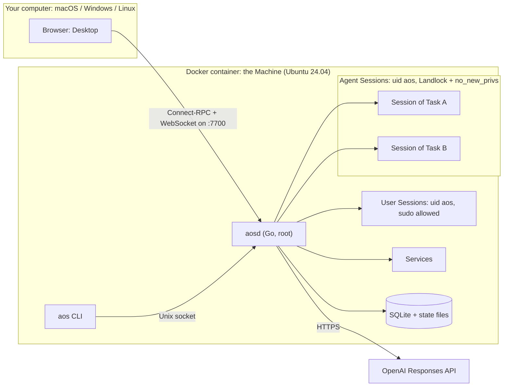
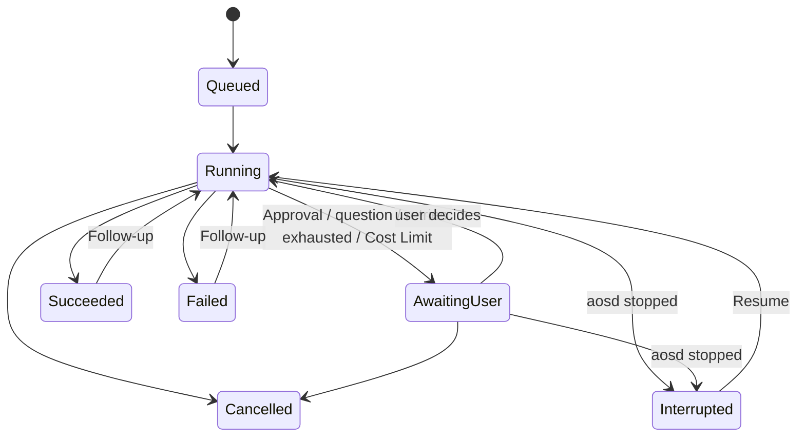

# Agentic OS — v1 Plan

**Status:** Approved 2026-09-14 · M0 done ([findings](m0-findings.md); its decisions are folded in below) · M1 done · M2 done · M3 in progress
**Vocabulary:** every capitalised term (Machine, Task, Agent, Tool, Session, Protected Path, Checkpoint, Replay, …) is defined in [CONTEXT.md](../CONTEXT.md).
**Decisions:** the hard-to-reverse ones are recorded in [docs/adr/](adr/).

---

## 1. Goal

A one-line `install.sh` turns a fresh Ubuntu server into a Machine in which OpenAI-powered Agents carry out everyday computer work: moving files, installing software, downloading, running Services. The user watches and steers them from a terminal (`cli` Mode) or from a macOS-like Desktop reached in the browser over the network (`ui` Mode), behind a password. It must feel **fast and smooth**, must **never destroy important data without asking**, and runs **natively on Linux** (Ubuntu) or, as a sandboxed alternative, under **Docker Compose** (M6, ADR-0009).

## 2. Scope

**In v1**

- One Go binary `aosd`: Agent runtime, Tools, Sessions, policy, API, Service supervisor, embedded Desktop.
- `aos` CLI on the Machine: interactive chat and one-shot `aos run`, plus `aos daemon`, `aos config`, `aos mode`, `aos model`, `aos user`, `aos browser`, `aos status` and `aos uninstall` (M6).
- The Desktop: menu bar, Dock, windows, Spotlight, Notification Center, light and dark themes; apps Finder, Terminal, Agent, TextEdit, Preview, Activity Monitor, Software, System Settings, Trash, Downloads; and, opt-in with `include_browser: true`, a Browser fetched on demand (ADR-0008, M5.2, M6).
- Protection: Autonomy levels, Approvals, Protected Paths (enforced by Landlock), Trash, Audit Log.
- Software: Install Ledger, Checkpoints, Restore; Replay at startup on a Compose install only (M6, ADR-0003).
- Services with port forwarding (`/port/<n>/`, authenticated).
- Machine Profile, Memory, Follow-ups, Resume, Retry guard, optional Cost Limit.
- Native install (`install.sh` + systemd), Configuration in `/etc/aos/config.yml`, username/password UI authentication, and Agents reaching the whole filesystem with Protected Paths asking first (M6).

**Not in v1** (candidates for v2)

- Linux GUI apps streamed into a Desktop window (ADR-0001), other than the opt-in Browser (ADR-0008)
- A headless browser Tool for JavaScript-heavy sites
- Sub-tasks (the data model allows them; not exposed)
- A CLI on your own computer (the API already supports it)
- Providers other than OpenAI (Chat Completions adapter)
- Multiple users
- Backup/export of the home volume
- Mission Control / Spaces
- Localisation

## 3. Architecture



_The diagram shows a **Compose install**. On a **native install** (M6, ADR-0009) the Machine is the Ubuntu server itself: there is no separate computer above it and no Shared Folder, `aosd` is run by systemd, and the Desktop is reached over the network behind a password._

**What happens in one Task:**

1. The user submits a Task from the Desktop or the CLI.
2. `aosd` queues it and starts an Agent with its own Session.
3. The Agent streams a response from OpenAI and requests Tool calls.
4. Policy checks each call: Protected Paths, then Autonomy, then grants. If needed, the Task becomes Awaiting User.
5. Approved calls run, confined by the sandbox. Their results go back to the model.
6. Every step is published on the event stream, which the Desktop and CLI render live, and is written to SQLite and the Audit Log.

## 4. Components

### 4.1 `aosd` modules (Go packages under `internal/`)

| Package | Responsibility |
|---|---|
| `api` | Connect-RPC handlers, Session WebSocket, uploads/downloads, authentication, Host/Origin checks, serving embedded Desktop assets |
| `events` | In-process publish/subscribe bus feeding the event stream; every state change goes through it |
| `task` | Task state machine, queue, `AOS_MAX_TASKS` slots, Follow-ups, Resume, cancellation |
| `agent` | Agent loop: context assembly, streaming, parallel Tool calls, Retry guard, usage and cost accounting |
| `llm` | Provider interface; `openai` implementation (Responses API); `fake` replay provider for tests |
| `tool` | Tool registry, JSON schemas, risk classification, dispatch |
| `policy` | Autonomy, Protected Paths, Approvals, Task-scoped grants, shell command analysis |
| `sandbox` | Landlock rulesets, `no_new_privs`, capability detection and fallback |
| `session` | PTY Sessions, command framing, background processes, attach/watch |
| `files` | File operations, Trash, file watching (fsnotify, plus polling for the Shared Folder) |
| `software` | Install Ledger; apt, pipx and npm adapters; Checkpoints; Restore; Replay |
| `service` | Service supervisor, restart policies, logs, listening-port discovery |
| `proxy` | Forwarding Services to the Host by subdomain and by path |
| `profile` | Machine Profile builder; Memory store |
| `metrics` | CPU, memory, disk and process sampling for Activity Monitor |
| `audit` | Append-only Audit Log |
| `store` | SQLite (WAL mode, pure-Go driver), embedded migrations |

**Main libraries:**

| Purpose | Library |
|---|---|
| OpenAI | `github.com/openai/openai-go` |
| API (Connect-RPC) | `connectrpc.com/connect` |
| WebSocket | `github.com/coder/websocket` |
| PTY | `github.com/creack/pty` |
| File watching | `github.com/fsnotify/fsnotify` |
| Landlock | `github.com/landlock-lsm/go-landlock` |
| SQLite | `modernc.org/sqlite` |
| Shell command parsing | `mvdan.cc/sh/v3` |
| Web page to text | `go-shiori/go-readability`, `JohannesKaufmann/html-to-markdown` |
| CLI | `spf13/cobra` + `charmbracelet/bubbletea` |

### 4.2 `aos` CLI

| Command | Purpose |
|---|---|
| `aos` | Interactive chat: live steps, Approval prompts, Ctrl-C cancels the current Task |
| `aos run "<task>" [--autonomy auto] [--json]` | One-shot, for scripts; non-interactive rules in §7.4 |
| `aos tasks` · `aos show <id>` | List Tasks · show a Task's steps |
| `aos follow-up <id> "<text>"` · `aos resume <id>` · `aos reply <id> "<text>"` | Continue a finished Task · resume an Interrupted one · answer a Task awaiting you |
| `aos cancel <id>` · `aos stop --all` | Cancel one Task · stop every Agent |
| `aos attach <id>` | Watch or type into a Task's Session |
| `aos approve <id>` · `aos deny <id>` | Decide an Approval (refused when called from an Agent Session) |
| `aos trash list\|restore\|empty` | Trash |
| `aos software list\|ledger` · `aos checkpoint list\|create\|restore` | Install Ledger and Checkpoints |
| `aos service list\|logs\|start\|stop\|restart\|remove` | Services |
| `aos protect\|unprotect <path>` · `aos memory list\|add\|accept\|forget` | Protected Paths · Memory |
| `aos desktop-url` | Print a one-time sign-in link for the Desktop |
| `aos doctor` | Mode, Landlock status, API key present, versions, volumes |

### 4.3 Desktop

**Stack:** React + Vite + TypeScript, Zustand for state, `@connectrpc/connect-web` generated clients, `@xterm/xterm` with the WebGL renderer, CodeMirror 6, pdf.js.

**Shell**

- **Menu bar:** AOS menu, menus of the active app, Agent status icon with a badge for pending Approvals, Control Center (theme, Stop all Agents), clock.
- **Dock:** magnification, running indicators, Downloads stack, Trash.
- **Window manager:** traffic-light buttons, focus and stacking order, minimise and zoom animations, layout kept per tab and saved on the server.
- **Spotlight:** find apps and files, or start a Task.
- **Notification Center:** Approvals and finished Tasks.
- **Theme and wallpaper:** light and dark themes, wallpaper.

**Apps**

| App | v1 capabilities |
|---|---|
| Finder | Sidebar (Home, Shared, Downloads, Trash); icon, list and column views; the open folder refreshes live; drag and drop; upload/download to the Host; Quick Look via Preview; 🔒 Protect; right-click "Ask Agent…". Double-clicking a file opens it in Preview or TextEdit by its type, and shows other files (archives, programs) selected (M4) |
| Terminal | Tabs of User Sessions; "Watch" opens an Agent's Session |
| Agent | Task list, live step feed, chat and Follow-ups, Approvals, cancel, Resume, tokens and cost, Audit Log browser, usage and Cost Limits. While it has the focus on a Task, that Task's Approvals are answered inline instead of in the pop-up (M4) |
| TextEdit | CodeMirror 6 editor with syntax highlighting; one file per window, up to 1 MiB; asks before saving over a file that changed on disk since it was opened (M4) |
| Preview | Images, PDF, audio, video; one file per window (M4) |
| Activity Monitor | Processes, CPU, memory, disk, network; running Agents; Services and their ports |
| Software | Install Ledger, Checkpoints, Restore, Replay progress |
| System Settings | API key (masked), model, Autonomy, Protected Paths, Memory, keyboard shortcuts, appearance, Mode and Landlock status |
| Trash | Browse, restore, empty |
| Browser | Opt-in (`INCLUDE_BROWSER=true`), pinned in the Dock when included: one page Chromium's headless shell renders inside the Machine and streams into the window; back, forward, reload and an address bar that searches DuckDuckGo for anything that isn't an address. Web pages only; downloads land in `~/Downloads` (M5.2, ADR-0008) |
| Downloads stack | A Dock stack of the newest files in `~/Downloads`, with downloads in progress (M4) |

**Rules for smoothness** (enforced by review and by the performance tests in §17)

1. Dragging, resizing and Dock magnification never cause a React re-render. Pointer events update `transform: translate3d(...)` directly on the DOM inside `requestAnimationFrame`; the store is updated once, on pointer-up.
2. Animations touch only compositor-friendly properties (`transform`, `opacity`) through the Web Animations API.
3. Each app is its own lazily loaded chunk. The first load of the shell is under 150 KB gzipped.
4. Event-stream updates are batched to one store commit per animation frame.
5. Long lists (Finder, Activity Monitor, Audit Log) are virtualised.
6. Terminal output goes straight into xterm.js, never through React state.

**Appearance**

- A macOS Sonoma/Sequoia-style look, themed with CSS custom properties.
- Frosted "vibrancy" panels, using a single `backdrop-filter` blur layer per surface.
- **Optional "Liquid Glass" appearance** (macOS Tahoe style: refraction and layered translucency), off by default, turned on in System Settings → Appearance. It thins the frosted panels and boosts the backdrop blur and saturation on the menu bar, Dock and panels. A frame watchdog runs only while it is on — it measures frames with `requestAnimationFrame` gaps plus the Long Animation Frames API where the browser supports it — and switches Liquid Glass off, with a notification, if frames stay over budget for a sustained stretch.
- Follows the Host's `prefers-color-scheme`, with a manual override.
- System font stack (SF on macOS Hosts), with bundled Inter as the fallback on Windows and Linux.
- **Assets:**
  - Original macOS-style SVG app icons (rounded-square shape, gradients, depth) and gradient wallpapers, drawn for this project.
  - All icons, wallpapers and sounds live in `desktop/src/assets/` and are listed in one `manifest.json`. Replacing them is drop-in.
  - No Apple asset files are downloaded into the repo.

**Keyboard**

- The Host OS is detected and the default shortcuts differ per Host:

  | Action | macOS | Linux | Windows |
  |---|---|---|---|
  | Spotlight | ⌥Space | Alt+Space | Ctrl+Space |
  | Close window | ⌥W | Alt+W | Alt+W |
  | Switch window | ⌥` | Alt+` | Alt+` |

- All shortcuts can be remapped in System Settings.
- "Immersive mode" uses Fullscreen plus the Keyboard Lock API where supported (Chromium) to capture more of the reserved shortcuts.

**Sync:** all state comes from the server, so several browser tabs stay consistent. The window layout, with each window's own state (the open Task, Finder's folder and view), is kept per tab, so a reload restores that tab's windows, and is saved on the server (debounced) to seed new tabs.

## 5. Repository layout

```
agentic-os/
├── install.sh                      # one-line native install (M6); fetches the release tarball
├── compose.yaml
├── compose.override.example.yaml   # copy to compose.override.yaml to publish extra ports
├── .env.example
├── .gitattributes                  # force LF for scripts (Windows checkouts)
├── docker/
│   ├── Dockerfile
│   └── rootfs/                     # apt config, sudoers, bash rc for Sessions, rm shim
├── proto/aos/v1/*.proto
├── buf.yaml · buf.gen.yaml
├── gen/                            # generated Go + TS (committed; CI checks it is fresh)
├── cmd/
│   ├── aosd/
│   └── aos/
├── internal/                       # packages listed in §4.1
├── desktop/                        # Vite app
│   └── src/{shell,apps/<app>,lib,assets/manifest.json}
├── tools/
│   ├── ci/                         # `go run ./tools/ci`: every check, runs locally and in GitHub Actions
│   ├── docsgen/                    # M6: generated command reference for the docs site
│   └── spikes/                     # throwaway prototypes (install, docs-site), out of the build
├── .github/workflows/              # thin wrappers around tools/ci
├── tests/
│   ├── e2e/                        # Playwright
│   ├── perf/                       # frame-time and latency checks
│   └── live/                       # real-model evaluation Tasks
├── docs-site/                      # M6: Astro + Starlight site, built to static files, never served by aosd
├── testdata/cassettes/             # recorded model conversations for the fake provider
├── CONTEXT.md
└── docs/{PLAN.md,adr/}
```

## 6. Container and Compose

> **M6.** This section describes the **Compose install**, now the sandboxed
> alternative rather than the primary shape (ADR-0009). M6 rebuilds it from the
> same one binary: the `cli`/`ui` targets collapse into a single image (they
> measured 1 MB apart, M0 F3), `AOS_IMAGE_MODE` and `INCLUDE_BROWSER` build-time
> forking are gone (Mode and the browser are runtime `config.yml` keys, M6.10/M6.11),
> Chromium is fetched on demand rather than baked in, and the Shared Folder is
> removed — Compose gets a plain bind mount into home with no symlink and no
> Protected entry (M6.6). Compose generates `/etc/aos/config.yml` from its
> environment on first start, so the two shapes share one configuration system.

### 6.1 Dockerfile stages

| Stage | Base | What it does |
|---|---|---|
| `desktop-build` | `node:24-slim` | `npm ci && vite build`. Built **only** for the `ui` target. |
| `go-base` | `golang` (pinned) | Module download with BuildKit cache mounts |
| `aosd-cli` | `go-base` | `CGO_ENABLED=0`, builds `aosd` and `aos` for `TARGETARCH` without the Desktop |
| `aosd-ui` | `go-base` | Same, plus `go:embed` of `desktop-build` output (build tag `desktop`) |
| `machine` | `ubuntu:24.04` | Baseline software (§6.3), user `aos`, sudoers, apt cache config, Session bash rc |
| **`cli`** | `machine` | + `aosd-cli` binaries |
| **`ui`** | `machine` | + `aosd-ui` binaries |

Compose passes `target: ${AOS_MODE}`. BuildKit builds only the stages that target needs, so `cli` builds never run Node. At startup, `AOS_MODE=ui` on a `cli` image fails with a clear message.

Images are built for `linux/amd64` and `linux/arm64`.

### 6.2 `compose.yaml` (shape)

```yaml
name: agentic-os
services:
  aos:
    build:
      context: .
      dockerfile: docker/Dockerfile
      target: ${AOS_MODE:-ui}
    image: agentic-os:${AOS_MODE:-ui}
    init: true
    hostname: aos
    stop_grace_period: 30s
    ports:
      - "${AOS_BIND:-127.0.0.1}:${AOS_PORT:-7700}:7700"
    environment:                    # explicit list; never env_file (it would leak the key)
      AOS_MODE: ${AOS_MODE:-ui}
      AOS_BIND: ${AOS_BIND:-127.0.0.1}
      OPENAI_MODEL: ${OPENAI_MODEL:-}  # empty → aosd's built-in default
      AOS_AUTONOMY: ${AOS_AUTONOMY:-confirm-risky}
      # … every other AOS_* / OPENAI_* variable from §6.4 except OPENAI_API_KEY
    secrets: [openai_api_key]
    volumes:
      - aos-home:/home                # /home/aos plus /home/.aos-protected (§7.2)
      - aos-state:/var/lib/aos
      - aos-pkgcache:/var/cache/aos
      # M6: no Shared Folder — a plain bind mount into home if you want one, no symlink
secrets:
  openai_api_key:
    environment: OPENAI_API_KEY
volumes:
  aos-home: {}
  aos-state: {}
  aos-pkgcache: {}
```

**Notes**

- Compose reads `.env` only to fill in `${…}` values. Environment variables are passed explicitly, so `OPENAI_API_KEY` reaches the container only as the secret file. M0.4 verifies it is absent from every process environment.
- Compose cannot add a port mapping only when an env var is set. Publishing extra ports (`AOS_PUBLISH_PORTS`) therefore lives in `compose.override.example.yaml`: copy it to `compose.override.yaml`, which Compose loads automatically on every Host.
- The home folder is a named volume for speed. M6 removes the Shared Folder, so there is no longer a bind mount by default (which also removes the `~/Desktop` hang below).
- The volume is mounted at `/home`, not `/home/aos`, so the relocated Protected dotfiles in `/home/.aos-protected` persist too.
- `OPENAI_API_KEY` must be *defined* for `docker compose up` to start, even if empty (M0 finding F4). The README quick start therefore begins with `cp .env.example .env`. An empty value means "no key yet".
- On macOS Hosts, Docker Desktop hangs on bind mounts from `~/Desktop`, `~/Documents` or `~/Downloads` unless it has been granted access to them (finding F6). This goes in README troubleshooting, together with `AOS_SHARED_DIR`.

### 6.3 Baseline software in the image

- **Shell and core tools:** `bash`, coreutils, `procps`, `less`, `nano`, `vim-tiny`, `htop`, `file`, `tree`, `jq`, `sudo`, `apt-utils`, `tzdata`
- **Network:** `curl`, `wget`, `ca-certificates`, `iproute2`, `iputils-ping`, `openssh-client`
- **Transfer and archives:** `git`, `rsync`, `rclone`, `zip`, `unzip`, `xz-utils`, `p7zip-full`
- **Python:** `python3`, `python3-venv`, `python3-pip`, `pipx`
- **Node.js 24 LTS** from the official binaries (Ubuntu's apt package is much older), with `npm` and `corepack`

Everything else is installed on demand and recorded in the Install Ledger.

**Image size targets** (M0 finding F3), measured as the unpacked size (`du -sx /` in the image): `cli` < 520 MB, `ui` < 540 MB. Compressed (`docker image inspect` on arm64): < 180 MB. The opt-in `ui` build with `INCLUDE_BROWSER=true` has its own targets (M5.2): < 820 MB unpacked, < 300 MB compressed (measured 769 and 271 on arm64).

### 6.4 Environment variables (`.env.example`)

| Variable | Default | Purpose |
|---|---|---|
| `AOS_MODE` | `ui` | `cli` or `ui`; selects the build target and runtime behaviour |
| `INCLUDE_BROWSER` | `false` | `true` or `false` only. `true` builds Chromium's headless shell into the `ui` image and adds the Browser app (M5.2); ignored, with a warning, in `cli` Mode. Needs `docker compose up --build` |
| `OPENAI_API_KEY` | — | Delivered to `aosd` as a secret file. Can also be set later in System Settings. |
| `OPENAI_MODEL` | `gpt-5.6-terra` | Model for Agents. Precedence: System Settings > `OPENAI_MODEL` > built-in default. |
| `OPENAI_REASONING_EFFORT` | unset | Optional reasoning-effort hint |
| `OPENAI_BASE_URL` | unset | Optional endpoint override |
| `AOS_PORT` | `7700` | Host port for the Desktop and API |
| `AOS_BIND` | `127.0.0.1` | Host interface; anything else prints a network-exposure warning |
| `AOS_ACCESS_TOKEN` | generated | Overrides the generated API token (ADR-0007) |
| `AOS_AUTONOMY` | `confirm-risky` | `auto` \| `confirm-risky` \| `confirm-all` |
| `AOS_MAX_TASKS` | `3` | Tasks running at once |
| `AOS_MAX_RETRIES` | `3` | Retry guard (§8.3) |
| `AOS_TASK_COST_LIMIT_USD` | unset | Optional per-Task Cost Limit |
| `AOS_DAILY_COST_LIMIT_USD` | unset | Optional daily Cost Limit |
| `AOS_REQUIRE_LANDLOCK` | `false` | Refuse to start on Hosts without Landlock |
| `AOS_UID` / `AOS_GID` | `1000` | Match the Linux Host user for Shared Folder ownership |
| `AOS_SHARED_DIR` | `./shared` | Host path of the Shared Folder (Windows paths accepted) |
| `AOS_PUBLISH_PORTS` | unset | Port range for `compose.override.yaml` |
| `AOS_TRASH_RETENTION_DAYS` | `30` | Trash expiry |
| `AOS_TRASH_MAX_GB` | `5` | Trash size cap |
| `TZ` | `UTC` | Machine timezone |

**M6 changes to this list.** `AOS_MODE` and `INCLUDE_BROWSER` stop being build-time: they become the `mode:` and `include_browser:` keys in `config.yml` (M6.10/M6.11). `AOS_ACCESS_TOKEN` is deleted — username/password with JWTs replaces the shared token (ADR-0007, M6.3) — and so is `AOS_SHARED_DIR`, with the Shared Folder itself (M6.6). `AOS_BIND` defaults to `0.0.0.0` on a native install (M6.4). `AOS_UID`/`AOS_GID` matter only to a Compose bind mount now. On a native install every setting above is a key in `/etc/aos/config.yml` (M6.1), not an environment variable.

There is deliberately **no step limit**.

## 7. Security model

### 7.1 Who runs what

| Actor | uid | Confinement | `sudo` |
|---|---|---|---|
| `aosd` | root | none | n/a |
| Agent Sessions and everything they spawn | `aos` | Landlock + `no_new_privs` | **No**: the kernel ignores setuid under `no_new_privs` |
| User Sessions (Desktop Terminal, `docker compose exec -u aos aos bash`) | `aos` | none | Yes, NOPASSWD |
| Approved calls on Protected Paths (§7.4) | `aos` | Landlock + `no_new_privs`, widened to the approved paths for that one call | **No** |
| Services | `aos` by default, root only via an approved Privileged Tool | Same confinement as whoever created them | as creator |

A plain `docker compose exec aos …` runs as root (aosd is the container's main process, so the container's user is root). The `aos` CLI works either way.

**M6.** On a native install `aosd` is run by systemd as root; the `aos` user is in sudoers with `NOPASSWD:ALL`, so a User Session — and the Desktop password behind it — is effectively root on the VPS. Kept deliberately (a single-user personal server), but said out loud (M6.17, ADR-0009). Agents stay confined: `no_new_privs` still blocks `sudo`, and the Landlock ruleset widens only to `/` minus the Protected list (M6.8, ADR-0004).

### 7.2 Landlock ruleset for Agent Sessions (validated in M0, ADR-0004)

**Home layout.** Landlock grants whole trees and cannot carve an exception out of a granted folder (M0 finding F1), so Protected dotfiles live outside home:

```
/home/                        aos-home volume
├── .aos-protected/           root:root 0755; entries owned by aos
│   ├── ssh/  gnupg/  config/
│   └── bashrc  profile  bash_logout  (bash_profile  bash_login  inputrc: only if created)
└── aos/                      the home folder: root:aos 1775 (sticky)
    ├── .ssh -> /home/.aos-protected/ssh        root-owned symlinks
    ├── .bashrc -> /home/.aos-protected/bashrc  …one for every entry above
    ├── Shared -> /shared
    └── everything else: owned by aos
```

- The sticky bit on a root-owned home means nobody but root can delete, rename or replace the symlinks.
- A write through a symlink resolves to `/home/.aos-protected`, which Agents cannot write.
- `aosd` creates and repairs this layout at every start, including on existing volumes.
- The user (unconfined) edits dotfiles through the symlinks as usual, but `sed -i` needs `--follow-symlinks`.

**Ruleset**

- **Read and execute:** everything except Hidden paths: `/run/secrets`, `/var/lib/aos` and other Sessions' directories under `/run/aos/sessions`.
- **Write, create and remove:** all of home, `/tmp`, `/var/tmp`, `/dev` (`/dev/null`, `/dev/tty`, the PTY) and the Session's own directory.
- **Not writable:** everything else, including `/home/.aos-protected` and system folders. (On a Compose install the Shared Folder used to be here too; M6.6 removes it.)
- **Paths the user locks** (🔒, `aos protect`) inside a Writable tree are carved out: every folder from home down to the locked path is split into per-entry grants.
  - In a split folder, home included, a new entry can be created but not written until the Session is re-sandboxed, which happens before its next command.
  - When a failed command created entries in a split folder, the Tool result tells the Agent to clean up and re-run.
  - Agents can create empty entries inside a locked folder, but never change or delete its content.
- **Symlinks are never granted**, because Landlock would grant their target.
- **Process isolation:** a confined process cannot ptrace an unconfined one. On kernels with Landlock ABI ≥ 6, signals and abstract Unix sockets are also scoped, so Agents cannot signal or reach User Sessions or `aosd`.
- **Files Tools** (§9) run as `aos` in a confined helper with the same ruleset, never as root inside `aosd`, so symlink tricks cannot turn them into root file access.

**M6 (native install).** The Writable set widens from home to **`/` minus an explicit Protected list** (M6.8, ADR-0004): `/boot`, `/proc`, `/sys`, `/snap`, `/root`, other users' homes, and AOS's own binaries and systemd unit, with `/var/lib/aos` and `/etc/aos` Hidden and `/dev` still Writable. Agents already read all of `/`; only writing widens. The walk stays bounded because `carve` descends only into directories that contain an exclusion, so no exclusion may live under `/proc` or `/sys`. The Browser gets its own narrow ruleset rather than borrowing the Agent's (M6.7), or the widening would hand it write access to the server.

### 7.3 Protected Paths (built-in defaults, plus your own in System Settings)

The built-in defaults below are read-only in System Settings — weakening `~/.ssh` and the like from a browser isn't worth the risk. You can add and remove your *own* locked paths there (and with 🔒 in Finder or `aos protect`).

**Enforced by the kernel** (Landlock, §7.2) and by policy:

- `/etc`, `/usr`, `/bin`, `/sbin`, `/lib*`, `/boot`, `/var/lib`
- `~/.ssh`, `~/.gnupg`, `~/.config`, `~/.bashrc`, `~/.profile`, `~/.bash_logout` (all in `/home/.aos-protected`)
- AOS's own state: `/var/lib/aos` and `/etc/aos`
- On a native install (M6.8): `/boot`, `/proc`, `/sys`, `/snap`, `/root`, other users' homes, and AOS's own binaries and systemd unit
- Paths the user locks (🔒 in Finder, `aos protect`)

**Enforced by policy only** (patterns that Landlock cannot express; a script can still change them, which is documented):

- **Any `.env` file:** changing or deleting one needs Approval, when done through a Files Tool or a shell command the analysis recognises.
- **Git working trees with changes the current Task did not make:** Approval is needed only to delete the tree or discard those changes (`git reset --hard`, `git clean`, `git checkout -- .`, `git restore .`, `git stash drop`). Edits do not need Approval.

### 7.4 Policy check for every Tool call

1. **Touches a Protected Path?** Approval, at every Autonomy level. With nobody to ask (`aos run` without a TTY): deny.
2. **Is it a Risky Action?** This covers Privileged Tools, `delete`, overwrites, uploads, `remove_package`, and destructive shell commands found by `mvdan.cc/sh` analysis.
   - `auto`: allow.
   - `confirm-risky`: Approval.
   - `confirm-all`: every call needs Approval.
   - Non-interactive: deny, unless `--autonomy auto` was passed.
3. **Is there a matching Task-scoped grant** ("Allow for the rest of this Task": same Tool, same folder)? Allow. Grants never cover Protected Paths.
4. **Is Landlock unavailable?** `auto` is treated as `confirm-risky`.

Shell analysis is only an early warning so the Agent can ask first. Landlock is the actual enforcement.

**Running an approved call on a Protected Path**

- The call runs as a one-off process as `aos`, confined by the usual ruleset **widened to exactly the approved paths**. For a file that doesn't exist yet, or a delete or move, the widened path is its folder. The Approval shows these paths.
- An approved `run_command` runs outside the persistent Session: in the Session's current folder, with a fresh environment.
- Shell analysis cannot see every path a program touches. So `run_command` takes an optional `protected_paths` list: after a kernel denial, the Agent can ask for exactly those paths, which triggers an Approval.
- Task-scoped grants never widen the ruleset: every Protected Path call is approved individually.

### 7.5 Approvals cannot come from Agents

- **TCP API:** requires the access token, which is stored under `/var/lib/aos` and unreadable to Agents.
- **Unix socket** (`/run/aos/aosd.sock`): `aosd` reads the caller's `SO_PEERCRED` and rejects any process whose `/proc/<pid>/status` shows `NoNewPrivs: 1`, meaning Agent-confined.
- **Unexpected actors:** settings changes and Approval decisions from anything other than the Desktop or a User Session are refused and written to the Audit Log.

### 7.6 Access to the Desktop (ADR-0007)

Rewritten by M6.3/M6.4 — the earlier one-time-code + HttpOnly-cookie + `Host`-check
design is superseded. The Desktop is reached over the network, `http://<ip>:7700`
by default, behind a username and password (one user, M6.3).

- **Sign-in:** initial credentials are written to `config.yml` at install and must be
  changed on first login. A JWT **access token** (in memory, 15 min) and a **refresh
  token** (in `localStorage`, 30 days, rotated on use with family revocation on replay)
  authenticate RPCs. Both travel in **headers, never cookies**, so DNS rebinding gains
  nothing and the two `Host` checks are deleted (M6.4).
- **Browser-initiated loads** — both WebSockets, ``/`<video>` on `/files/raw`, PDF
  ranges and the download anchor — carry no header, so each is authorised by a
  **single-use 30-second ticket** the Desktop mints from its access token.
- **Request checks:** `Origin` must match on RPC and WebSocket upgrades. This is the real
  CSRF defence and it handles an arbitrary public host, which is why the `Host` allow-list
  can go. No CORS.
- **Path-forwarded Services** (`/port/<n>/`) are served only after the ticket is exchanged,
  **inside the authenticator** (M6.4), for a cookie scoped to `Path=/port/<n>/`, with
  `Content-Security-Policy: sandbox` and no `allow-same-origin` — an opaque origin that
  cannot ride on the Desktop's session. A Service that binds `0.0.0.0` bypasses the
  forwarder entirely and is flagged as publicly reachable (M6.13).
- **Not a secure context:** plain `http://<ip>:7700` leaves Service Workers, `crypto.subtle`
  and the async clipboard API unavailable; auth no longer depends on any of them. A user who
  puts nginx and TLS in front (their own business, out of scope) gets them back.
- **Compose install:** the same model, with `bind` defaulting to `127.0.0.1`.

### 7.7 API key

- **Delivery:** a Compose secret sourced from the Host's `OPENAI_API_KEY`, copied at startup into `/var/lib/aos/keys/openai` (root, mode 0400). Compose delivers the secret world-readable (0444, M0 finding 0.4), so at every start `aosd` also makes it root-only: Landlock keeps Agents out, but not the user's own file operations or Terminal, which run as `aos` too.
- **Where it's used:** only `aosd`'s `llm` package reads it. The UI shows `sk-…abcd`.
- **Replacing it:** possible from System Settings. A key saved there is written to the same root-only file and wins over the Compose secret, across restarts, until you choose the key from `.env` again. Only a hint (`sk-…abcd`) ever leaves `aosd`; the Audit Log records each change with that hint.

- **M6 (native install).** There is no Compose secret. The key is set in System Settings or `aos config set openai_api_key …` and stored in the same root-only file (`/var/lib/aos/keys/openai`), out of Agents' reach by Landlock and by file mode; it is never written into `config.yml`. The JWT signing key (M6.3) lives beside it in `/var/lib/aos/`, likewise never in `config.yml`.

### 7.8 Trash

- **Standard layout:** the freedesktop.org Trash specification, one Trash per filesystem, so deleting is always an instant rename:
  - `~/.local/share/Trash` for the home volume
  - `.Trash-<uid>` at the mount root of any other filesystem, found by walking up until the device changes (an `st_dev` comparison, M6.6). On a one-filesystem VPS everything shares home's device, so deletes are a plain rename into the home Trash.
- **Agent `rm`:** an `rm` shim early in Agent `PATH` sends deletions to Trash. `/tmp`, `/var/tmp`, `node_modules`, `__pycache__`, `.cache` and build outputs are deleted permanently.
- **Expiry:** after `AOS_TRASH_RETENTION_DAYS`, or oldest-first above `AOS_TRASH_MAX_GB`.
- **Emptying:** only the user can empty the Trash.

### 7.9 Audit Log

Every Tool call is recorded with: Task, Tool, arguments (secrets redacted), policy decision, who approved, result summary, duration and time. It is append-only and kept forever. Full step output is kept for 90 days.

## 8. Agent runtime

### 8.1 Task states



- **Concurrency:** `AOS_MAX_TASKS` Running at once; the rest are Queued. Privileged Tool calls are serialised across all Tasks.
- **Resume:** a new Agent run gets the transcript plus the note "the Machine restarted; verify state before continuing".
- **Cancel:** SIGINT to the Session's process group, then SIGKILL after 5 s. A package operation in progress is allowed to finish first. Afterwards the user is offered a Restore to the Checkpoint taken before the Task.

### 8.2 The loop

1. **Assemble the model input**, stable parts first so OpenAI's prompt caching works:
   - System prompt and Tool schemas (never change within a version)
   - Memory
   - Machine Profile
   - Task transcript
2. **Stream** the Responses API output. Text deltas go to the event stream immediately.
3. **Run Tool calls in parallel when safe:**
   - Read-only calls always run in parallel.
   - Calls that change the same path are serialised.
   - Privileged Tools are serialised globally.
4. **Shape results before returning them:**
   - Command output: first 2 KB + last 6 KB, with a pointer to the full output, which the Agent can page through with `read_output`.
   - Web pages: converted to Markdown and trimmed.
5. **Repeat** until the model produces a final answer, then mark the Task Succeeded or Failed with a summary.

**Context:** the local transcript in SQLite is the source of truth. `previous_response_id` is used when valid, as an optimisation; otherwise a compacted transcript is sent.

### 8.3 Retry guard (`AOS_MAX_RETRIES`, default 3)

- **Step retries:** a counter per step tracks consecutive failures of the same goal (same Tool, and for commands the same program); a success of that goal resets it. When the first attempt and `AOS_MAX_RETRIES` Retries have all failed (4 failures with the default 3), the Task becomes **Awaiting User** with a summary of what was tried; the user can say "try another way", add a hint, or cancel. The reply reaches the Agent as a message. With nobody to ask, the Task fails.
- **Loop detection:** an identical Tool call repeated `AOS_MAX_RETRIES` times in a row counts as retries, even if each "succeeded". This catches endless polling or re-downloading.
- **Transport retries:** OpenAI rate limits, 5xx errors and timeouts are retried with exponential backoff and jitter up to the limit, then the Task becomes Awaiting User.
- **Never:** automatic re-runs of a whole Task.

### 8.4 Usage and Cost Limit

- **Usage:** tokens from every response are stored per Task and per day.
- **Cost:** estimated from `/var/lib/aos/prices.yaml`, which is user-editable because prices change. `aosd` writes it on first start with OpenAI's Standard short-context prices for the default model, as listed on 2026-09-14, and reads it again whenever it changes. A model without an entry has an unknown cost, and Cost Limits can't apply to it.
- **Limits:** if `AOS_TASK_COST_LIMIT_USD` or `AOS_DAILY_COST_LIMIT_USD` is set and reached, the Task becomes Awaiting User ("continue?").
- **Display:** the Agent app and `aos show` display usage live.

### 8.5 Machine Profile and Memory

- **Machine Profile** (< 1 KB, rebuilt on change): Ubuntu version and architecture, Mode, Landlock status, installed software from the Ledger, running Services and ports, key folders, and hints (e.g. "avoid heavy work in `~/Shared`: slow on this Host").
- **Memory:** the `remember` Tool only *proposes* an entry. It is saved when the user accepts it, or directly when the user says "remember …". Entries are editable in System Settings.

## 9. Tool catalogue

"Risky" means it needs Approval under `confirm-risky`. Protected Paths always need Approval.

| Tool | Group | Risky? | Notes |
|---|---|---|---|
| `run_command` | Session | Depends on analysis | Timeout (default 10 min); `background: true` for long jobs; optional `protected_paths` requests an Approval to change those paths (§7.4) |
| `send_input` | Session | No | For interactive prompts |
| `read_output` | Session | No | Page through full or background output |
| `stop_process` | Session | No | Only the Task's own processes |
| `list_dir` · `read_file` · `file_info` · `search_files` | Files | No | `read_file` supports line ranges; search by name or content |
| `write_file` · `edit_file` | Files | Yes, if overwriting an existing file | `edit_file` applies a patch |
| `move` · `copy` | Files | Yes, if overwriting | |
| `delete` | Files | Yes | Goes to Trash |
| `install_package` | Software (Privileged) | Yes | apt (root via `aosd`), pipx, npm global (user prefix); recorded in the Ledger; automatic Checkpoint before the first install in a Task |
| `remove_package` | Software (Privileged) | Yes | Recorded in the Ledger |
| `run_privileged_command` | Software (Privileged) | Yes | Runs as root, outside the sandbox |
| `manage_service` | Software | create/remove/root: yes · status/logs: no | §12 |
| `download` | Internet | No | Resumable, progress events, `~/Downloads` by default |
| `http_request` | Internet | Only when sending a body (upload) | HTML converted to readable Markdown |
| `web_search` | Internet | No | OpenAI hosted tool |
| `open_in_desktop` · `notify` | Desktop | No | Offered only in `ui` Mode. `open_in_desktop` shows a file or folder in the Finder, or, for a port, sends a notification with an Open button (browsers block pop-ups no click started); it never opens web addresses. `notify` is capped at 5 per Task |
| `browser_open` · `browser_read` · `browser_back` | Browser | No | Offered only when the Machine includes the Browser (M5.3). Use the Desktop's Browser page, whose window opens for the user to watch; return the page's text and numbered interactive elements (12 KB inline, the rest via `read_output`) |
| `browser_click` · `browser_type` | Browser | Only when submitting a form (a submit button, or `browser_type` with `submit`) | A real click or typing on an element number; grants are per site. `browser_type` refuses password, card and code fields |
| `ask_user` | Coordination | — | Makes the Task Awaiting User with a question |
| `remember` | Coordination | — | Proposal; the user accepts |
| `create_checkpoint` | Coordination | No | |

## 10. Sessions

**How commands run**

- **Shell:** a PTY (`creack/pty`) running `bash` with an AOS rc file.
- **Output framing:** each command is wrapped with a random nonce and OSC 133-style markers, so `aosd` knows exactly where its output starts and ends and what its exit code was.
- **Background commands:** tracked by `aosd` with a ring buffer plus an output file.
- **Non-interactive defaults:** `DEBIAN_FRONTEND=noninteractive`, `GIT_TERMINAL_PROMPT=0`, `PIP_NO_INPUT=1`, `npm_config_yes=true`, `PAGER=cat`.
- **Interactive prompt detection:** no output for 3 s and a last line that looks like a prompt means the Agent is told the command is waiting and can use `send_input`.

**Watching and typing in**

- Any number of viewers (Desktop "Watch", `aos attach`).
- If the user types into an Agent's Session, the Agent is told what was typed.
- An Agent's Session stays listed after its Task ends (15 minutes, the newest 8), so a late viewer still replays its last 64 KB of output; an ended Session takes no input.

**Transport**

- Binary WebSocket frames for output.
- Input and resize are small control frames.
- Backpressure pauses reading from the PTY when a slow client falls behind.

## 11. Software

**Install Ledger** (decided in M2): every operation with root authority (`install_package`, `remove_package`, `run_privileged_command`, a Restore) and every Service created or removed is one Ledger operation: Task, actor, time, summary, and each thing it changed with its state before and after. Things are:
- packages: apt as `name:arch` with its version, dependencies included and flagged as automatically installed (M0 finding F9); pipx; npm
- paths under `/etc`, whose content is kept by SHA-256 under `/var/lib/aos/blobs`
- Service definitions

The states come from comparing `dpkg`, pipx/npm and `/etc` before and after each operation, so a `run_privileged_command` that runs `apt-get` is recorded too.

**Per package manager**

- **apt:**
  - Ubuntu's `docker-clean` apt config is removed, and `APT::Keep-Downloaded-Packages` is enabled, with archives kept in the `aos-pkgcache` volume.
  - The Ledger records exact versions. Recommended packages are not installed (`--no-install-recommends`), which keeps installs small; Agents name them when needed.
- **pipx:** `PIPX_HOME` lives in the home volume. Recorded so a Restore can undo it.
- **npm global:** the prefix is `~/.local`, the cache is in `aos-pkgcache`. Recorded.

**Checkpoint** = a Ledger position. The copies of `/etc` files it needs are the "before" states of the operations after it.
- `aosd` scans `/etc` before and after each Privileged Tool call, hashing again only files whose size, modification time or inode changed.
- Created automatically before a Task's first software or Service change, or manually (`create_checkpoint`, `aos checkpoint create`).

**Restore:**
1. Create a "Before restoring" Checkpoint, so a Restore can itself be undone.
2. For everything the Ledger changed after the target Checkpoint, take its state before the first such change.
3. Remove Services that didn't exist then; purge and install packages to match (cached `.deb` files first, downgrades allowed); write back `/etc`; put Service definitions back.
4. Record the Restore itself as a Ledger operation, and log it in the Audit Log.

**Replay at startup (in the background):**
- Compare `dpkg` state with the Ledger.
- Install the cached `.deb` files directly (offline, version-exact, needs no package lists), then re-mark automatically installed packages. Otherwise, fall back to the package lists kept in `aos-pkgcache`, then to the network.
- Write back the `/etc` files Privileged Tools changed, but only where the image still has the file as the Ledger first recorded it: a newer image's own change wins, with a note. pipx and npm installs live in the home volume and need no Replay.
- Services start once Replay has finished.
- Cache clean-up keeps every `.deb` the Ledger references.
- If a version is unavailable, install the latest and notify the user. If the image already has a newer version, skip it.
- Show progress in the menu bar and in `aos doctor`.
- Tasks may start meanwhile. Agents see "Replay in progress", and new installs wait for Replay to finish.

## 12. Services and port forwarding

- **Service definition:** name, command, working directory, env, user, autostart, restart policy (`always` | `on-failure` | `never`; `on-failure` by default), confinement inherited from the creator. Stored in SQLite; started at boot after Replay.
  - Creating and removing a Service is recorded in the Install Ledger, so restoring a Task's Checkpoint also removes the Services it created.
  - `aos service stop` lasts until the next start or the next restart of the Machine; `aos service remove` deletes the Service.
- **Logs:** ring buffer in memory plus a rotated file. Visible in Activity Monitor and via `aos service logs`.
- **Port discovery:** `/proc/net/tcp{,6}` is scanned every 2 s for listening sockets, feeding Activity Monitor and the Desktop's "Open" buttons.
- **Forwarding** (M6 reorders these):
  - `http://<ip>:7700/port/<port>/` is the **canonical** form: prefix stripped, served inside the authenticator after a single-use ticket is exchanged for a cookie scoped to `Path=/port/<n>/` (M6.4), CSP sandbox applied so the page gets an opaque origin. It is the only form that works from a remote browser. Apps that need their own cookies or localStorage may still misbehave in this mode.
  - `http://<port>.localhost:7700` is a **local convenience only**: `aosd` routes by `Host` header to `127.0.0.1:<port>`, including WebSockets. `*.localhost` resolves to `127.0.0.1` on the machine running the browser, so it **cannot reach a remote VPS** — it is for a browser on the same box (Compose on a laptop). Chrome and Safari verified in M0.
  - The per-Service cookie above is scoped to its own path and carries no Desktop session; there is no shared session cookie to strip (that mechanism is gone with the cookie itself, ADR-0007/M6.3).
  - **Compose only:** published ports via `compose.override.yaml` — full fidelity in every browser, needs a restart. There is no such file on a native install.
- **Low ports.** This differs by shape. Under Docker, `ip_unprivileged_port_start` is set to `0` in the container (M0.7), so nginx on port 80 works as `aos`. On a **native install** the kernel default is `1024`, so binding port 80 as `aos` fails unless the operator lowers it (`sysctl net.ipv4.ip_unprivileged_port_start=80`) or grants a capability — Agents should use ports ≥ 1024 or a proxy. *(Aman to confirm the VPS value: `cat /proc/sys/net/ipv4/ip_unprivileged_port_start`.)*
- **A wildcard listener is a publish (M6.13).** Under Docker an unpublished port was unreachable — the network namespace was the barrier. Natively there is none, so a Service on `0.0.0.0` or `::` is on the public internet directly, bypassing the forwarder and the Account. Activity Monitor, the Services list and `aos status` flag such listeners as reachable from outside (`wildcard()` in `ports.go`), and the Agent prompt tells Agents to bind `127.0.0.1` unless the user asked for public.

## 13. API (Connect-RPC, `proto/aos/v1`)

| Service | RPCs |
|---|---|
| `AuthService` | `ExchangeLoginCode` |
| `TaskService` | `CreateTask`, `ListTasks`, `GetTask`, `SendFollowUp`, `AnswerQuestion`, `CancelTask`, `ResumeTask`, `StopAll` |
| `ApprovalService` | `ListPending`, `Decide` (allow once / allow for Task / deny) |
| `EventService` | `Subscribe` (server stream): `TaskChanged`, `TaskStep`, `TextDelta`, `ApprovalChanged`, `DownloadProgress`, `ServiceChanged`, `ReplayProgress`, `Notification` (also sent with `dismissed` set when one is dismissed), `OpenInDesktop` (M4). Folder changes and metrics are not events: `FileService.Watch` and `SystemService.Metrics` serve them only while a window shows them (decided in M4). |
| `FileService` | `List`, `Stat`, `Read`, `Write`, `Move`, `Copy`, `Delete`, `Protect`, `Unprotect`, `ListProtected`; `Watch` (server stream: a folder's listing each time it changes). Browsers allow six HTTP/1.1 connections to aosd, so the Desktop shares one stream per folder, keeps at most three open, and lists any further folders every 2 s instead (M4) |
| `TrashService` | `List`, `Restore`, `Empty` |
| `SoftwareService` | `ListPackages`, `ListLedger`, `ListCheckpoints`, `CreateCheckpoint`, `RestoreCheckpoint` |
| `SupervisorService` | `ListServices` (with every listening port), `StartService`, `StopService`, `RestartService`, `RemoveService`, `StreamLogs` |
| `SessionService` | `Create`, `List`, `Close` (I/O via WebSocket) |
| `SettingsService` | `ListMemory`, `AddMemory`, `AcceptMemory`, `ForgetMemory` (M2); `GetDesktopState`, `SaveDesktopState` (M3); `Get`, `Update` (M4: the settings that can change while AOS runs, §6.4, each with where its value comes from), `SetApiKey` (M4) |
| `SystemService` | `Info` (Mode, versions, Landlock, Host hints), `Processes` (M4: read from /proc when asked; a process belongs to a Task when it, an ancestor, its process group or its session is a process that Task's Agent started, matched by pid and start time; "confined" means no_new_privs), `Audit`; `Usage` (M4: model usage per day, for the Agent app's chart), `Metrics` (M4: the Machine's CPU, memory, disks and network, read from its own cgroup first; polled by Activity Monitor while open), `ListNotifications` and `DismissNotification` (M4: notifications are kept, newest 200, until dismissed; a dismissal is published as a `Notification` event with `dismissed` set, so every tab drops it) |

**Plain HTTP routes:**
- `GET /` serves the Desktop.
- `POST /upload?path=[&overwrite=1]` streams one file: the request body, with its `Content-Length`, becomes the file, written as `aos` through a temporary file, so a failed or cut-short upload leaves nothing (browsers can't stream uploads over Connect).
- `GET /files/raw?path=[&download=1]` streams a file read as `aos`, with single-range `Range` support. Images, audio, video, PDF and plain text open in place; everything else, HTML and SVG included, downloads; every response carries `Content-Security-Policy: sandbox` and `nosniff`.
- `GET /ws/session/<id>` is the Session WebSocket.
- `/port/<n>/…` and `<n>.localhost` handle forwarding.

## 14. Storage

- **SQLite at `/var/lib/aos/aos.db`:**
  - WAL mode, a single writer goroutine, migrations embedded in the binary.
  - Tables: `tasks`, `task_steps`, `approvals`, `grants`, `audit_log`, `usage`, `ledger_ops`, `ledger_entries`, `checkpoints`, `memories`, `protected_paths`, `services`, `settings`, `desktop_state`, `notifications`.
- **Files under `/var/lib/aos/`:** `outputs/` (full command output, 90 days), `blobs/` (`/etc` contents the Ledger refers to), `services/` (Service logs), `keys/`, `token`, `prices.yaml`.

## 15. Install shapes and clients

M6 retires the "Cross-Host" matrix along with the word *Host* (ADR-0009). The
Machine is the Ubuntu server on a **native install**, or a container on a
**Compose install**. What used to vary by Host now varies by install shape; the
only thing that still varies by the computer you browse from is client-side.

**The two install shapes**

| | Native install | Compose install |
|---|---|---|
| What runs it | `install.sh` + systemd on Ubuntu (ADR-0009) | `docker compose up` on any Docker host |
| The Machine | the VPS itself; Agents write `/` minus the Protected list (M6.8) | a container; Replay rebuilds system state |
| Reach | `http://<ip>:7700`, binds `0.0.0.0`, behind a password (M6.4) | `http://localhost:7700`, binds `127.0.0.1` |
| Replay at boot | off — the Ledger is user-initiated (M6.9, ADR-0003) | on |
| Landlock | required; Ubuntu kernels ship it | linuxkit / WSL2 / Docker Engine, as before |
| Low ports | kernel default 1024 unless the operator lowers it (§12) | `ip_unprivileged_port_start=0` in the container (§12) |
| Browser | fetched by `aos browser install` (M6.11) | fetched the same way; not baked in |

**Client-side** — the computer you browse from ("your computer", not a Host):

| | macOS | Windows | Linux |
|---|---|---|---|
| Reserved shortcuts | ⌘Space, ⌘Tab, ⌘W, ⌘Q | Alt+Space, Alt+Tab, Alt+F4, Win, Ctrl+W | Super, Alt+Tab, Ctrl+W |
| Service subdomains | Chrome, Safari ✅ (M0), local convenience only (§12) | ✅ local only | ✅ local only |
| Verified by | Me, for the Compose install | Aman, on the Ubuntu VPS (native install) | — |

Nothing else about your computer is AOS's to decide: only which keyboard shortcuts
it prefers (`browserOS()`, M6.14) and where a download should land.

## 16. Performance targets

| Target | Value | How it is measured |
|---|---|---|
| `docker compose up` to usable (after build) | < 5 s | CI timer from container start to `SystemService.Info` OK and Desktop first paint |
| Window drag and animations | 60 fps (p95 frame < 16.7 ms) | Playwright + Chrome tracing on a scripted drag |
| Window drag with eight windows open | main-thread p95 stays cheap | Playwright + Chrome tracing on a scripted drag; gates on main-thread p95 only (headless has no GPU compositor). The real-GPU eight-plus-window run is reported from the live suite |
| Terminal keystroke echo | < 30 ms p95 | Input-to-render timing in the e2e perf test |
| Tool dispatch overhead | < 10 ms p95 | Go benchmark: policy + sandbox + framing around `true` |
| First visible Agent step | < 1 s after submit | Time to first `TextDelta` or `TaskStep` (real-model live suite) |
| `aosd` idle memory | < 50 MB RSS | `aos doctor` + CI assertion: the `playwright` stage reads aosd's RSS after 10 s idle, once after startup and again after the whole Desktop suite |
| Image size | Unpacked: `cli` < 520 MB · `ui` < 540 MB. Compressed: < 180 MB | CI assertion on `du -sx /` in the image and `docker image inspect` |
| Desktop initial bundle | < 150 KB gzipped | Vite build size check |

A CI run that misses any deterministic target fails.

**M6 (native install).** These targets were set for Docker Desktop on Apple Silicon. The client-side ones (Desktop bundle < 150 KB, drag/keystroke fps, tool-dispatch overhead) carry over unchanged. The Machine-side ones do not translate directly: `docker compose up` timing is Compose-only, the eight-window real-GPU drag depends on the browsing computer not the VPS, and `aosd` idle memory and image size shift on a persistent server. Which VPS targets apply, and what they become on a 1-vCPU box, are measured by Aman once the install exists — they cannot be set from this Mac.

## 17. Testing strategy

1. **Go unit tests** per package, run twice: on the macOS Host (`unit`) and under Linux in Docker (`unit-linux`), so the `_linux.go` code (Sessions, the sandbox, the socket guard) is tested too.
   - Policy decision tables.
   - Shell analysis corpus.
   - Retry guard and Cost Limit logic.
   - Ledger diff for Restore.
2. **Agent-loop tests with the `fake` provider:**
   - Recorded model conversations ("cassettes") replay deterministically, at no cost.
   - A `-record` flag re-captures them with a real key.
3. **Container integration tests** (the real image, started by Go tests that drive the Docker CLI: `docker compose` for milestone acceptance in `tools/e2e`; no testcontainers dependency):
   - Landlock guard: a Python script cannot delete `~/.ssh/id_ed25519`, and `sudo` fails in Agent Sessions.
   - Trash round-trip.
   - Replay yields identical versions offline.
   - Services come back after a restart.
   - Forwarding works, including WebSockets.
   - The API rejects missing tokens, bad Origins and Agent callers on the socket.
4. **Playwright e2e** for the Desktop against `aosd` with the fake provider: Finder operations, Approval pop-up flow, Terminal, Software Restore.
5. **Performance tests** (§16) in CI.
6. **Live evaluation suite:** real Tasks run manually with a real key. Each is graded by inspecting Machine state, never the Agent's own claims. Examples:
   - "install htop"
   - "download and unzip X into ~/Downloads/x"
   - "start a static site Service on port 3000"
   - "move all PDFs from Shared to ~/Documents"
7. **Where tests run:**
   - All checks run through `go run ./tools/ci`, locally on the macOS Host. GitHub Actions calls the same script once the repository is public (M6.20).
   - **M6:** the native install on the Ubuntu VPS is tested by Aman — `install.sh` end to end, the M6 acceptance checks, and the VPS-only measurements (§16, `ip_unprivileged_port_start`, re-plan cost). This Mac ships unit and logic tests only; it cannot exercise a VPS.
8. **M6 additions to the suite (this Mac):** `config`/`auth`/`store`-migration unit tests; the sandbox's widened ruleset asserted in Docker (`unit-linux`); the installer rehearsed with `DRY_RUN=1` plus `shellcheck`; a `release`-stage asset-name and arch-matrix test; the command-reference drift check and a README link-check in `lint`; the fake-provider Playwright auth flow. Live suite (real key, Aman) covers the first native Task's toolchain install and real side effect.

## 18. Milestones

### M0 — Prototypes (de-risk before building) ✅ done 2026-09-14, see [m0-findings.md](m0-findings.md)

| # | Prototype | Passes when |
|---|---|---|
| 0.1 | Landlock ruleset | On the macOS Host, an Agent Session: writes anywhere in home except Protected Paths (including new top-level folders); cannot modify `~/.ssh/*` or the Shared Folder, even via a Python script; cannot read `/run/secrets` or `/var/lib/aos`; `sudo` fails. A User Session is unaffected. |
| 0.2 | Session framing | 1,000 mixed commands (binary output, no trailing newline, interactive prompts, background jobs) all framed with correct exit codes; overhead < 10 ms p95 |
| 0.3 | Replay from cache | 10 apt packages reinstalled offline on a fresh container at exact versions |
| 0.4 | Compose secret | Secret file's owner and mode inside the container confirmed; key absent from `/proc/*/environ`; behaviour when `OPENAI_API_KEY` is unset understood |
| 0.5 | Forwarding | On the macOS Host: subdomain works in Chrome, Edge and Firefox; path mode + CSP sandbox works in Safari; override file publishes ports |
| 0.6 | Build | `docker compose up --build` from zsh on the macOS Host; `cli` target never runs Node; image sizes within targets on arm64 (amd64 built via buildx emulation for the size check) |
| 0.7 | Low ports | Unprivileged `aos` can bind port 80 in the container |
| 0.8 | Host check | `aos doctor --host-check` runs M0.1, 0.2, 0.4, 0.5 (except the browser part) and 0.7 inside the container and prints a pass/fail report you can run on Windows and Linux Hosts |

**Output:** a short findings note. ADR-0004's ruleset section is finalised. Windows and Linux results come from you running the host check; any failure found there is triaged before M1 starts, if it arrives by then.

### M1 — `aosd` core + CLI Mode ✅ done 2026-09-14 (acceptance: `go run ./tools/ci e2e`)

- **Building blocks:** `store`, `events`, `task`, `agent`, `llm/openai`, `llm/fake`, `sandbox`, `session`, `files` + Trash, `policy`, `audit`, `api` (auth, Task/Approval/Event/File/Trash/Session/System services).
- **Tools:** Session, Files, Internet, Coordination (except Checkpoint).
- **CLI:** `aos` interactive and `aos run`, with Approvals in the terminal.
- **Compose:** `AOS_MODE=cli` end to end.

**Accepted when** all of the following hold, with `AOS_MODE=cli docker compose up --build`:
- `aos run "download <url> and extract it to ~/Downloads/x"` succeeds.
- A delete inside a Protected Path triggers an Approval.
- The same delete attempted by a script is blocked by the kernel.
- Cancelling works.
- The Audit Log shows every step.
- Integration tests for the above pass.

### M2 — Machine features ✅ done 2026-09-14 (acceptance: `go run ./tools/ci e2e`)

- Install Ledger, Checkpoints, Restore, Replay.
- Services, port discovery, forwarding.
- Machine Profile, Memory, Follow-ups, Resume.
- Retry guard, usage tracking, Cost Limits.
- CLI commands for all of the above.

**Accepted when:**
- "install nginx and serve ~/site on port 8081" works end to end.
- After `docker compose down && up`, nginx is reinstalled (offline) and the Service is running and reachable at `8081.localhost:7700`.
- Restoring to the pre-Task Checkpoint removes nginx and its config.
- Killing `aosd` mid-Task leaves the Task Interrupted and Resumable.
- A deliberately failing step pauses after 3 Retries.

### M3 — Desktop basics

- Vite app embedded via the `ui` target.
- Sign-in via one-time link.
- Window manager, menu bar, Dock, Spotlight, Notification Center.
- Light and dark themes; Host-aware shortcuts.
- Finder and Terminal (User Sessions + Watch).
- Approval pop-ups.

**Scope (agreed 2026-09-14):** M3 is the shell plus Finder, Terminal, approval
pop-ups and a *minimal* in-shell task surface (start a Task from Spotlight, watch
its steps, answer Approvals and Follow-ups). The rich dedicated apps stay in M4.
The perf + Playwright gate is wired into `go run ./tools/ci` from the start.
Built in phases (M3.0 foundation done: Vite/React/Zustand app, TypeScript client
codegen, `ui`/`playwright` CI stages).

**Accepted when:**
- Everything from M1/M2 can be driven from the Desktop.
- Performance tests pass for drag fps and keystroke echo.
- Two browser tabs stay in sync.
- Reload restores the window layout.

### M4 — Desktop apps — review written 2026-09-16, see [m4-review.md](m4-review.md); awaiting sign-off

- Agent app (live feed, Follow-ups, Audit Log, usage).
- TextEdit, Preview, Activity Monitor (with Services and ports), Software (Ledger, Checkpoints, Replay progress), System Settings (all settings from §6.4 that are safe to change at runtime, Protected Paths, Memory, API key, shortcuts), Trash, Downloads stack.
- `open_in_desktop` and `notify` Tools.
- Finder "Ask Agent…" and 🔒 Protect.

**Accepted when:** every app works against the fake provider in Playwright, and the live suite passes in `ui` Mode.

**Status (M4.7).** The fake-provider Playwright gate is green (34/34) across every app and the watchdog. The live suite is built at `desktop/e2e-live/` and wired as an optional CI stage — `go run ./tools/ci live` — that never runs in the default sweep because it spends the key. It brings the `ui` Machine up against the real provider in `.env`, refuses to start without a real key, runs headed on a real GPU to assert the eight-window drag drops no frames (the run §16 defers here), checks the first visible Agent step is under 1 s and that a real Task finishes with a real file side effect, and prints the run's spend at the end. It has been run against the real provider (2026-09-16, `gpt-5.6-terra`). The first run failed §16's "first visible Agent step under 1 s" (1,204 ms), which aborted the rest of that spec; a manual Chrome sweep of every app on the same live Machine confirmed the parts it never reached (Task reaches Done, real file side effect, real cost) and turned up the defects listed in M4.8. After those fixes the suite is green end to end: first visible step 43 ms, the Task finishes and writes its file, the cost is reported ($0.0179), and the eight-window drag on a real GPU renders 120 frames at p95 0.75 ms with 0 dropped. Total spend across the sweep and the runs: about $0.09. The fake-provider gate is 52/52 with the M4.8 regression specs added, and the whole `go run ./tools/ci` sweep is green (2026-09-16). The M4 review remains.

### M4.8 — Defects from the live Chrome sweep (found 2026-09-16)

Every app was driven by hand in Chrome against a live `ui` Machine on the real
provider (no cassettes), on top of `go run ./tools/ci live`. What follows is what
that sweep found, worst first. Everything below is fixed: the majors first, then
the minors, and the live suite passes end to end.

**Majors — all fixed** (each with a regression spec in the fake-provider gate, so
none of them can come back unnoticed)

| # | Area | What happened | The fix |
|---|---|---|---|
| 8.1 | Terminal | A page reload never re-attached the open Session: the Terminal created a *new* one and the old `bash` was orphaned, still running. Four shells were alive for one Terminal window after three reloads and a second tab. Scrollback, folder, environment and any running command were silently lost, with no way back. | The Terminal window remembers its Sessions in its window state, so a reload re-attaches exactly those (`useWinState("sessions")` in `desktop/src/apps/Terminal.tsx`) and the shell's own scrollback is replayed. Closing a tab now ends its Session, and any User Session no window is showing is offered in the Watch menu to be taken back. `e2e/terminal.spec.ts`: "a reload re-attaches the Session instead of leaving it running" also asserts no second shell was started. |
| 8.2 | Window manager | A minimized window could not be restored. Its Dock icon opened a *second* window, ⌥\` skipped it, and the stranded window survived reloads, still hidden. | The Dock brings an app's minimized windows back before it opens new ones, focusing a window now un-minimizes it, and ⌥\` cycles through minimized windows too (`openApp`/`focusWindow` in `desktop/src/store.ts`, `switchWindow` in `desktop/src/shell/Shell.tsx`). Two specs in `e2e/layout.spec.ts`, one of them across a reload. |
| 8.3 | Files, security-facing | Finder's 🔒 badge and its Protect/Unprotect item ignored the built-in Protected Paths and ignored ancestors: `~/.ssh`, `~/.gnupg`, `~/.config` and the Shared Folder showed *no* badge and offered "🔒 Protect", and unprotecting a path that is protected by default made the badge vanish while the path stayed locked. | `policy.DefaultPaths` is now the one list the Agent's policy, `aos protect` and the badge all read, and `IsProtected` answers *why* a path is protected — `user`, `default`, `inherited` or not at all — carried to the Desktop as `FileInfo.protect_source`. Finder badges all three, explains each in the tooltip, and offers Unprotect only for a path the user locked; the other two are shown as locked and disabled. `e2e/finder.spec.ts`: "the lock badge covers built-in Protected Paths and what is inside them". |
| 8.4 | Shell | Preferences did not reach a second tab: a theme, wallpaper, Liquid Glass or shortcut change in one tab left the other on the old one until it reloaded. (Windows are deliberately *not* shared — §4.3 keeps the layout per tab — so only the preferences were wrong.) | `SaveDesktopState` publishes a `DesktopStateChanged` event carrying the saving tab's id; every other tab adopts the preferences in it and keeps its own windows (`adoptPreferences` in `desktop/src/store.ts`). `e2e/sync.spec.ts`: "a preference changed in one tab reaches the other". The copy on the server is still whichever tab saved last, which is what seeds a *new* tab (§4.3) — not shared state. |
| 8.5 | Performance (§16) | First visible Agent step: 1,204 ms against the < 1 s target, most of it fetching the Agent app's lazy chunk. | The shell warms every app's chunk once the Desktop is up, Agent first, and Spotlight warms it again when it opens (`preloadApps` in `desktop/src/apps/registry.ts`). The live suite now measures **43 ms**. |
| 8.6 | Terminal | Every new Session opened showing the internal framing line twice — `__aos_c <nonce>; source …; __aos_d <nonce> $?` — before the first prompt. | `session.Start` drops what the synchronising command echoed and redraws (`internal/session/session_linux.go`), so a Session opens on a prompt. `e2e/terminal.spec.ts`: "a new Session opens on a clean prompt". |

**Minors — all fixed**

| # | Area | What happened | The fix |
|---|---|---|---|
| 8.7 | Finder | The row context menu was clipped by the window: on a row near the bottom, Protect / Ask Agent… / Move to Trash rendered below the window edge and could not be clicked. The menu never flipped or clamped. | `ContextMenu` renders into the body, so no window can clip it, and measures itself on mount: it flips above the pointer when it would run past the bottom and slides left when it would run past the right, as a native menu does (`desktop/src/apps/Finder.tsx`). `e2e/finder.spec.ts`: "a context menu near the bottom of the screen stays on screen". |
| 8.8 | Shell | Closing the front window left nothing focused — the menu bar fell back to "Agentic OS" while another window was plainly in front. Same after minimizing. | `closeWindow` and `minimize` hand focus to the topmost window still on screen (`topmost` in `desktop/src/store.ts`). Two specs in `e2e/layout.spec.ts`. |
| 8.9 | Appearance | Switching theme left the menu bar and Dock painted in the *old* theme until some unrelated repaint (toggling Liquid Glass fixed it). | The menu bar and Dock are `backdrop-filter` layers, which Chrome does not re-read when only an ancestor's custom properties change. `applyTheme` now drops those filters for one frame (`data-theming`), which tears the layers down and rebuilds them against the new palette (`desktop/src/theme.ts`, `index.css`). **It does not reproduce under headless Chromium**, and the Host it was found on was not available to re-check, so the fix is reasoned from the cause rather than observed: `e2e/glass.spec.ts` guards the nudge, not the pixels. Worth one look on the next real-Chrome pass. |
| 8.10 | Window manager | Windows resized only from a 16 × 16 bottom-right handle; no edges, no other corners. | Eight handles — four edges, four corners — through one `resized()` rect function, still writing straight to the DOM per frame and committing once on pointer-up, so §4.3 rule 1 and the drag budget are untouched (`desktop/src/shell/Window.tsx`). `e2e/layout.spec.ts`: "a window resizes from its left edge" also asserts the opposite edge stays put. |
| 8.11 | Shell | System Settings ▸ Status and About This Machine both reported `Version 0.1.0-m1` at M4. | `daemon.Version` is `0.1.0-m4`, and `version_linux_test.go` reads the milestones out of this plan and fails if the two drift again. |
| 8.12 | Agent | Cancel took about ten seconds to show: the state stayed "Running" long after the click, then the feed printed the raw `error: context canceled` instead of saying the step was cancelled. | `Manager.Cancel` publishes `CANCELLED` on the click rather than waiting for the Agent to unwind (the run writes the summary, with the Restore hint, when it returns), and a Tool call that ends because the Task was cancelled reports "Cancelled." rather than whatever the dying command printed (`internal/task/manager.go`, `internal/agent/agent.go`). Covered by `TestATaskRecordsItsCheckpointAndACancelOffersTheRestore`. |
| 8.13 | System Settings | Errors reached the user as Go internals: locking a bad path showed `[not_found] lstat /home/aos/not/an/absolute/path: no such file or directory`. | One `friendlyError` (`desktop/src/api/error.ts`) strips Connect's code prefix, turns the Go syscall shapes into sentences and capitalises them; all 33 error surfaces in the Desktop go through it, and `locks.Protect` returns a sentence to begin with. `e2e/settings-behaviour.spec.ts`: "a failed lock explains itself in plain words". |
| 8.14 | Activity Monitor | The per-process CPU column was always "—"; Services & Ports listed an internal loopback port with an empty name next to the real one. | CPU is a rate, so it needed a reading to measure against: `Sampler.Prime()` takes one at startup and the first render already has figures (confirmed live: 2 of 2 processes on the first call). The stray port was Docker's embedded DNS on 127.0.0.11, which has no process to name because it is outside the Machine's pid namespace; `Listener.Internal()` drops unattributable loopback listeners and aosd's own, in the API and the Machine Profile alike, so the CLI agrees. `internal/service/ports_test.go`. |
| 8.15 | Finder | The list header was 92 % opaque, so rows scrolled visibly through it. | A new opaque `--bg-raised` token for surfaces that sit over scrolling content, rather than widening `--panel-strong`, which Liquid Glass relies on (`desktop/src/index.css`). |
| 8.16 | Audit Log | A failed call was recorded with Decision `allow` and the error as its result (`aos protect list` → `lstat …: no such file or directory`). | `decisionFor(err)` records `error` for a call that failed, keeping `allow` for one that ran and `deny` for a policy refusal; applied to the file, settings, API-key and Trash audit sites (`internal/api/server.go`). |
| 8.17 | Finder | Column view kept a trailing empty column, and columns other than the watched one went stale — a file created in the Terminal did not appear until you re-navigated. | Every column follows its folder through `watchFolder`, which keeps this inside the Desktop's one-stream budget (the folder in front streams, the rest poll), and an empty column says "No items" instead of showing a blank strip (`desktop/src/apps/Finder.tsx`). `e2e/finder.spec.ts`: "column view shows a file created behind its back". |
| 8.18 | Finder | First open after sign-in sat on "Loading…" for several seconds while the lazy chunk loaded, though `FileService/List` answered in 18 ms. No skeleton. | A row skeleton (`desktop/src/ui/Skeleton.tsx`) is both the window's Suspense fallback and Finder's own loading state, so a window has shape immediately; 8.5's preloading already shortened the wait behind it. |
| 8.19 | Trash | The Trash list used a generic document icon rather than the type icons the folder listing uses, and the Dock's Trash icon never showed a full state. | The Trash list calls the same `iconFor` the folder listing does, and the Dock's tile swaps to a full bin while the Trash has something in it — the picture, with no count, as on macOS. The Trash has no event of its own, so the Desktop counts it at boot and after every change it makes (`trashCount` in `desktop/src/store.ts`). `e2e/trash.spec.ts`: "the Trash uses type icons and the Dock shows a full bin". |
| 8.20 | Preview | The zoom read-out said "100 %" while the page was actually scaled to fit the width (a 200 pt-wide PDF drawn 535 px wide). | The read-out reports the scale the page is drawn at, not the zoom step (`desktop/src/apps/preview/PdfView.tsx`). `e2e/preview.spec.ts` asserts the canvas grows by the ratio the read-out claims. |

**Verified working in the same sweep** (so the list above is not mistaken for the
whole picture): sign-in; Spotlight (apps, files, "Ask the Agent"); Finder list /
icon / column views, navigation, Quick Look, Ask Agent…, Move to Trash, Put Back,
live refresh of the watched folder; Terminal input, output and a real shell;
TextEdit open/edit/save; Preview for images and PDFs, including a clean error on a
corrupt one; the Agent app's feed, tool arguments and results, follow-ups, Audit
Log and Usage; Approvals (inline card, Notification Center, Deny handled by the
model); `notify` and `open_in_desktop`; Activity Monitor's four tabs; Software's
four panes; the Downloads stack; Trash; every System Settings pane, including
remapping and persistence; both themes and Liquid Glass; window drag, resize,
zoom, close, ⌥W, ⌥\` cycling; and layout restored across a reload.

**Not covered by this sweep** (needs a human or a longer run): the Upload button
(native file picker), Download… to the Host (the automation pane blocks
downloads), a real Service and port forwarding, Checkpoints/Restore/Replay with
real packages, Interrupt/Resume, Immersive mode, Safari path-forwarding mode, and
the Windows and Linux Hosts.

### M5.1 — Desktop polish (found while using the Agent app)

Six gaps in the Desktop's own flow, all reachable from the Agent window and the
desktop itself:

1. **Start a Task from the Agent app.** A `＋ New Task` composer in the Tasks
   toolbar (`NewTask.tsx`) with an Autonomy select, doing exactly what `aos run`
   does — `store.createTask` already existed but was unreachable from the app.
2. **Delete a Task.** New `TaskService.DeleteTask` RPC and `Manager.Delete`,
   refused while the Task is queued/running/awaiting; it removes the Task's
   `grants`, `approvals` and `task_steps` and the Task, in one tx (no migration —
   only `audit_log` carries the no-delete trigger, and its `task_id` is FK-free,
   so the record survives). `TaskChanged` gained `removed` (mirroring
   `ServiceChanged`) so every tab converges. In the UI: a row context menu and a
   Delete button in the detail, both behind `ui/Confirm.tsx`.
3. **Clear the Audit Log.** A view-level floor in `AuditLog.tsx` (Clear / Show
   all), never a DELETE — the append-only invariant is untouched, and the dialog
   says so.
4. **Dock spacing.** `gap 6→20px`, `padding 6px 10px→6px 14px`, so a hovered tile
   (PEAK 1.6×) no longer overlaps its neighbours. No JS change.
5. **Minimize / restore animation.** Windows fly to and from their Dock tile
   (compositor-only WAAPI transform/opacity, `Window.tsx` + `dockRect.ts`), a
   local `hidden` state lagging the store so `display:none` is not animated;
   `prefers-reduced-motion` skips it.
6. **Generated wallpapers.** Right-click the desktop → Change Wallpaper opens a
   picker of ~6 generated CSS designs (`shell/wallpaper.ts`, `WallpaperPicker.tsx`)
   tuned by hue and saturation, no network. `WallpaperPref` widened to keep the
   `"aurora"|"none"` literals; `adoptPreferences`'s wallpaper compare fixed to a
   value compare. Finder's `ContextMenu`/`MenuItem` were promoted to
   `ui/ContextMenu.tsx` and `.menu` raised above the Dock.

7. **Resizable panes.** The Agent app's view sidebar and Task list, and Finder's
   Places sidebar, were fixed widths; all three now have a divider between them
   (`ui/Splitter.tsx`). A drag writes the pane's width straight to the DOM in
   rAF and commits once on pointer-up (§4.3 rule 1), so it never re-renders
   React. It is a real `separator`: ←/→ nudge, Home/End run to the limits, Enter
   or a double-click collapses and restores, and dragging well past the minimum
   collapses too, leaving a chevron handle. Widths ride with the window through
   `useWinState`, so a reload brings them back. The Browser's bookmarks sidebar
   (M5.2 item 5) uses the same divider.

Tests: `manager_test.go` (delete removes children, keeps the Audit Log, refuses
while active); Playwright `agent.spec.ts` (New Task, row-menu delete, audit
clear/show all), new `desktop.spec.ts` (right-click wallpaper, survives a
reload) and new `split.spec.ts` (drag, reload, collapse/restore, keyboard).
Nothing committed; changes stay in the tree for review.

### M5.2 — Browser app (opt-in)

`INCLUDE_BROWSER=true` in `.env` (default `false`, `ui` Mode only) adds a Browser
to the Desktop, pinned in the Dock (ADR-0008):

1. **Build.** `compose.yaml` passes `INCLUDE_BROWSER` as a build argument and to
   `aosd`. The Dockerfile's `ui` target is `FROM ui-browser-${INCLUDE_BROWSER}`:
   the `true` stage adds Playwright's pinned `chromium-headless-shell` (at
   `/opt/aos-browser/chrome`), its libraries and two font families, and checks
   with `ldd` that nothing is missing; a default build never downloads it.
   `config` accepts only `true`/`false`.
2. **`internal/browser`.** A minimal DevTools client over
   `--remote-debugging-pipe`; one shared page; the screencast runs only while a
   viewer can see it and waits for a viewer to send each frame before the next;
   the browser starts on the first viewer and stops 5 minutes after the last.
   `Policy` allows http(s) and `about:blank`, refuses aosd's port, turns bare
   hosts into addresses and everything else into a DuckDuckGo search, and turns
   away refused redirects; popups open in the page; dialogs are answered and
   shown as notices; downloads go to `~/Downloads`. The daemon launches it as
   `aos`, Landlock-confined like an Agent, in its own process group.
3. **API.** `GET /ws/browser` (behind the usual auth): JPEG frames one way,
   `state`/`notice` text frames and checked Commands the other.
   `InfoResponse.browser` / `browser_unavailable` tell the Desktop, and
   `aos doctor` prints them.
4. **Desktop.** `apps/browser` (its own chunk, CSS included): toolbar, a canvas
   the frames are drawn on outside React, pointer/wheel/keyboard input through a
   hidden textarea (input methods and paste work), streaming paused while
   minimized or the tab is hidden, the last address kept with the window.
   `appShown` hides the app from the Dock and Spotlight unless the Machine asked
   for it; opened in an image built without it, it says to rebuild.
5. **Bookmarks.** A sidebar beside the page (`apps/browser/Bookmarks.tsx`),
   behind the same `ui/Splitter.tsx` divider as Finder's Places, so it drags,
   collapses and comes back. ☆ in the toolbar keeps the page showing (filled ★
   when it is already kept, and starring while the sidebar is away opens it);
   ▤ puts the sidebar away and back; a row opens its page, and its right-click
   menu opens or removes it. The list is kept with the *window*, like the
   address — each Browser window has its own and a reload brings it back — so a
   bookmark is a JSON string in `useWinState`, and one that fails to parse reads
   as no bookmarks rather than breaking the window.

Tests: `config_test.go`; `browser_test.go` (address policy, input translation,
frame acks, idle stop, popups) against a fake DevTools pipe; `api/browser_test.go`
(auth, 404 without the Browser, the socket's messages); Playwright
`browser.spec.ts` (Dock tile, a page served in the Machine, link, Back, a
refused `file:` address, reload, and bookmarks: star, open, survive a reload,
resize and hide the sidebar, remove from the row menu); `tools/ci image` builds and measures the
`ui+browser` image and checks only it carries the browser.

### M5.3 — Agents use the Browser

When the Machine includes the Browser (M5.2), Agents get five Tools for its
page, so "open the browser and go to github" happens in front of the user:

1. **`internal/browser/agent.go`.** `Manager.Agent(taskID)` gives one Task at a
   time a lease on the shared page (another Task gets "another Task is using
   the Browser"); the lease keeps the browser running without a window, ends
   with the Task (`Release`) or after 2 idle minutes, and shows in the
   toolbar state (`agent`). The Agent's scripts run in an isolated world
   (`Page.createIsolatedWorld`), which the page can't see: a snapshot returns
   the page's text and up to 300 visible interactive elements, numbered and
   remembered there until the document changes. Clicks are real mouse events
   at the element's centre (after scrolling to it; a covered element is
   clicked directly); typing selects the field and uses `Input.insertText`,
   then Enter if asked; lists pick an option by its text. Password, card and
   one-time-code fields are refused. Opening waits for the load (15 s at
   most); a click waits briefly for one to start. None of this is reachable
   from `Viewer.Do`, so a Browser window still can't run scripts.
2. **Tools** (`internal/tool/browser.go`, §9). `browser_click` on a submit
   button and `browser_type` with `submit` are Risky, with the site as the
   grant folder; opening, reading and going back aren't. The first call in a
   Task publishes `OpenInDesktop{app: "browser"}`, and the Desktop opens or
   focuses the Browser window. Results say page content is data, not
   instructions, and so does the system prompt's Browser section, which is
   only there when the Tools are.
3. **Desktop.** The toolbar shows "🤖 Agent is browsing" (it opens the Task)
   while a Task holds the page; a window that starts while an Agent holds it
   doesn't restore its own last address over the Agent's.

Tests: `agent_test.go` (snapshot, isolated world, click, type and Enter,
refused password field, stale numbers, waiting for a load, the lease) against
the fake DevTools pipe; `tool/browser_test.go` (Risky classification, summaries,
window shown once, output cut to `read_output`, busy and missing Browser);
Playwright `browser.spec.ts` with `ui-browser.json` (the window opens on the
Agent's page, typing, the submit Approval with a per-site grant, the badge).

Not yet: screenshots for the model (needs image input in `llm`), more than
one tab, and Agents signing in.

### M5 — Hardening and release

- All §16 targets enforced in CI.
- Cross-Host checklist: run by me on the macOS Host; by you on Windows and Linux Hosts, using `aos doctor --host-check` plus a short manual Desktop checklist.
- No-Landlock fallback tested by simulating an unsupported kernel (forcing the capability probe to fail), and by you on an older Linux Host if available.
- Security review (auth, Origin/Host checks, sandbox escapes, secret handling).
- README quick start and troubleshooting (`aos doctor` output explained).

**Accepted when:** a fresh user on each Host goes from `git clone` to a finished Task in the Desktop by following only the README.

### M6 — Native Linux install (Ubuntu VPS)

The Machine stops being a container the user runs on their laptop and becomes the
Ubuntu server itself. A one-line `install.sh` drops prebuilt `aosd`/`aos` binaries
onto a fresh VPS, systemd runs the Daemon, and the Desktop is reached over the
network at `http://<ip>:7700` behind a password. Agents act on the whole server,
not a curated image. Docker Compose stays as the sandboxed alternative, built from
the same one binary. See **ADR-0009** (*The Machine is the host*) for the umbrella
decision and **ADR-0010** for the Configuration file; ADRs 0003, 0004, 0005, 0007
and 0008 are amended in this same commit, so every reference below resolves.

This Mac cannot exercise a Linux VPS (the standing constraint for the whole
effort), so M6 ships **unit and logic tests** — table tests, fakes, the sandbox's
own Landlock assertions run in Docker, the installer rehearsed with `DRY_RUN=1` —
and Aman runs the acceptance checks on real hardware and reports back. Where a
value can only be measured on the VPS (§16, low ports, re-plan cost) the sub-task
says so and carries the exact command.

**Order of work.** The sub-tasks are numbered in build order, and four orderings
are load-bearing rather than tidy:

- **M6.4 is atomic.** The public bind, deleting the two `Host` checks, moving the
  forwarder inside the authenticator, and dropping the TCP listener in `cli` Mode
  must land in *one* commit. Split any apart and there is a commit in between where
  every Agent-started port is on the public internet with nothing to refuse it.
- **Remove the Shared Folder (M6.6) before widening the filesystem (M6.8)**, so the
  widening rewrites one smaller `Policy()` instead of the widened one twice.
- **The browser's own ruleset (M6.7) lands before or with the widening (M6.8)**,
  or there is a commit where an unsandboxed Chromium can write to `/`.
- **The generated command reference (M6.22) lands last**, after every M6 command
  exists, because it is generated from the command tree it documents.

#### Foundation

1. **Configuration in `/etc/aos/config.yml` (ADR-0010).** The file replaces the
   SQLite `settings` table as the single source of truth (`internal/settings`).
   Root-owned `0600`, outside `/home/aos`. `aos config get|set|list` and the UI
   write back through `yaml.v3`'s `Node` API — comments and key order survive,
   written atomically via a temp file and `rename()`. A malformed file or an
   unknown key **refuses the start** rather than falling back to defaults;
   startup-only keys are accepted, written and marked *(pending restart)*. Compose
   generates the same file from its environment on first start, so there is one
   configuration system, not two. *Acceptance:* `aos config set autonomy auto`
   survives a restart; a hand-added comment is still there afterwards; an unknown
   key stops the Daemon with a named error. *Tests:* `config_test.go` — round-trip
   with comments, atomic write, unknown-key refusal, precedence (UI over file,
   file over built-in default), startup-only marking; a golden `config.yml`.

2. **The Daemon under systemd (ADR-0005, ADR-0009).** `/etc/systemd/system/aos.service`,
   `Type=notify` so `install.sh` cannot race the listener, `Restart=always` with a
   start-limit so a bad config fails loudly instead of looping, `KillMode=mixed`,
   `TimeoutStopSec=60s`. Hardening directives are deliberately absent, argued by
   layer in a comment in the unit itself: systemd would confine `aosd` and every
   Agent indiscriminately, where Landlock plus uid separation confines each Agent
   precisely. The verbs are `aos daemon start|stop|restart|logs` with `aos status`
   as the front door; the control socket becomes `0600` root-only with a uid
   check (it was `0666` and unauthenticated — harmless in a one-user container, a
   local root API on a VPS). HTTP shutdown drains Tasks *before* the socket
   closes. *Acceptance:* `systemctl start aos` reaches a listening socket before
   `install.sh` returns; `aos status` prints Mode, port and health; a bad config
   fails the unit instead of looping. *Tests:* `daemon_test.go` — drain-before-shutdown
   ordering, socket mode and uid guard; a unit-file golden checked by `tools/ci lint`.

#### Authentication and reach

3. **The authentication model (ADR-0007).** One user, stored in SQLite
   (`users`, `refresh_tokens` in `0005_m6.sql`). Password hashing is stdlib
   `crypto/pbkdf2` (no new dependency). A **single-use 30-second ticket**
   authenticates every browser-initiated load — both WebSockets, ``/`<video>`
   on `/files/raw`, PDF ranges and the download anchor — because removing cookies
   removes what served all four. Refresh token in `localStorage` (XSS-readable,
   said plainly in the docs), access token in memory, 15 min / 30 days, rotated on
   use with family revocation on replay. The signing key lives in `/var/lib/aos/`,
   never in `config.yml`. `AOS_ACCESS_TOKEN` and `aos desktop-url` are deleted.
   Tokens travel in headers, never cookies, or DNS rebinding returns. *Acceptance:*
   sign-in, refresh, replay-revokes-the-family, and a served image all work with
   auth in headers only. *Tests:* `auth_test.go` — ticket single-use and expiry,
   refresh rotation and family revocation, pbkdf2 verify, `/files/raw` behind a
   ticket; `store` migration test for `0005_m6.sql`.

4. **Public bind, and the four things that close behind it — one commit.**
   (a) Bind defaults to `0.0.0.0`; a fresh install answers at `http://<ip>:7700`
   with no proxy. (b) Both `Host` checks are deleted (`aos doctor --host-check`,
   `tools/hostcheck`, and the request-time `Host` allow-list): the `Origin` check
   already handles arbitrary hosts and is the real CSRF defence, so nothing is
   lost. (c) The forwarder moves *inside* the authenticator
   (`daemon_linux.go:198`): `/port/<n>/` is served only after the single-use
   ticket is exchanged for a cookie scoped to `Path=/port/<n>/`. (d) `cli` Mode
   starts **no TCP listener at all** — the Unix socket and nothing else
   (`daemon_linux.go:198,229` start it unconditionally today). The first-run
   window is closed by initial credentials written to `config.yml` at install plus
   a mandatory password change on first login, the pre-reset token restricted to
   that one call. *Acceptance:* on a public bind, an unauthenticated request to
   `/port/<n>/` and to any RPC is refused; `cli` Mode opens no TCP port
   (`ss -ltn` shows none). *Tests:* `api/auth_test.go` — forwarder refuses without
   the scoped cookie, Origin check on RPC and WS, no `Host` allow-list remains;
   `daemon_test.go` — `cli` Mode binds only the socket.

5. **The Desktop's authentication screens (ADR-0007).** The login screen is the
   `needs-signin` boot phase promoted (`App.tsx:22`); the forced first change is a
   third boot phase; an expired session is a **modal over the desktop, never a
   bounce** — `sessionStorage` restores the window layout on reload, though unsaved
   TextEdit buffers and terminal scrollback die with it. Refresh runs proactively
   on a timer, because a 401-triggered refresh would queue behind the held streams
   that occupy the browser's six connections. Logout revokes the refresh family
   *and* closes the streams and WebSockets it authorised. Twelve-character minimum,
   refused not warned; changing the password signs every other session out. The
   `cli` → `ui` switch (`aos mode ui`) is the account-creation moment: it guards,
   generates and prints the password, writes `mode: ui` and restarts. *Acceptance:*
   sign in, forced first change, an expired token shows the modal and re-auth
   resumes without a reload, logout closes a live feed. *Tests:* Playwright
   `auth.spec.ts` against the fake provider — the three boot phases, the expiry
   modal, proactive refresh, logout closing a stream; `aos mode ui` unit-tested for
   the guard and password generation.
   > **Built (M6.5).** The Desktop half is done: token-in-header transport,
   > in-memory access + `localStorage` refresh, proactive refresh, the login /
   > forced-change screens, the expiry modal and logout, and the ticket rewiring
   > of every browser load (`/files/raw`, the WebSockets, `/port/<n>/?ticket=`).
   > `auth.spec.ts` runs Docker-free against a faked aosd (`desktop/e2e-auth`, the
   > `auth-ui` CI stage). `aos mode ui` does the **account-creation moment only** —
   > guard, generate + print the password, `CreateInitialUser` (socket-only) — and
   > the runtime **`mode: ui` write + restart lands in M6.10** with the runtime
   > Mode key, since the Daemon reads Mode from `AOS_MODE` (env) until then.

#### The filesystem

6. **Remove the Shared Folder — everywhere, including Compose.** `Ops.Shared` and
   `Layout.Shared` go; the `~/Shared` symlink is actively removed by `PrepareHome`
   (root-owned in a sticky `1775` home, it strands otherwise). Trash selection
   becomes an **`st_dev` comparison**, not a path prefix: same device as home →
   the home Trash, otherwise `.Trash-<uid>` at the mount root found by walking up
   until the device changes; the item ID becomes a validated absolute path, and
   `ListTrash` enumerates mounts from `/proc/self/mountinfo`. Compose gets a plain
   bind mount into home with no Protected entry and no symlink — which also deletes
   the repo's most-documented setup failure (the `/shared` bind mount that hangs
   Docker Desktop on `~/Desktop`). *Acceptance:* deleting `/etc/nginx.conf` on a
   one-filesystem VPS is a plain rename into `~/.local/share/Trash`; nothing is
   created at `/`; an old volume's `~/Shared` link is gone after one start. *Tests:*
   `trash_test.go` — `st_dev` selection, mount-root Trash, path-ID validation,
   migration removes the symlink; `layout_test.go` — no `Shared` remains.

7. **The browser gets its own Landlock ruleset (ADR-0008).** `browser_linux.go:69`
   stops borrowing `d.agentPolicy()` and gets a narrow allow-list of its own, so
   the widening in M6.8 does not hand an unsandboxed Chromium write access to the
   whole server. Lands before or with M6.8. *Acceptance:* the browser process can
   write only its profile and `~/Downloads`, refused elsewhere, asserted in Docker.
   *Tests:* `browser_linux_test.go` — the ruleset denies a write to `/etc` and to
   home outside Downloads.

8. **Widen the filesystem to the whole VPS (ADR-0004).** Agents already *read* all
   of `/` (`Plan` carves Read+List from `/` today), so only `Writable` changes: to
   `/` minus an explicit Protected list — `/boot`, `/proc`, `/sys`, `/snap`,
   `/root`, other users' homes, and AOS's own binaries and unit — with
   `/var/lib/aos` and `/etc/aos` Hidden and `/dev` still Writable. Other users'
   homes join the built-in Protected list. The walk cost is bounded because
   `carve` only descends into directories that contain an exclusion, which makes
   **"no exclusion may live under `/proc` or `/sys`" a hard rule**. AOS owns
   `/home/aos`, created by the installer; `PrepareHome`'s dotfile relocation must
   **never** run against a home AOS did not create — pointed at a live
   `/home/ubuntu` it would move the `authorized_keys` that is the only way into the
   server. *Acceptance:* an Agent writes `/opt/thing` after an Approval, is refused
   at `/boot` and `/home/otheruser` by the kernel, and `~/.ssh` still refuses.
   *Tests:* `sandbox_linux_test.go` in Docker — write allowed under `/opt`, refused
   under each Protected root; `PrepareHome` refuses a home it did not create.
   *On the VPS (Aman):* the re-plan cost and how often `/run` churning triggers
   `Ruleset.Stale` — the one number this Mac cannot produce.

#### Software, model and Mode

9. **Replay is off natively (ADR-0003).** The Install Ledger is still recorded and
   Checkpoint/Restore stay available, but user-initiated: re-applying the Ledger at
   every boot is right for a disposable container and destructive on a persistent
   server. *Acceptance:* a restart does not re-run the Ledger; `aos software restore`
   still works on demand. *Tests:* `replay_test.go` — boot does not trigger Replay
   in native Mode; Restore still diffs and applies.

10. **One binary, one image.** The `desktop` build tag and `embed_none.go` go;
    `Assets()` returns nil when `dist/index.html` is absent (the test stage never
    builds the Desktop). The Dockerfile's `cli`/`ui` targets collapse into one
    image — they measured 1 MB apart (M0 F3) — taking `AOS_IMAGE_MODE` and the
    `main.go:45` refusal with them. Mode is a runtime `config.yml` key.
    *Acceptance:* one tarball serves both Modes; `aos mode` switches without a
    rebuild. *Tests:* `assets_test.go` — nil without `dist`; a build test that the
    single image carries the Desktop.
    > **Carried from M6.5.** `aos mode ui` already creates the account
    > (`CreateInitialUser`, socket-only); this sub-task adds the runtime Mode key
    > and so completes the switch — writing `mode:` to `config.yml` and restarting
    > — which M6.5 deferred here because the Daemon still reads `AOS_MODE` (env).

11. **Lazy browser install (ADR-0008).** `sudo aos browser install` fetches
    Chrome-for-Testing (a 120 MB zip from Google's bucket, keyed by Chrome version)
    pinned by **a sha256 we pin ourselves** (Playwright verifies nothing), checks
    `DT_NEEDED` against `ldconfig -p` with stdlib `debug/elf`, refuses under 1 GB
    free, downloads to `.tmp` then `rename`s, and writes `include_browser: true`
    itself. It stays **out of the Install Ledger** (Restore would otherwise remove
    the browser's libraries out from under it). `aos browser remove` reverses it.
    The published image carries no Chromium and no browser libraries either — true
    parity, one runtime stage. *Acceptance:* a fresh install has no browser; after
    `aos browser install` the Browser app appears and works; a corrupt download is
    rejected by the sha256. *Tests:* `browser_install_test.go` — sha256 mismatch
    refused, `DT_NEEDED` check against a fake `ldconfig`, free-space refusal,
    write-back; not in the Ledger.
    > **Built (M6.11).** `internal/browser/install.go` does the download, sha256,
    > `debug/elf` DT_NEEDED scan against `ldconfig -p`, free-space refusal, and the
    > staging-then-`rename`; `aos browser install`/`remove` (`internal/cli/browser.go`)
    > write the new `include_browser` startup key through aosd and restart, and stay
    > out of the Ledger by calling `browser.Install`/`Remove` directly. The image
    > drops the `browser-dist` stage and the `INCLUDE_BROWSER` fork for one runtime
    > stage; `tools/ci` now asserts the image carries **no** browser. Tests run on
    > this Mac against a hand-built ELF and an `httptest` server; the on-VPS checks
    > (a real install/launch, a genuinely missing lib, Restore leaving it alone) are
    > Aman's.

#### Product language

12. **The Agent prompt and the Machine Profile, rewritten whole.** Three sentences
    are false natively and one is behaviour-shaping. In `internal/agent/instructions.go`:
    "running in Docker on \<host\>" (line 31), "There is no systemd" (line 38), and
    "The Machine restarts with a fresh system: only the home folder … survive" —
    the last is what makes Agents cram everything into home and distrust the
    filesystem M6 opens. The Machine Profile (`internal/profile/profile.go:86-88`)
    repeats the same falsehoods in a second file the same Agent reads in the same
    request: `~/Shared`, `http://<port>.localhost:<port>` as the way to reach a
    Service, and the "survive a restart" line. Both are rewritten together, and
    `browser.go:31,36`'s `--no-sandbox` comment (which cited a container that no
    longer exists) is rewritten with them; `LibDir` and its `LD_LIBRARY_PATH` are
    deleted, since `libgbm1` is an ordinary package once nothing is kept out of an
    image. *Acceptance:* the prompt and Profile name systemd, `/port/<n>/` and the
    real filesystem; no "fresh system" sentence remains. *Tests:*
    `instructions_test.go`, `profile_test.go` — the retired phrases are absent, the
    new ones present.

    > **Built (M6.12).** `instructions.go` and `profile.go` are rewritten together:
    > no "running in Docker", no "There is no systemd", no "fresh system", no
    > `~/Shared` (retired in M6.6) — the prompt/Profile now name a persistent
    > filesystem, `manage_service` over hand-written systemd units, and the
    > `/port/<n>/` reachable form. `service.go`'s tool description, which the Agent
    > reads in the same request, got the same two fixes. `browser.go`'s `--no-sandbox`
    > comment is rewritten and `LibDir` / `LD_LIBRARY_PATH` are deleted (the dir they
    > pointed at went with M6.11's `browser-dist` stage). New `instructions_test.go`
    > plus extended `profile_test.go` assert the retired phrases are gone and the new
    > ones present. Out of scope here: the bind-`127.0.0.1`/wildcard flag (M6.13) and
    > the Desktop `Host` sweep (M6.14).

13. **A wildcard listener is a publish, and AOS says so.** Under Docker an
    unpublished port was unreachable — the network namespace was the barrier.
    Natively there is none, so an Agent that starts a dev server on `0.0.0.0:3000`
    has put it on the internet, bypassing the forwarder and the Account. Activity
    Monitor, the Services list and `aos status` flag a listener on `0.0.0.0` or
    `::` as reachable from outside (`internal/service/ports.go:144` already has the
    `wildcard()` helper), and the Agent prompt gains one sentence telling Agents to
    bind Services to `127.0.0.1` unless the user asked for public. *Acceptance:* a
    Service on `0.0.0.0` is marked "reachable from outside" in all three surfaces.
    *Tests:* `ports_test.go` — `wildcard()` classification feeds the reachable flag;
    the prompt carries the bind sentence.

    > **Built (M6.13).** A `reachable` flag rides the `Listener` and `ServiceInfo`
    > protos (regenerated, not hand-edited). `Listener.Reachable()` in `ports.go`
    > wraps the existing `wildcard()`; `service.info()` and `api/machine.go` set it.
    > It shows as `, exposed` in `aos service list`, an `Exposed: …` warning line
    > in `aos status`, and an `exposed` badge in Activity Monitor
    > (`Services.tsx` + `.svc__tag--exposed`). The Agent prompt gains the bind
    > sentence. Tests: `TestReachable`, `TestInfoMarksReachable`, and the
    > instructions bind assertion. Only *reports* — no change to binding or the
    > forwarder.

14. **The Desktop's product language.** The four `Host` surfaces are a text-and-rename
    sweep — no behaviour changes, only the word: `keyboard.ts:13` (`hostOS()` →
    `browserOS()`), `AppearancePane.tsx:12` ("Follow the Host" → "Follow your
    computer"), `KeyboardPane.tsx:115`, `Finder.tsx:237` (`downloadToHost` →
    `download`). Finder's **Places** become Home, Downloads, Filesystem (`/`) and
    Trash, now that `/` is reachable. *Acceptance:* no user-visible "Host" remains
    in the Desktop; Places lists Filesystem and it opens `/`. *Tests:* Playwright
    `finder.spec.ts` — Places has Filesystem, it navigates to `/`; a grep test in
    `tools/ci lint` that no retired product term reappears in `desktop/src`.

    > **Built (M6.14).** "Host" is retired across `desktop/src`: `hostOS()` →
    > `browserOS()` (`keyboard.ts`, callers in `shortcuts.ts`), `downloadToHost`
    > → `download` (`finder/fs.ts`, `Finder.tsx`, `Preview.tsx`), and the two
    > Settings strings ("Follow your computer", "instead of your computer") plus
    > the remaining comments now say "your computer"/"the browser". Finder's
    > Places are Home, Downloads, **Filesystem** (`/`), Trash — the Shared
    > shortcut is gone (its `/shared` folder is still reachable through
    > Filesystem). `tools/ci lint` gains `desktopProductLanguage()`, which fails
    > if `\bHost\b` returns to `desktop/src` (outside `src/gen`). `finder.spec.ts`
    > asserts the new Places, that Filesystem opens `/`, and reaches `/shared`
    > through it. `services.go` already said "from this computer's browser". No
    > behaviour change beyond the new Place.

#### Installer, release and docs

15. **What software a native Machine has.** The Docker image curates ~25 apt
    packages plus a pinned Node; `install.sh` installs none of them, and the Agent
    prompt promises `pipx`/`npm` on a box that may have neither. M6 decides the
    contract: the installer installs **only `aosd`**, and the prompt/Profile state
    that Agents install what they need through the Install Ledger (which persists
    natively) rather than assuming a toolchain is present. *Acceptance:* a first
    Task that needs Node installs it through a Tool and it persists across a
    restart. *Tests:* covered by the live suite (Aman); the prompt text is asserted
    in M6.12.

    > **Built (M6.15).** The contract is made honest in the code the model reads.
    > The Agent prompt (`internal/agent/instructions.go`) no longer lists
    > `apt, pipx or npm` as if all three runtimes are present: it says the Machine
    > starts with a minimal toolchain, so if a Task needs one (Node, a Python app
    > runner, …) the Agent installs it with `install_package` first, and what it
    > installs that way persists across restarts through the Ledger. The Machine
    > Profile (`internal/profile/profile.go`) gains the same one line, so the model
    > doesn't assume a runtime exists. The `docker/Dockerfile` header no longer
    > claims the Compose image and a native install "carry exactly the same
    > software" — it is a curated convenience image; a native box ships only `aosd`
    > (`install.sh` is M6.17). Asserted in `instructions_test.go`/`profile_test.go`;
    > the live Node-installs-and-survives-restart acceptance stays Aman's VPS.

16. **The Model Catalogue ships as data.** It seeds `/var/lib/aos/models.yaml`,
    open rather than a strict allow-list, because `GET /v1/models` reports nothing
    about reasoning effort. Fix the live defect found on the way: the fixed effort
    list (`internal/settings/settings.go:74`) is missing `max`, still offers the
    legacy `minimal`, and is per-model in reality, where a wrong value is an HTTP
    400, not a clamp. *Acceptance:* the catalogue loads from data; a per-model
    effort list is offered; `max` is present and `minimal` gone. *Tests:*
    `models_test.go` — catalogue seeding, per-model effort, the corrected list.

    > **Built (M6.16).** New package `internal/catalogue`: `DefaultModels` (the
    > six-model seed from the research, with per-model `efforts`, `default_effort`,
    > `price` and `long_context`), a `yaml.v3` parser that refuses an unknown
    > version or a non-wire effort, `Lookup` (id → alias → dash-prefix snapshot,
    > like `prices.Lookup`), and `Efforts` — a listed model's own set, the full
    > wire enum for an unlisted one (open, not an allow-list). aosd seeds
    > `/var/lib/aos/models.yaml` on first run exactly as it seeds `prices.yaml`,
    > and re-reads it on change. The effort defect is fixed by validating the
    > **pair**: `internal/settings` gained an `Efforts` hook, wired to the
    > catalogue, so an effort a model rejects is refused (not a saved 400) and a
    > model change substitutes an invalid saved effort with `low`; the wire floor
    > now includes `max`. The catalogue reaches System Settings over the
    > `SettingsService.Get` RPC (new `ModelChoice` message; `buf generate`
    > regenerated Go + TS), where the Model field became a combobox (catalogue +
    > free-text escape hatch) and the effort dropdown narrows to the selected
    > model's set. Asserted in `catalogue_test.go` and `settings_test.go`; the
    > `GET /v1/models` entitlement/`shutdown_date` surfacing and the ~2 live calls
    > that close the Astra-default / `minimal`-on-5.6 gaps stay Aman's (they spend
    > the key). Version unchanged (no new `### M` heading).

17. **`install.sh`** (prototype at `tools/spikes/install/`, rehearsable with
    `DRY_RUN=1`). POSIX `sh`, `set -eu`, body in a `main()` called on the last line
    so a truncated `curl | sh` does nothing. Version-less asset names mean no GitHub
    API call and no rate limit; `grep`-then-`sha256sum -c` (because `--ignore-missing`
    passes vacuously); `install` + `mv` because writing over a running binary is
    `ETXTBSY`. It checks `/run/systemd/system` and refuses cleanly on a non-systemd
    box, naming Compose as the alternative. `useradd --uid 1000` is the
    administrator's uid on stock Ubuntu, and the `NOPASSWD:ALL` grant means the
    Desktop password is root — kept, but said out loud in the docs. No rollback:
    every step is idempotent, so re-running is the repair, and an upgrade refuses
    while a Task is running. *Acceptance (Aman, on the VPS):* `curl … | sh` on a
    fresh VPS reaches a password screen; re-running upgrades in place; a truncated
    pipe is a no-op. *Tests:* `DRY_RUN=1` rehearsal in `tools/ci` from any machine;
    `shellcheck` in `lint`.

    > **Built (M6.17).** `install.sh` at the repository root — POSIX `sh`,
    > `set -eu`, `main` on the last line. It reconciles the `tools/spikes/install/`
    > prototype with the shipped product: the systemd unit is installed from the
    > release tarball (byte-for-byte `daemon.Unit()`, not re-embedded), the config
    > template carries only keys aosd accepts and writes `filesystem: host` (the
    > native marker) — the prototype's `username`/`password`/`bind`/`port` would
    > have made aosd refuse to start on an unknown key — and account creation runs
    > `aos mode ui`, which mints the one-time password over the local control
    > socket. `lint` runs `DRY_RUN=1 sh install.sh` (exit 0) and `shellcheck` over
    > it. The tarball layout it fetches is the contract M6.18 must satisfy. The
    > real `curl … | sh` on a VPS stays Aman's acceptance check.

18. **Release engineering.** A hand-written `release` stage in `tools/ci` (not
    GoReleaser — the Dockerfile already compiles Go and GoReleaser would need a
    second toolchain that drifts) builds `linux/amd64` and `linux/arm64` tarballs
    with **version-less asset names** (`agentic-os-linux-<arch>.tar.gz`) so
    `/releases/latest/download/` resolves without the API. Two traps: `-ldflags -X`
    silently cannot write `Version` while it is a `const` (it becomes a `var`), and
    the first tag must be `v0.1.0` — a `-m6` suffix makes GitHub treat it as a
    prerelease and `/releases/latest` 404s. Reconcile `version_linux_test.go` (which
    ties `Version` to the newest `### M<n>` heading) with tag-derived versions.
    *Acceptance:* a tag produces two tarballs at a stable URL; `aos --version` and
    the tag agree. *Tests:* `release_test.go` — asset names, arch matrix,
    `-X`-writable `Version`; the version-scheme reconciliation.

19. **`aos uninstall`.** Removes the binary and the systemd unit; keeps
    `/home/aos`, `/var/lib/aos` and the config unless `--purge`. *Acceptance:*
    `aos uninstall` leaves data, `--purge` removes it. *Tests:* `uninstall_test.go`
    against a temp root — units and binary gone, data kept without `--purge`.

20. **Make the repository public** — a decision, not code, but ordered *ahead of
    the release stage running*, because two sub-tasks are inert while it is private:
    `raw.githubusercontent.com/…/install.sh` and `/releases/latest/download/…` both
    return 404 on a private repo, and GitHub Pages is unavailable on a private repo
    under Free. Confirm public-at-first-tag is acceptable (open question for Aman).

21. **The documentation site** (prototype at `tools/spikes/docs-site/`). Astro 7 +
    Starlight 0.42, `base: "/agentic-os/"` (a sub-path deploy 404s on the real host
    with the default base), the fifteen-page map, deployed on tag to
    `https://amantiwari.co.in/agentic-os/`. Never served by `aosd`, never in the
    binary. One version (Starlight's versioning is a third-party plugin).
    *Acceptance (Aman):* the site builds and deploys under the sub-path without 404s.
    *Tests:* the Astro build is an optional `docs` stage in `tools/ci`, named like
    `live`.

22. **The generated command reference** (`tools/docsgen`). 120 lines of our own,
    not `cobra/doc` (whose package pulls `go-md2man` and `blackfriday` into a module
    graph ADR-0002 is proud of). One production change first: `rootCmd()`
    (`internal/cli/cli.go:40`) becomes exported `Root()`. **Lands last**, after
    every M6 command exists (the generator produces 22 pages against today's tree,
    before M6 adds `daemon`, `config`, `mode`, `model`, `user`, `browser`, `status`
    and `uninstall` and deletes `desktop-url`). *Acceptance:* the reference matches
    the command tree. *Tests:* a drift check joins `lint` (pure Go, fails like
    `gofmt -l`).

23. **Rewrite `README.md` whole.** Its thesis is falsified — "An Ubuntu Machine in
    Docker", `docker compose up --build` as the Quick start, `INCLUDE_BROWSER`,
    `AOS_MODE`, and a Troubleshooting section entirely about the Shared Folder. It
    becomes the public front door the moment the repository goes public: `curl …
    | sh` first, Compose second, the password and public-bind facts stated plainly.
    *Acceptance:* a fresh reader goes from the README to a signed-in Desktop on a
    VPS. *Tests:* link-check in `lint`.

**Accepted when:** a fresh user on a fresh Ubuntu VPS runs the one-line
`install.sh`, opens `http://<ip>:7700`, sets a password, and drives a Task to a
real side effect on the server's own filesystem — following only the README. The
Compose install still comes up from the same binary, and `go run ./tools/ci` is
green on this Mac (unit, unit-linux, the fake-provider Playwright gate, the
installer's `DRY_RUN` rehearsal, the reference-drift check). VPS-only measurements
(§16 targets, `ip_unprivileged_port_start`, re-plan cost) are reported by Aman.


## 19. Risks

| Risk | Mitigation |
|---|---|
| Landlock can't express "home except Protected Paths" cleanly | Resolved in M0: Protected dotfiles are relocated behind root-owned symlinks (§7.2). Paths the user locks inside home still split their folder. |
| No step limit leads to runaway token spend | Retry guard, loop detection, visible live usage, optional Cost Limits; README recommends setting a daily limit |
| Model quality varies by model and version | Live evaluation suite graded on Machine state; model is configurable |
| Apps break in Safari path-forwarding mode | Documented; `compose.override.yaml` published ports as a full-fidelity escape hatch |
| Replay is slow with a large Ledger | Offline cache, runs in the background, doesn't block Tasks |
| Windows Shared Folder is slow and doesn't report changes | Polling; Machine Profile steers heavy work into the home volume |
| Agents interfering with User Sessions (same uid) | Landlock ptrace restriction; signal and socket scoping on ABI ≥ 6; covered by integration tests |

## 20. Decision log

| Decision | Where |
|---|---|
| Browser-built Desktop, not a streamed Linux desktop | [ADR-0001](adr/0001-browser-built-desktop.md) |
| Single Go binary, not Rust | [ADR-0002](adr/0002-go-single-binary.md) |
| Install Ledger + Checkpoints instead of persisting system folders | [ADR-0003](adr/0003-install-ledger-and-checkpoints.md) |
| Unprivileged, Landlock-confined Agents in one container | [ADR-0004](adr/0004-privilege-separation-with-landlock.md) |
| `aosd` supervises Services (no systemd) | [ADR-0005](adr/0005-aosd-supervises-services.md) |
| Connect-RPC + Session WebSocket | [ADR-0006](adr/0006-connect-rpc-plus-session-websocket.md) |
| API always authenticated, even on localhost | [ADR-0007](adr/0007-api-always-authenticated.md) |
| Opt-in Browser: one page streamed from a headless shell | [ADR-0008](adr/0008-opt-in-streamed-browser.md) |
| The Machine is the host: a native Linux install (M6) | [ADR-0009](adr/0009-native-linux-install.md) |
| Configuration in one file; runtime writes back | [ADR-0010](adr/0010-config-file-writeback.md) |
| Agents write `/` minus Protected on a native install | [ADR-0004](adr/0004-privilege-separation-with-landlock.md) (amended, M6) |
| Auth survives a public bind: password + JWT + single-use ticket | [ADR-0007](adr/0007-api-always-authenticated.md) (amended, M6) |
| Replay is off on a native install | [ADR-0003](adr/0003-install-ledger-and-checkpoints.md) (amended, M6) |

## 21. Pending decisions

M0's findings were decided on 2026-09-14: Option B home layout; the new size
targets; approved Protected Path calls run with a ruleset widened for that one
call; pattern-based Protected Paths enforced by policy only, narrowly. (The
"Shared Folder at `/shared`" decision is retired by M6.6.) The module-path owner rename
(`github.com/amantiwari/agentic-os` → `github.com/Aman123at/agentic-os`) was
done on 2026-09-18 as its own commit (`e9d7a5b`), ahead of the first tag.

**Open for Aman, before or within M6:**
- **Which Ubuntu the VPS runs.** It decides whether Chromium's own sandbox *could* work (22.04 allows unprivileged user namespaces; 24.04+ refuses them via AppArmor). M6 keeps `--no-sandbox` either way; ADR-0008/0009 state the dependence rather than a flat impossibility.
- **Repository public at the first tag** (M6.20): confirmation this is acceptable.
- **~2 live API calls** to close the Model Catalogue's reasoning-effort gaps (M6.16), which spend the key.
- **VPS-only measurements** Aman reports back: `cat /proc/sys/net/ipv4/ip_unprivileged_port_start` (§12), the re-plan cost and `/run` churn (M6.8), and the §16 targets on a 1-vCPU box.

Also open but ruled *not* to block M6: data migration for existing Compose users, non-Ubuntu Linux reach, SQLite retention on a long-running box, and whether `/etc` Checkpoints still earn their place once Replay is off (§19 candidates).

## 22. Working agreement

| Topic | Agreement |
|---|---|
| Start | Nothing is implemented until you approve this plan |
| Review points | M0: one review at the end, using the findings note. M1–M5: I stop at the end of each milestone for review and a demo against its acceptance criteria. Anytime: I stop immediately if a finding forces a change to this plan or an ADR. |
| Version control | `git init` at the start of M0. Small commits, one logical change each. A private GitHub repo with Actions once you create it or log in to `gh`. Nothing is pushed without asking. |
| Checks | `go run ./tools/ci` is the single entry point (lint, unit, integration, e2e, perf, image-size); CI only wraps it |
| Install shapes | I develop and verify the **Compose install** on your macOS (Apple Silicon; Docker Desktop, 8 CPUs, 8 GB). You test the **native install** on your Ubuntu VPS — `install.sh`, the M6 acceptance checks and the VPS-only measurements — and report results (M6, ADR-0009). Windows and macOS native installs are out of scope. |
| Local toolchain | Installed on the macOS Host: Go 1.27.1, buf 1.73.0, golangci-lint 2.13.2. The Dockerfile pins the same Go minor version. Linux-only behaviour (Landlock, PTY Sessions, apt) is always exercised inside Docker. |
| Model | `aosd`'s built-in default is `gpt-5.6-terra`. `OPENAI_MODEL` overrides it when set, and System Settings overrides both. Test conversations are recorded with the default model. |
| API key for development | You put it in your local `.env` (git-ignored) yourself, with a spending cap on the OpenAI project; I never handle the key. Actual spend is reported after each live run or recording session. |
| Desktop assets | Original macOS-style SVG icons and wallpapers in one folder with a manifest; swappable for your own |
| macOS look | Sonoma/Sequoia style by default; optional Liquid Glass appearance that turns itself off when frames drop |
