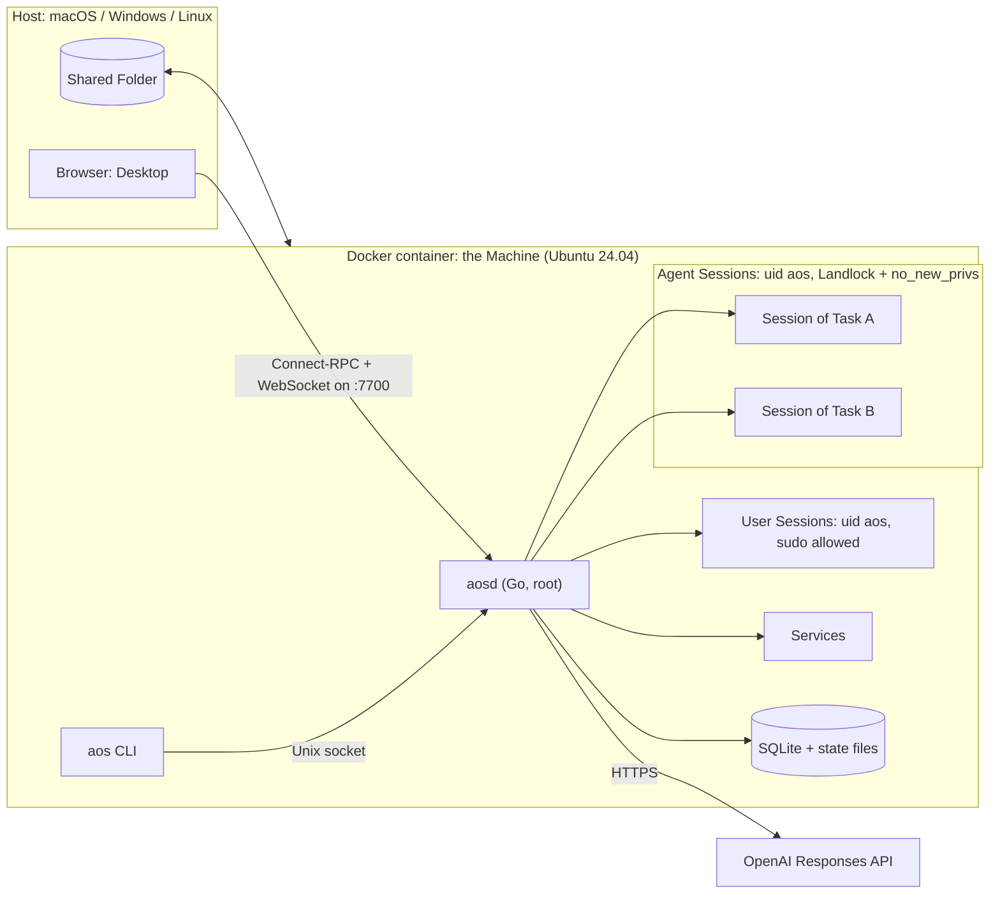
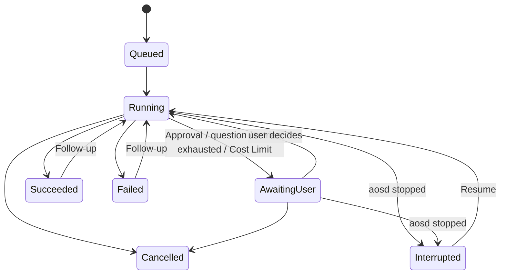

# Agentic OS — v1 Plan

**Status:** Approved 2026-09-14 · M0 done ([findings](m0-findings.md); its decisions are folded in below) · M1 done · M2 done · M3 in progress
**Vocabulary:** every capitalised term (Machine, Task, Agent, Tool, Session, Protected Path, Checkpoint, Replay, …) is defined in [CONTEXT.md](../CONTEXT.md).
**Decisions:** the hard-to-reverse ones are recorded in [docs/adr/](adr/).

---

## 1. Goal

A single `docker compose up --build` gives the user an Ubuntu Machine in which OpenAI-powered Agents carry out everyday computer work: moving files, installing software, downloading, running Services. The user watches and steers them from a terminal (`cli` Mode) or from a macOS-like Desktop in the browser (`ui` Mode). It must feel **fast and smooth**, must **never destroy important data without asking**, and must work on **macOS, Windows and Linux Hosts**.

## 2. Scope

**In v1**

- One Go binary `aosd`: Agent runtime, Tools, Sessions, policy, API, Service supervisor, embedded Desktop.
- `aos` CLI inside the container: interactive chat and one-shot `aos run`.
- The Desktop: menu bar, Dock, windows, Spotlight, Notification Center, light and dark themes; apps Finder, Terminal, Agent, TextEdit, Preview, Activity Monitor, Software, System Settings, Trash, Downloads.
- Protection: Autonomy levels, Approvals, Protected Paths (enforced by Landlock), Trash, Audit Log.
- Software: Install Ledger, Checkpoints, Restore, Replay at startup.
- Services with port forwarding to the Host.
- Machine Profile, Memory, Follow-ups, Resume, Retry guard, optional Cost Limit.

**Not in v1** (candidates for v2)

- Linux GUI apps streamed into a Desktop window (ADR-0001)
- A headless browser Tool for JavaScript-heavy sites
- Sub-tasks (the data model allows them; not exposed)
- Host-side CLI (the API already supports it)
- Providers other than OpenAI (Chat Completions adapter)
- Multiple users
- Backup/export of the home volume
- Mission Control / Spaces
- Localisation

## 3. Architecture



**What happens in one Task:**

1. The user submits a Task from the Desktop or the CLI.
2. `aosd` queues it and starts an Agent with its own Session.
3. The Agent streams a response from OpenAI and requests Tool calls.
4. Policy checks each call: Protected Paths, then Autonomy, then grants. If needed, the Task becomes Awaiting User.
5. Approved calls run, confined by the sandbox. Their results go back to the model.
6. Every step is published on the event stream, which the Desktop and CLI render live, and is written to SQLite and the Audit Log.

## 4. Components

### 4.1 `aosd` modules (Go packages under `internal/`)

| Package | Responsibility |
|---|---|
| `api` | Connect-RPC handlers, Session WebSocket, uploads/downloads, authentication, Host/Origin checks, serving embedded Desktop assets |
| `events` | In-process publish/subscribe bus feeding the event stream; every state change goes through it |
| `task` | Task state machine, queue, `AOS_MAX_TASKS` slots, Follow-ups, Resume, cancellation |
| `agent` | Agent loop: context assembly, streaming, parallel Tool calls, Retry guard, usage and cost accounting |
| `llm` | Provider interface; `openai` implementation (Responses API); `fake` replay provider for tests |
| `tool` | Tool registry, JSON schemas, risk classification, dispatch |
| `policy` | Autonomy, Protected Paths, Approvals, Task-scoped grants, shell command analysis |
| `sandbox` | Landlock rulesets, `no_new_privs`, capability detection and fallback |
| `session` | PTY Sessions, command framing, background processes, attach/watch |
| `files` | File operations, Trash, file watching (fsnotify, plus polling for the Shared Folder) |
| `software` | Install Ledger; apt, pipx and npm adapters; Checkpoints; Restore; Replay |
| `service` | Service supervisor, restart policies, logs, listening-port discovery |
| `proxy` | Forwarding Services to the Host by subdomain and by path |
| `profile` | Machine Profile builder; Memory store |
| `metrics` | CPU, memory, disk and process sampling for Activity Monitor |
| `audit` | Append-only Audit Log |
| `store` | SQLite (WAL mode, pure-Go driver), embedded migrations |

**Main libraries:**

| Purpose | Library |
|---|---|
| OpenAI | `github.com/openai/openai-go` |
| API (Connect-RPC) | `connectrpc.com/connect` |
| WebSocket | `github.com/coder/websocket` |
| PTY | `github.com/creack/pty` |
| File watching | `github.com/fsnotify/fsnotify` |
| Landlock | `github.com/landlock-lsm/go-landlock` |
| SQLite | `modernc.org/sqlite` |
| Shell command parsing | `mvdan.cc/sh/v3` |
| Web page to text | `go-shiori/go-readability`, `JohannesKaufmann/html-to-markdown` |
| CLI | `spf13/cobra` + `charmbracelet/bubbletea` |

### 4.2 `aos` CLI

| Command | Purpose |
|---|---|
| `aos` | Interactive chat: live steps, Approval prompts, Ctrl-C cancels the current Task |
| `aos run "<task>" [--autonomy auto] [--json]` | One-shot, for scripts; non-interactive rules in §7.4 |
| `aos tasks` · `aos show <id>` | List Tasks · show a Task's steps |
| `aos follow-up <id> "<text>"` · `aos resume <id>` · `aos reply <id> "<text>"` | Continue a finished Task · resume an Interrupted one · answer a Task awaiting you |
| `aos cancel <id>` · `aos stop --all` | Cancel one Task · stop every Agent |
| `aos attach <id>` | Watch or type into a Task's Session |
| `aos approve <id>` · `aos deny <id>` | Decide an Approval (refused when called from an Agent Session) |
| `aos trash list\|restore\|empty` | Trash |
| `aos software list\|ledger` · `aos checkpoint list\|create\|restore` | Install Ledger and Checkpoints |
| `aos service list\|logs\|start\|stop\|restart\|remove` | Services |
| `aos protect\|unprotect <path>` · `aos memory list\|add\|accept\|forget` | Protected Paths · Memory |
| `aos desktop-url` | Print a one-time sign-in link for the Desktop |
| `aos doctor` | Mode, Landlock status, API key present, versions, volumes |

### 4.3 Desktop

**Stack:** React + Vite + TypeScript, Zustand for state, `@connectrpc/connect-web` generated clients, `@xterm/xterm` with the WebGL renderer, CodeMirror 6, pdf.js.

**Shell**

- **Menu bar:** AOS menu, menus of the active app, Agent status icon with a badge for pending Approvals, Control Center (theme, Stop all Agents), clock.
- **Dock:** magnification, running indicators, Downloads stack, Trash.
- **Window manager:** traffic-light buttons, focus and stacking order, minimise and zoom animations, layout kept per tab and saved on the server.
- **Spotlight:** find apps and files, or start a Task.
- **Notification Center:** Approvals and finished Tasks.
- **Theme and wallpaper:** light and dark themes, wallpaper.

**Apps**

| App | v1 capabilities |
|---|---|
| Finder | Sidebar (Home, Shared, Downloads, Trash); icon, list and column views; the open folder refreshes live; drag and drop; upload/download to the Host; Quick Look via Preview; 🔒 Protect; right-click "Ask Agent…". Double-clicking a file opens it in Preview or TextEdit by its type, and shows other files (archives, programs) selected (M4) |
| Terminal | Tabs of User Sessions; "Watch" opens an Agent's Session |
| Agent | Task list, live step feed, chat and Follow-ups, Approvals, cancel, Resume, tokens and cost, Audit Log browser, usage and Cost Limits. While it has the focus on a Task, that Task's Approvals are answered inline instead of in the pop-up (M4) |
| TextEdit | CodeMirror 6 editor with syntax highlighting; one file per window, up to 1 MiB; asks before saving over a file that changed on disk since it was opened (M4) |
| Preview | Images, PDF, audio, video; one file per window (M4) |
| Activity Monitor | Processes, CPU, memory, disk, network; running Agents; Services and their ports |
| Software | Install Ledger, Checkpoints, Restore, Replay progress |
| System Settings | API key (masked), model, Autonomy, Protected Paths, Memory, keyboard shortcuts, appearance, Mode and Landlock status |
| Trash | Browse, restore, empty |
| Downloads stack | A Dock stack of the newest files in `~/Downloads`, with downloads in progress (M4) |

**Rules for smoothness** (enforced by review and by the performance tests in §17)

1. Dragging, resizing and Dock magnification never cause a React re-render. Pointer events update `transform: translate3d(...)` directly on the DOM inside `requestAnimationFrame`; the store is updated once, on pointer-up.
2. Animations touch only compositor-friendly properties (`transform`, `opacity`) through the Web Animations API.
3. Each app is its own lazily loaded chunk. The first load of the shell is under 150 KB gzipped.
4. Event-stream updates are batched to one store commit per animation frame.
5. Long lists (Finder, Activity Monitor, Audit Log) are virtualised.
6. Terminal output goes straight into xterm.js, never through React state.

**Appearance**

- A macOS Sonoma/Sequoia-style look, themed with CSS custom properties.
- Frosted "vibrancy" panels, using a single `backdrop-filter` blur layer per surface.
- **Optional "Liquid Glass" appearance** (macOS Tahoe style: refraction and layered translucency), off by default, turned on in System Settings → Appearance. It thins the frosted panels and boosts the backdrop blur and saturation on the menu bar, Dock and panels. A frame watchdog runs only while it is on — it measures frames with `requestAnimationFrame` gaps plus the Long Animation Frames API where the browser supports it — and switches Liquid Glass off, with a notification, if frames stay over budget for a sustained stretch.
- Follows the Host's `prefers-color-scheme`, with a manual override.
- System font stack (SF on macOS Hosts), with bundled Inter as the fallback on Windows and Linux.
- **Assets:**
  - Original macOS-style SVG app icons (rounded-square shape, gradients, depth) and gradient wallpapers, drawn for this project.
  - All icons, wallpapers and sounds live in `desktop/src/assets/` and are listed in one `manifest.json`. Replacing them is drop-in.
  - No Apple asset files are downloaded into the repo.

**Keyboard**

- The Host OS is detected and the default shortcuts differ per Host:

  | Action | macOS | Linux | Windows |
  |---|---|---|---|
  | Spotlight | ⌥Space | Alt+Space | Ctrl+Space |
  | Close window | ⌥W | Alt+W | Alt+W |
  | Switch window | ⌥` | Alt+` | Alt+` |

- All shortcuts can be remapped in System Settings.
- "Immersive mode" uses Fullscreen plus the Keyboard Lock API where supported (Chromium) to capture more of the reserved shortcuts.

**Sync:** all state comes from the server, so several browser tabs stay consistent. The window layout, with each window's own state (the open Task, Finder's folder and view), is kept per tab, so a reload restores that tab's windows, and is saved on the server (debounced) to seed new tabs.

## 5. Repository layout

```
agentic-os/
├── compose.yaml
├── compose.override.example.yaml   # copy to compose.override.yaml to publish extra ports
├── .env.example
├── .gitattributes                  # force LF for scripts (Windows checkouts)
├── docker/
│   ├── Dockerfile
│   └── rootfs/                     # apt config, sudoers, bash rc for Sessions, rm shim
├── proto/aos/v1/*.proto
├── buf.yaml · buf.gen.yaml
├── gen/                            # generated Go + TS (committed; CI checks it is fresh)
├── cmd/
│   ├── aosd/
│   └── aos/
├── internal/                       # packages listed in §4.1
├── desktop/                        # Vite app
│   └── src/{shell,apps/<app>,lib,assets/manifest.json}
├── tools/
│   ├── ci/                         # `go run ./tools/ci`: every check, runs locally and in GitHub Actions
│   └── hostcheck/                  # checks behind `aos doctor --host-check` (Host acceptance report)
├── .github/workflows/              # thin wrappers around tools/ci
├── tests/
│   ├── e2e/                        # Playwright
│   ├── perf/                       # frame-time and latency checks
│   └── live/                       # real-model evaluation Tasks
├── testdata/cassettes/             # recorded model conversations for the fake provider
├── CONTEXT.md
└── docs/{PLAN.md,adr/}
```

## 6. Container and Compose

### 6.1 Dockerfile stages

| Stage | Base | What it does |
|---|---|---|
| `desktop-build` | `node:24-slim` | `npm ci && vite build`. Built **only** for the `ui` target. |
| `go-base` | `golang` (pinned) | Module download with BuildKit cache mounts |
| `aosd-cli` | `go-base` | `CGO_ENABLED=0`, builds `aosd` and `aos` for `TARGETARCH` without the Desktop |
| `aosd-ui` | `go-base` | Same, plus `go:embed` of `desktop-build` output (build tag `desktop`) |
| `machine` | `ubuntu:24.04` | Baseline software (§6.3), user `aos`, sudoers, apt cache config, Session bash rc |
| **`cli`** | `machine` | + `aosd-cli` binaries |
| **`ui`** | `machine` | + `aosd-ui` binaries |

Compose passes `target: ${AOS_MODE}`. BuildKit builds only the stages that target needs, so `cli` builds never run Node. At startup, `AOS_MODE=ui` on a `cli` image fails with a clear message.

Images are built for `linux/amd64` and `linux/arm64`.

### 6.2 `compose.yaml` (shape)

```yaml
name: agentic-os
services:
  aos:
    build:
      context: .
      dockerfile: docker/Dockerfile
      target: ${AOS_MODE:-ui}
    image: agentic-os:${AOS_MODE:-ui}
    init: true
    hostname: aos
    stop_grace_period: 30s
    ports:
      - "${AOS_BIND:-127.0.0.1}:${AOS_PORT:-7700}:7700"
    environment:                    # explicit list; never env_file (it would leak the key)
      AOS_MODE: ${AOS_MODE:-ui}
      AOS_BIND: ${AOS_BIND:-127.0.0.1}
      OPENAI_MODEL: ${OPENAI_MODEL:-}  # empty → aosd's built-in default
      AOS_AUTONOMY: ${AOS_AUTONOMY:-confirm-risky}
      # … every other AOS_* / OPENAI_* variable from §6.4 except OPENAI_API_KEY
    secrets: [openai_api_key]
    volumes:
      - aos-home:/home                # /home/aos plus /home/.aos-protected (§7.2)
      - aos-state:/var/lib/aos
      - aos-pkgcache:/var/cache/aos
      - ${AOS_SHARED_DIR:-./shared}:/shared   # ~/Shared is a symlink to it
secrets:
  openai_api_key:
    environment: OPENAI_API_KEY
volumes:
  aos-home: {}
  aos-state: {}
  aos-pkgcache: {}
```

**Notes**

- Compose reads `.env` only to fill in `${…}` values. Environment variables are passed explicitly, so `OPENAI_API_KEY` reaches the container only as the secret file. M0.4 verifies it is absent from every process environment.
- Compose cannot add a port mapping only when an env var is set. Publishing extra ports (`AOS_PUBLISH_PORTS`) therefore lives in `compose.override.example.yaml`: copy it to `compose.override.yaml`, which Compose loads automatically on every Host.
- The home folder is a named volume for speed on every Host. Only the Shared Folder is a bind mount.
- The volume is mounted at `/home`, not `/home/aos`, so the relocated Protected dotfiles in `/home/.aos-protected` persist too.
- `OPENAI_API_KEY` must be *defined* for `docker compose up` to start, even if empty (M0 finding F4). The README quick start therefore begins with `cp .env.example .env`. An empty value means "no key yet".
- On macOS Hosts, Docker Desktop hangs on bind mounts from `~/Desktop`, `~/Documents` or `~/Downloads` unless it has been granted access to them (finding F6). This goes in README troubleshooting, together with `AOS_SHARED_DIR`.

### 6.3 Baseline software in the image

- **Shell and core tools:** `bash`, coreutils, `procps`, `less`, `nano`, `vim-tiny`, `htop`, `file`, `tree`, `jq`, `sudo`, `apt-utils`, `tzdata`
- **Network:** `curl`, `wget`, `ca-certificates`, `iproute2`, `iputils-ping`, `openssh-client`
- **Transfer and archives:** `git`, `rsync`, `rclone`, `zip`, `unzip`, `xz-utils`, `p7zip-full`
- **Python:** `python3`, `python3-venv`, `python3-pip`, `pipx`
- **Node.js 24 LTS** from the official binaries (Ubuntu's apt package is much older), with `npm` and `corepack`

Everything else is installed on demand and recorded in the Install Ledger.

**Image size targets** (M0 finding F3), measured as the unpacked size (`du -sx /` in the image): `cli` < 520 MB, `ui` < 540 MB. Compressed (`docker image inspect` on arm64): < 180 MB.

### 6.4 Environment variables (`.env.example`)

| Variable | Default | Purpose |
|---|---|---|
| `AOS_MODE` | `ui` | `cli` or `ui`; selects the build target and runtime behaviour |
| `OPENAI_API_KEY` | — | Delivered to `aosd` as a secret file. Can also be set later in System Settings. |
| `OPENAI_MODEL` | `gpt-5.6-terra` | Model for Agents. Precedence: System Settings > `OPENAI_MODEL` > built-in default. |
| `OPENAI_REASONING_EFFORT` | unset | Optional reasoning-effort hint |
| `OPENAI_BASE_URL` | unset | Optional endpoint override |
| `AOS_PORT` | `7700` | Host port for the Desktop and API |
| `AOS_BIND` | `127.0.0.1` | Host interface; anything else prints a network-exposure warning |
| `AOS_ACCESS_TOKEN` | generated | Overrides the generated API token (ADR-0007) |
| `AOS_AUTONOMY` | `confirm-risky` | `auto` \| `confirm-risky` \| `confirm-all` |
| `AOS_MAX_TASKS` | `3` | Tasks running at once |
| `AOS_MAX_RETRIES` | `3` | Retry guard (§8.3) |
| `AOS_TASK_COST_LIMIT_USD` | unset | Optional per-Task Cost Limit |
| `AOS_DAILY_COST_LIMIT_USD` | unset | Optional daily Cost Limit |
| `AOS_REQUIRE_LANDLOCK` | `false` | Refuse to start on Hosts without Landlock |
| `AOS_UID` / `AOS_GID` | `1000` | Match the Linux Host user for Shared Folder ownership |
| `AOS_SHARED_DIR` | `./shared` | Host path of the Shared Folder (Windows paths accepted) |
| `AOS_PUBLISH_PORTS` | unset | Port range for `compose.override.yaml` |
| `AOS_TRASH_RETENTION_DAYS` | `30` | Trash expiry |
| `AOS_TRASH_MAX_GB` | `5` | Trash size cap |
| `TZ` | `UTC` | Machine timezone |

There is deliberately **no step limit**.

## 7. Security model

### 7.1 Who runs what

| Actor | uid | Confinement | `sudo` |
|---|---|---|---|
| `aosd` | root | none | n/a |
| Agent Sessions and everything they spawn | `aos` | Landlock + `no_new_privs` | **No**: the kernel ignores setuid under `no_new_privs` |
| User Sessions (Desktop Terminal, `docker compose exec -u aos aos bash`) | `aos` | none | Yes, NOPASSWD |
| Approved calls on Protected Paths (§7.4) | `aos` | Landlock + `no_new_privs`, widened to the approved paths for that one call | **No** |
| Services | `aos` by default, root only via an approved Privileged Tool | Same confinement as whoever created them | as creator |

A plain `docker compose exec aos …` runs as root (aosd is the container's main process, so the container's user is root). The `aos` CLI works either way.

### 7.2 Landlock ruleset for Agent Sessions (validated in M0, ADR-0004)

**Home layout.** Landlock grants whole trees and cannot carve an exception out of a granted folder (M0 finding F1), so Protected dotfiles live outside home:

```
/home/                        aos-home volume
├── .aos-protected/           root:root 0755; entries owned by aos
│   ├── ssh/  gnupg/  config/
│   └── bashrc  profile  bash_logout  (bash_profile  bash_login  inputrc: only if created)
└── aos/                      the home folder: root:aos 1775 (sticky)
    ├── .ssh -> /home/.aos-protected/ssh        root-owned symlinks
    ├── .bashrc -> /home/.aos-protected/bashrc  …one for every entry above
    ├── Shared -> /shared
    └── everything else: owned by aos
```

- The sticky bit on a root-owned home means nobody but root can delete, rename or replace the symlinks.
- A write through a symlink resolves to `/home/.aos-protected`, which Agents cannot write.
- `aosd` creates and repairs this layout at every start, including on existing volumes.
- The user (unconfined) edits dotfiles through the symlinks as usual, but `sed -i` needs `--follow-symlinks`.

**Ruleset**

- **Read and execute:** everything except Hidden paths: `/run/secrets`, `/var/lib/aos` and other Sessions' directories under `/run/aos/sessions`.
- **Write, create and remove:** all of home, `/tmp`, `/var/tmp`, `/dev` (`/dev/null`, `/dev/tty`, the PTY) and the Session's own directory.
- **Not writable:** everything else, including `/home/.aos-protected`, the Shared Folder (mounted at `/shared`, outside home: finding F2) and system folders.
- **Paths the user locks** (🔒, `aos protect`) inside a Writable tree are carved out: every folder from home down to the locked path is split into per-entry grants.
  - In a split folder, home included, a new entry can be created but not written until the Session is re-sandboxed, which happens before its next command.
  - When a failed command created entries in a split folder, the Tool result tells the Agent to clean up and re-run.
  - Agents can create empty entries inside a locked folder, but never change or delete its content.
- **Symlinks are never granted**, because Landlock would grant their target.
- **Process isolation:** a confined process cannot ptrace an unconfined one. On kernels with Landlock ABI ≥ 6, signals and abstract Unix sockets are also scoped, so Agents cannot signal or reach User Sessions or `aosd`.
- **Files Tools** (§9) run as `aos` in a confined helper with the same ruleset, never as root inside `aosd`, so symlink tricks cannot turn them into root file access.

### 7.3 Protected Paths (built-in defaults, plus your own in System Settings)

The built-in defaults below are read-only in System Settings — weakening `~/.ssh` and the like from a browser isn't worth the risk. You can add and remove your *own* locked paths there (and with 🔒 in Finder or `aos protect`).

**Enforced by the kernel** (Landlock, §7.2) and by policy:

- `/etc`, `/usr`, `/bin`, `/sbin`, `/lib*`, `/boot`, `/var/lib`
- `~/.ssh`, `~/.gnupg`, `~/.config`, `~/.bashrc`, `~/.profile`, `~/.bash_logout` (all in `/home/.aos-protected`)
- The whole Shared Folder
- AOS's own state: `/var/lib/aos`
- Paths the user locks (🔒 in Finder, `aos protect`)

**Enforced by policy only** (patterns that Landlock cannot express; a script can still change them, which is documented):

- **Any `.env` file:** changing or deleting one needs Approval, when done through a Files Tool or a shell command the analysis recognises.
- **Git working trees with changes the current Task did not make:** Approval is needed only to delete the tree or discard those changes (`git reset --hard`, `git clean`, `git checkout -- .`, `git restore .`, `git stash drop`). Edits do not need Approval.

### 7.4 Policy check for every Tool call

1. **Touches a Protected Path?** Approval, at every Autonomy level. With nobody to ask (`aos run` without a TTY): deny.
2. **Is it a Risky Action?** This covers Privileged Tools, `delete`, overwrites, uploads, `remove_package`, and destructive shell commands found by `mvdan.cc/sh` analysis.
   - `auto`: allow.
   - `confirm-risky`: Approval.
   - `confirm-all`: every call needs Approval.
   - Non-interactive: deny, unless `--autonomy auto` was passed.
3. **Is there a matching Task-scoped grant** ("Allow for the rest of this Task": same Tool, same folder)? Allow. Grants never cover Protected Paths.
4. **Is Landlock unavailable?** `auto` is treated as `confirm-risky`.

Shell analysis is only an early warning so the Agent can ask first. Landlock is the actual enforcement.

**Running an approved call on a Protected Path**

- The call runs as a one-off process as `aos`, confined by the usual ruleset **widened to exactly the approved paths**. For a file that doesn't exist yet, or a delete or move, the widened path is its folder. The Approval shows these paths.
- An approved `run_command` runs outside the persistent Session: in the Session's current folder, with a fresh environment.
- Shell analysis cannot see every path a program touches. So `run_command` takes an optional `protected_paths` list: after a kernel denial, the Agent can ask for exactly those paths, which triggers an Approval.
- Task-scoped grants never widen the ruleset: every Protected Path call is approved individually.

### 7.5 Approvals cannot come from Agents

- **TCP API:** requires the access token, which is stored under `/var/lib/aos` and unreadable to Agents.
- **Unix socket** (`/run/aos/aosd.sock`): `aosd` reads the caller's `SO_PEERCRED` and rejects any process whose `/proc/<pid>/status` shows `NoNewPrivs: 1`, meaning Agent-confined.
- **Unexpected actors:** settings changes and Approval decisions from anything other than the Desktop or a User Session are refused and written to the Audit Log.

### 7.6 Access from the Host (ADR-0007)

- **Token:** generated on first start. `docker compose up` logs and `aos desktop-url` print `http://localhost:7700/#code=<one-time>`. The Desktop exchanges the code for an HttpOnly, SameSite=Strict cookie.
- **Request checks:** every request's `Host` must be `localhost`, `127.0.0.1` or `<port>.localhost`, which defeats DNS rebinding. `Origin` must match on RPC and WebSocket upgrades. No CORS.
- **Media loads:** ``, `<video>` and downloads send no `Origin`, so the Desktop's cookie may `GET /files/raw` without one only when `Sec-Fetch-Site: same-origin`. A page on a forwarded port is the same *site* as the Desktop, so SameSite alone would let it in, but it is never the same *origin*.
- **Path-forwarded Services** (`/port/<n>/`) are served with `Content-Security-Policy: sandbox …` without `allow-same-origin`. They get an opaque origin and cannot use the Desktop's cookie.

### 7.7 API key

- **Delivery:** a Compose secret sourced from the Host's `OPENAI_API_KEY`, copied at startup into `/var/lib/aos/keys/openai` (root, mode 0400). Compose delivers the secret world-readable (0444, M0 finding 0.4), so at every start `aosd` also makes it root-only: Landlock keeps Agents out, but not the user's own file operations or Terminal, which run as `aos` too.
- **Where it's used:** only `aosd`'s `llm` package reads it. The UI shows `sk-…abcd`.
- **Replacing it:** possible from System Settings. A key saved there is written to the same root-only file and wins over the Compose secret, across restarts, until you choose the key from `.env` again. Only a hint (`sk-…abcd`) ever leaves `aosd`; the Audit Log records each change with that hint.

### 7.8 Trash

- **Standard layout:** the freedesktop.org Trash specification, one Trash per filesystem, so deleting is always an instant rename:
  - `~/.local/share/Trash` for the home volume
  - `/shared/.Trash-<uid>` for the Shared Folder (a hidden folder, visible on the Host)
- **Agent `rm`:** an `rm` shim early in Agent `PATH` sends deletions to Trash. `/tmp`, `/var/tmp`, `node_modules`, `__pycache__`, `.cache` and build outputs are deleted permanently.
- **Expiry:** after `AOS_TRASH_RETENTION_DAYS`, or oldest-first above `AOS_TRASH_MAX_GB`.
- **Emptying:** only the user can empty the Trash.

### 7.9 Audit Log

Every Tool call is recorded with: Task, Tool, arguments (secrets redacted), policy decision, who approved, result summary, duration and time. It is append-only and kept forever. Full step output is kept for 90 days.

## 8. Agent runtime

### 8.1 Task states



- **Concurrency:** `AOS_MAX_TASKS` Running at once; the rest are Queued. Privileged Tool calls are serialised across all Tasks.
- **Resume:** a new Agent run gets the transcript plus the note "the Machine restarted; verify state before continuing".
- **Cancel:** SIGINT to the Session's process group, then SIGKILL after 5 s. A package operation in progress is allowed to finish first. Afterwards the user is offered a Restore to the Checkpoint taken before the Task.

### 8.2 The loop

1. **Assemble the model input**, stable parts first so OpenAI's prompt caching works:
   - System prompt and Tool schemas (never change within a version)
   - Memory
   - Machine Profile
   - Task transcript
2. **Stream** the Responses API output. Text deltas go to the event stream immediately.
3. **Run Tool calls in parallel when safe:**
   - Read-only calls always run in parallel.
   - Calls that change the same path are serialised.
   - Privileged Tools are serialised globally.
4. **Shape results before returning them:**
   - Command output: first 2 KB + last 6 KB, with a pointer to the full output, which the Agent can page through with `read_output`.
   - Web pages: converted to Markdown and trimmed.
5. **Repeat** until the model produces a final answer, then mark the Task Succeeded or Failed with a summary.

**Context:** the local transcript in SQLite is the source of truth. `previous_response_id` is used when valid, as an optimisation; otherwise a compacted transcript is sent.

### 8.3 Retry guard (`AOS_MAX_RETRIES`, default 3)

- **Step retries:** a counter per step tracks consecutive failures of the same goal (same Tool, and for commands the same program); a success of that goal resets it. When the first attempt and `AOS_MAX_RETRIES` Retries have all failed (4 failures with the default 3), the Task becomes **Awaiting User** with a summary of what was tried; the user can say "try another way", add a hint, or cancel. The reply reaches the Agent as a message. With nobody to ask, the Task fails.
- **Loop detection:** an identical Tool call repeated `AOS_MAX_RETRIES` times in a row counts as retries, even if each "succeeded". This catches endless polling or re-downloading.
- **Transport retries:** OpenAI rate limits, 5xx errors and timeouts are retried with exponential backoff and jitter up to the limit, then the Task becomes Awaiting User.
- **Never:** automatic re-runs of a whole Task.

### 8.4 Usage and Cost Limit

- **Usage:** tokens from every response are stored per Task and per day.
- **Cost:** estimated from `/var/lib/aos/prices.yaml`, which is user-editable because prices change. `aosd` writes it on first start with OpenAI's Standard short-context prices for the default model, as listed on 2026-09-14, and reads it again whenever it changes. A model without an entry has an unknown cost, and Cost Limits can't apply to it.
- **Limits:** if `AOS_TASK_COST_LIMIT_USD` or `AOS_DAILY_COST_LIMIT_USD` is set and reached, the Task becomes Awaiting User ("continue?").
- **Display:** the Agent app and `aos show` display usage live.

### 8.5 Machine Profile and Memory

- **Machine Profile** (< 1 KB, rebuilt on change): Ubuntu version and architecture, Mode, Landlock status, installed software from the Ledger, running Services and ports, key folders, and hints (e.g. "avoid heavy work in `~/Shared`: slow on this Host").
- **Memory:** the `remember` Tool only *proposes* an entry. It is saved when the user accepts it, or directly when the user says "remember …". Entries are editable in System Settings.

## 9. Tool catalogue

"Risky" means it needs Approval under `confirm-risky`. Protected Paths always need Approval.

| Tool | Group | Risky? | Notes |
|---|---|---|---|
| `run_command` | Session | Depends on analysis | Timeout (default 10 min); `background: true` for long jobs; optional `protected_paths` requests an Approval to change those paths (§7.4) |
| `send_input` | Session | No | For interactive prompts |
| `read_output` | Session | No | Page through full or background output |
| `stop_process` | Session | No | Only the Task's own processes |
| `list_dir` · `read_file` · `file_info` · `search_files` | Files | No | `read_file` supports line ranges; search by name or content |
| `write_file` · `edit_file` | Files | Yes, if overwriting an existing file | `edit_file` applies a patch |
| `move` · `copy` | Files | Yes, if overwriting | |
| `delete` | Files | Yes | Goes to Trash |
| `install_package` | Software (Privileged) | Yes | apt (root via `aosd`), pipx, npm global (user prefix); recorded in the Ledger; automatic Checkpoint before the first install in a Task |
| `remove_package` | Software (Privileged) | Yes | Recorded in the Ledger |
| `run_privileged_command` | Software (Privileged) | Yes | Runs as root, outside the sandbox |
| `manage_service` | Software | create/remove/root: yes · status/logs: no | §12 |
| `download` | Internet | No | Resumable, progress events, `~/Downloads` by default |
| `http_request` | Internet | Only when sending a body (upload) | HTML converted to readable Markdown |
| `web_search` | Internet | No | OpenAI hosted tool |
| `open_in_desktop` · `notify` | Desktop | No | Offered only in `ui` Mode. `open_in_desktop` shows a file or folder in the Finder, or, for a port, sends a notification with an Open button (browsers block pop-ups no click started); it never opens web addresses. `notify` is capped at 5 per Task |
| `ask_user` | Coordination | — | Makes the Task Awaiting User with a question |
| `remember` | Coordination | — | Proposal; the user accepts |
| `create_checkpoint` | Coordination | No | |

## 10. Sessions

**How commands run**

- **Shell:** a PTY (`creack/pty`) running `bash` with an AOS rc file.
- **Output framing:** each command is wrapped with a random nonce and OSC 133-style markers, so `aosd` knows exactly where its output starts and ends and what its exit code was.
- **Background commands:** tracked by `aosd` with a ring buffer plus an output file.
- **Non-interactive defaults:** `DEBIAN_FRONTEND=noninteractive`, `GIT_TERMINAL_PROMPT=0`, `PIP_NO_INPUT=1`, `npm_config_yes=true`, `PAGER=cat`.
- **Interactive prompt detection:** no output for 3 s and a last line that looks like a prompt means the Agent is told the command is waiting and can use `send_input`.

**Watching and typing in**

- Any number of viewers (Desktop "Watch", `aos attach`).
- If the user types into an Agent's Session, the Agent is told what was typed.
- An Agent's Session stays listed after its Task ends (15 minutes, the newest 8), so a late viewer still replays its last 64 KB of output; an ended Session takes no input.

**Transport**

- Binary WebSocket frames for output.
- Input and resize are small control frames.
- Backpressure pauses reading from the PTY when a slow client falls behind.

## 11. Software

**Install Ledger** (decided in M2): every operation with root authority (`install_package`, `remove_package`, `run_privileged_command`, a Restore) and every Service created or removed is one Ledger operation: Task, actor, time, summary, and each thing it changed with its state before and after. Things are:
- packages: apt as `name:arch` with its version, dependencies included and flagged as automatically installed (M0 finding F9); pipx; npm
- paths under `/etc`, whose content is kept by SHA-256 under `/var/lib/aos/blobs`
- Service definitions

The states come from comparing `dpkg`, pipx/npm and `/etc` before and after each operation, so a `run_privileged_command` that runs `apt-get` is recorded too.

**Per package manager**

- **apt:**
  - Ubuntu's `docker-clean` apt config is removed, and `APT::Keep-Downloaded-Packages` is enabled, with archives kept in the `aos-pkgcache` volume.
  - The Ledger records exact versions. Recommended packages are not installed (`--no-install-recommends`), which keeps installs small; Agents name them when needed.
- **pipx:** `PIPX_HOME` lives in the home volume. Recorded so a Restore can undo it.
- **npm global:** the prefix is `~/.local`, the cache is in `aos-pkgcache`. Recorded.

**Checkpoint** = a Ledger position. The copies of `/etc` files it needs are the "before" states of the operations after it.
- `aosd` scans `/etc` before and after each Privileged Tool call, hashing again only files whose size, modification time or inode changed.
- Created automatically before a Task's first software or Service change, or manually (`create_checkpoint`, `aos checkpoint create`).

**Restore:**
1. Create a "Before restoring" Checkpoint, so a Restore can itself be undone.
2. For everything the Ledger changed after the target Checkpoint, take its state before the first such change.
3. Remove Services that didn't exist then; purge and install packages to match (cached `.deb` files first, downgrades allowed); write back `/etc`; put Service definitions back.
4. Record the Restore itself as a Ledger operation, and log it in the Audit Log.

**Replay at startup (in the background):**
- Compare `dpkg` state with the Ledger.
- Install the cached `.deb` files directly (offline, version-exact, needs no package lists), then re-mark automatically installed packages. Otherwise, fall back to the package lists kept in `aos-pkgcache`, then to the network.
- Write back the `/etc` files Privileged Tools changed, but only where the image still has the file as the Ledger first recorded it: a newer image's own change wins, with a note. pipx and npm installs live in the home volume and need no Replay.
- Services start once Replay has finished.
- Cache clean-up keeps every `.deb` the Ledger references.
- If a version is unavailable, install the latest and notify the user. If the image already has a newer version, skip it.
- Show progress in the menu bar and in `aos doctor`.
- Tasks may start meanwhile. Agents see "Replay in progress", and new installs wait for Replay to finish.

## 12. Services and port forwarding

- **Service definition:** name, command, working directory, env, user, autostart, restart policy (`always` | `on-failure` | `never`; `on-failure` by default), confinement inherited from the creator. Stored in SQLite; started at boot after Replay.
  - Creating and removing a Service is recorded in the Install Ledger, so restoring a Task's Checkpoint also removes the Services it created.
  - `aos service stop` lasts until the next start or the next restart of the Machine; `aos service remove` deletes the Service.
- **Logs:** ring buffer in memory plus a rotated file. Visible in Activity Monitor and via `aos service logs`.
- **Port discovery:** `/proc/net/tcp{,6}` is scanned every 2 s for listening sockets, feeding Activity Monitor and the Desktop's "Open" buttons.
- **Forwarding:**
  - `http://<port>.localhost:7700`: `aosd` routes by `Host` header to `127.0.0.1:<port>`, including WebSockets. The default in every browser; Chrome and Safari verified in M0 (finding F5).
  - `http://localhost:7700/port/<port>/`: prefix stripped, CSP sandbox applied. A fallback for setups where `*.localhost` doesn't resolve (proxies, custom resolvers). Apps that need their own cookies or localStorage may not work in this mode.
  - Both modes strip the Desktop's session cookie from requests, and drop any `Set-Cookie` that names it or carries a `Domain` attribute.
  - Published ports via `compose.override.yaml`: full fidelity in every browser, needs a restart.
- **Low ports:** Docker containers normally allow unprivileged binding to ports below 1024 (verified in M0), so nginx on port 80 works as `aos`.

## 13. API (Connect-RPC, `proto/aos/v1`)

| Service | RPCs |
|---|---|
| `AuthService` | `ExchangeLoginCode` |
| `TaskService` | `CreateTask`, `ListTasks`, `GetTask`, `SendFollowUp`, `AnswerQuestion`, `CancelTask`, `ResumeTask`, `StopAll` |
| `ApprovalService` | `ListPending`, `Decide` (allow once / allow for Task / deny) |
| `EventService` | `Subscribe` (server stream): `TaskChanged`, `TaskStep`, `TextDelta`, `ApprovalChanged`, `DownloadProgress`, `ServiceChanged`, `ReplayProgress`, `Notification` (also sent with `dismissed` set when one is dismissed), `OpenInDesktop` (M4). Folder changes and metrics are not events: `FileService.Watch` and `SystemService.Metrics` serve them only while a window shows them (decided in M4). |
| `FileService` | `List`, `Stat`, `Read`, `Write`, `Move`, `Copy`, `Delete`, `Protect`, `Unprotect`, `ListProtected`; `Watch` (server stream: a folder's listing each time it changes). Browsers allow six HTTP/1.1 connections to aosd, so the Desktop shares one stream per folder, keeps at most three open, and lists any further folders every 2 s instead (M4) |
| `TrashService` | `List`, `Restore`, `Empty` |
| `SoftwareService` | `ListPackages`, `ListLedger`, `ListCheckpoints`, `CreateCheckpoint`, `RestoreCheckpoint` |
| `SupervisorService` | `ListServices` (with every listening port), `StartService`, `StopService`, `RestartService`, `RemoveService`, `StreamLogs` |
| `SessionService` | `Create`, `List`, `Close` (I/O via WebSocket) |
| `SettingsService` | `ListMemory`, `AddMemory`, `AcceptMemory`, `ForgetMemory` (M2); `GetDesktopState`, `SaveDesktopState` (M3); `Get`, `Update` (M4: the settings that can change while AOS runs, §6.4, each with where its value comes from), `SetApiKey` (M4) |
| `SystemService` | `Info` (Mode, versions, Landlock, Host hints), `Processes` (M4: read from /proc when asked; a process belongs to a Task when it, an ancestor, its process group or its session is a process that Task's Agent started, matched by pid and start time; "confined" means no_new_privs), `Audit`; `Usage` (M4: model usage per day, for the Agent app's chart), `Metrics` (M4: the Machine's CPU, memory, disks and network, read from its own cgroup first; polled by Activity Monitor while open), `ListNotifications` and `DismissNotification` (M4: notifications are kept, newest 200, until dismissed; a dismissal is published as a `Notification` event with `dismissed` set, so every tab drops it) |

**Plain HTTP routes:**
- `GET /` serves the Desktop.
- `POST /upload?path=[&overwrite=1]` streams one file: the request body, with its `Content-Length`, becomes the file, written as `aos` through a temporary file, so a failed or cut-short upload leaves nothing (browsers can't stream uploads over Connect).
- `GET /files/raw?path=[&download=1]` streams a file read as `aos`, with single-range `Range` support. Images, audio, video, PDF and plain text open in place; everything else, HTML and SVG included, downloads; every response carries `Content-Security-Policy: sandbox` and `nosniff`.
- `GET /ws/session/<id>` is the Session WebSocket.
- `/port/<n>/…` and `<n>.localhost` handle forwarding.

## 14. Storage

- **SQLite at `/var/lib/aos/aos.db`:**
  - WAL mode, a single writer goroutine, migrations embedded in the binary.
  - Tables: `tasks`, `task_steps`, `approvals`, `grants`, `audit_log`, `usage`, `ledger_ops`, `ledger_entries`, `checkpoints`, `memories`, `protected_paths`, `services`, `settings`, `desktop_state`, `notifications`.
- **Files under `/var/lib/aos/`:** `outputs/` (full command output, 90 days), `blobs/` (`/etc` contents the Ledger refers to), `services/` (Service logs), `keys/`, `token`, `prices.yaml`.

## 15. Cross-Host support

| | macOS Host | Windows Host | Linux Host |
|---|---|---|---|
| Runtime | Docker Desktop (Apple Silicon, Intel) | Docker Desktop, WSL2 backend | Docker Engine; Podman/rootless: best effort |
| Landlock | ✅ confirmed (linuxkit kernel) | ✅ in WSL2 kernel config | Depends on distro and kernel; fallback per ADR-0004 |
| Shared Folder ownership | Automatic | Automatic | `AOS_UID`/`AOS_GID` applied at startup (re-owns home only when changed) |
| Shared Folder live updates | 2 s polling (`FileService.Watch`) | 2 s polling (Windows changes aren't reliably seen by file notifications) | 2 s polling |
| Service subdomains | Chrome, Safari ✅ (M0); Edge, Firefox expected | ✅ | ✅ |
| Reserved shortcuts | ⌘Space, ⌘Tab, ⌘W, ⌘Q | Alt+Space, Alt+Tab, Alt+F4, Win, Ctrl+W | Super, Alt+Tab, Ctrl+W |
| Start command | `docker compose up --build` (zsh/bash) | same (PowerShell/cmd) | same |
| Verified by | Me, during every milestone | You, via `aos doctor --host-check` + manual Desktop checklist | You, same |

## 16. Performance targets

| Target | Value | How it is measured |
|---|---|---|
| `docker compose up` to usable (after build) | < 5 s | CI timer from container start to `SystemService.Info` OK and Desktop first paint |
| Window drag and animations | 60 fps (p95 frame < 16.7 ms) | Playwright + Chrome tracing on a scripted drag |
| Window drag with eight windows open | main-thread p95 stays cheap | Playwright + Chrome tracing on a scripted drag; gates on main-thread p95 only (headless has no GPU compositor). The real-GPU eight-plus-window run is reported from the live suite |
| Terminal keystroke echo | < 30 ms p95 | Input-to-render timing in the e2e perf test |
| Tool dispatch overhead | < 10 ms p95 | Go benchmark: policy + sandbox + framing around `true` |
| First visible Agent step | < 1 s after submit | Time to first `TextDelta` or `TaskStep` (real-model live suite) |
| `aosd` idle memory | < 50 MB RSS | `aos doctor` + CI assertion: the `playwright` stage reads aosd's RSS after 10 s idle, once after startup and again after the whole Desktop suite |
| Image size | Unpacked: `cli` < 520 MB · `ui` < 540 MB. Compressed: < 180 MB | CI assertion on `du -sx /` in the image and `docker image inspect` |
| Desktop initial bundle | < 150 KB gzipped | Vite build size check |

A CI run that misses any deterministic target fails.

## 17. Testing strategy

1. **Go unit tests** per package, run twice: on the macOS Host (`unit`) and under Linux in Docker (`unit-linux`), so the `_linux.go` code (Sessions, the sandbox, the socket guard) is tested too.
   - Policy decision tables.
   - Shell analysis corpus.
   - Retry guard and Cost Limit logic.
   - Ledger diff for Restore.
2. **Agent-loop tests with the `fake` provider:**
   - Recorded model conversations ("cassettes") replay deterministically, at no cost.
   - A `-record` flag re-captures them with a real key.
3. **Container integration tests** (the real image, started by Go tests that drive the Docker CLI: `docker run` for the host check, `docker compose` for milestone acceptance in `tools/e2e`; no testcontainers dependency):
   - Landlock guard: a Python script cannot delete `~/.ssh/id_ed25519`, and `sudo` fails in Agent Sessions.
   - Trash round-trip.
   - Replay yields identical versions offline.
   - Services come back after a restart.
   - Forwarding works, including WebSockets.
   - The API rejects missing tokens, bad Origins and Agent callers on the socket.
4. **Playwright e2e** for the Desktop against `aosd` with the fake provider: Finder operations, Approval pop-up flow, Terminal, Software Restore.
5. **Performance tests** (§16) in CI.
6. **Live evaluation suite:** real Tasks run manually with a real key. Each is graded by inspecting Machine state, never the Agent's own claims. Examples:
   - "install htop"
   - "download and unzip X into ~/Downloads/x"
   - "start a static site Service on port 3000"
   - "move all PDFs from Shared to ~/Documents"
7. **Where tests run:**
   - All checks run through `go run ./tools/ci`, locally on the macOS Host. GitHub Actions calls the same script once the remote repo exists.
   - Windows and Linux Hosts are tested by you with `aos doctor --host-check` plus a short manual Desktop checklist.

## 18. Milestones

### M0 — Prototypes (de-risk before building) ✅ done 2026-09-14, see [m0-findings.md](m0-findings.md)

| # | Prototype | Passes when |
|---|---|---|
| 0.1 | Landlock ruleset | On the macOS Host, an Agent Session: writes anywhere in home except Protected Paths (including new top-level folders); cannot modify `~/.ssh/*` or the Shared Folder, even via a Python script; cannot read `/run/secrets` or `/var/lib/aos`; `sudo` fails. A User Session is unaffected. |
| 0.2 | Session framing | 1,000 mixed commands (binary output, no trailing newline, interactive prompts, background jobs) all framed with correct exit codes; overhead < 10 ms p95 |
| 0.3 | Replay from cache | 10 apt packages reinstalled offline on a fresh container at exact versions |
| 0.4 | Compose secret | Secret file's owner and mode inside the container confirmed; key absent from `/proc/*/environ`; behaviour when `OPENAI_API_KEY` is unset understood |
| 0.5 | Forwarding | On the macOS Host: subdomain works in Chrome, Edge and Firefox; path mode + CSP sandbox works in Safari; override file publishes ports |
| 0.6 | Build | `docker compose up --build` from zsh on the macOS Host; `cli` target never runs Node; image sizes within targets on arm64 (amd64 built via buildx emulation for the size check) |
| 0.7 | Low ports | Unprivileged `aos` can bind port 80 in the container |
| 0.8 | Host check | `aos doctor --host-check` runs M0.1, 0.2, 0.4, 0.5 (except the browser part) and 0.7 inside the container and prints a pass/fail report you can run on Windows and Linux Hosts |

**Output:** a short findings note. ADR-0004's ruleset section is finalised. Windows and Linux results come from you running the host check; any failure found there is triaged before M1 starts, if it arrives by then.

### M1 — `aosd` core + CLI Mode ✅ done 2026-09-14 (acceptance: `go run ./tools/ci e2e`)

- **Building blocks:** `store`, `events`, `task`, `agent`, `llm/openai`, `llm/fake`, `sandbox`, `session`, `files` + Trash, `policy`, `audit`, `api` (auth, Task/Approval/Event/File/Trash/Session/System services).
- **Tools:** Session, Files, Internet, Coordination (except Checkpoint).
- **CLI:** `aos` interactive and `aos run`, with Approvals in the terminal.
- **Compose:** `AOS_MODE=cli` end to end.

**Accepted when** all of the following hold, with `AOS_MODE=cli docker compose up --build`:
- `aos run "download <url> and extract it to ~/Downloads/x"` succeeds.
- A delete inside a Protected Path triggers an Approval.
- The same delete attempted by a script is blocked by the kernel.
- Cancelling works.
- The Audit Log shows every step.
- Integration tests for the above pass.

### M2 — Machine features ✅ done 2026-09-14 (acceptance: `go run ./tools/ci e2e`)

- Install Ledger, Checkpoints, Restore, Replay.
- Services, port discovery, forwarding.
- Machine Profile, Memory, Follow-ups, Resume.
- Retry guard, usage tracking, Cost Limits.
- CLI commands for all of the above.

**Accepted when:**
- "install nginx and serve ~/site on port 8081" works end to end.
- After `docker compose down && up`, nginx is reinstalled (offline) and the Service is running and reachable at `8081.localhost:7700`.
- Restoring to the pre-Task Checkpoint removes nginx and its config.
- Killing `aosd` mid-Task leaves the Task Interrupted and Resumable.
- A deliberately failing step pauses after 3 Retries.

### M3 — Desktop basics

- Vite app embedded via the `ui` target.
- Sign-in via one-time link.
- Window manager, menu bar, Dock, Spotlight, Notification Center.
- Light and dark themes; Host-aware shortcuts.
- Finder and Terminal (User Sessions + Watch).
- Approval pop-ups.

**Scope (agreed 2026-09-14):** M3 is the shell plus Finder, Terminal, approval
pop-ups and a *minimal* in-shell task surface (start a Task from Spotlight, watch
its steps, answer Approvals and Follow-ups). The rich dedicated apps stay in M4.
The perf + Playwright gate is wired into `go run ./tools/ci` from the start.
Built in phases (M3.0 foundation done: Vite/React/Zustand app, TypeScript client
codegen, `ui`/`playwright` CI stages).

**Accepted when:**
- Everything from M1/M2 can be driven from the Desktop.
- Performance tests pass for drag fps and keystroke echo.
- Two browser tabs stay in sync.
- Reload restores the window layout.

### M4 — Desktop apps

- Agent app (live feed, Follow-ups, Audit Log, usage).
- TextEdit, Preview, Activity Monitor (with Services and ports), Software (Ledger, Checkpoints, Replay progress), System Settings (all settings from §6.4 that are safe to change at runtime, Protected Paths, Memory, API key, shortcuts), Trash, Downloads stack.
- `open_in_desktop` and `notify` Tools.
- Finder "Ask Agent…" and 🔒 Protect.

**Accepted when:** every app works against the fake provider in Playwright, and the live suite passes in `ui` Mode.

**Status (M4.7).** The fake-provider Playwright gate is green (34/34) across every app and the watchdog. The live suite is built at `desktop/e2e-live/` and wired as an optional CI stage — `go run ./tools/ci live` — that never runs in the default sweep because it spends the key. It brings the `ui` Machine up against the real provider in `.env`, refuses to start without a real key, runs headed on a real GPU to assert the eight-window drag drops no frames (the run §16 defers here), checks the first visible Agent step is under 1 s and that a real Task finishes with a real file side effect, and prints the run's spend at the end. It has been run against the real provider (2026-09-16, `gpt-5.6-terra`). The first run failed §16's "first visible Agent step under 1 s" (1,204 ms), which aborted the rest of that spec; a manual Chrome sweep of every app on the same live Machine confirmed the parts it never reached (Task reaches Done, real file side effect, real cost) and turned up the defects listed in M4.8. After those fixes the suite is green end to end: first visible step 43 ms, the Task finishes and writes its file, the cost is reported ($0.0179), and the eight-window drag on a real GPU renders 120 frames at p95 0.75 ms with 0 dropped. Total spend across the sweep and the runs: about $0.09. The fake-provider gate is 52/52 with the M4.8 regression specs added, and the whole `go run ./tools/ci` sweep is green (2026-09-16). The M4 review remains.

### M4.8 — Defects from the live Chrome sweep (found 2026-09-16)

Every app was driven by hand in Chrome against a live `ui` Machine on the real
provider (no cassettes), on top of `go run ./tools/ci live`. What follows is what
that sweep found, worst first. Everything below is fixed: the majors first, then
the minors, and the live suite passes end to end.

**Majors — all fixed** (each with a regression spec in the fake-provider gate, so
none of them can come back unnoticed)

| # | Area | What happened | The fix |
|---|---|---|---|
| 8.1 | Terminal | A page reload never re-attached the open Session: the Terminal created a *new* one and the old `bash` was orphaned, still running. Four shells were alive for one Terminal window after three reloads and a second tab. Scrollback, folder, environment and any running command were silently lost, with no way back. | The Terminal window remembers its Sessions in its window state, so a reload re-attaches exactly those (`useWinState("sessions")` in `desktop/src/apps/Terminal.tsx`) and the shell's own scrollback is replayed. Closing a tab now ends its Session, and any User Session no window is showing is offered in the Watch menu to be taken back. `e2e/terminal.spec.ts`: "a reload re-attaches the Session instead of leaving it running" also asserts no second shell was started. |
| 8.2 | Window manager | A minimized window could not be restored. Its Dock icon opened a *second* window, ⌥\` skipped it, and the stranded window survived reloads, still hidden. | The Dock brings an app's minimized windows back before it opens new ones, focusing a window now un-minimizes it, and ⌥\` cycles through minimized windows too (`openApp`/`focusWindow` in `desktop/src/store.ts`, `switchWindow` in `desktop/src/shell/Shell.tsx`). Two specs in `e2e/layout.spec.ts`, one of them across a reload. |
| 8.3 | Files, security-facing | Finder's 🔒 badge and its Protect/Unprotect item ignored the built-in Protected Paths and ignored ancestors: `~/.ssh`, `~/.gnupg`, `~/.config` and the Shared Folder showed *no* badge and offered "🔒 Protect", and unprotecting a path that is protected by default made the badge vanish while the path stayed locked. | `policy.DefaultPaths` is now the one list the Agent's policy, `aos protect` and the badge all read, and `IsProtected` answers *why* a path is protected — `user`, `default`, `inherited` or not at all — carried to the Desktop as `FileInfo.protect_source`. Finder badges all three, explains each in the tooltip, and offers Unprotect only for a path the user locked; the other two are shown as locked and disabled. `e2e/finder.spec.ts`: "the lock badge covers built-in Protected Paths and what is inside them". |
| 8.4 | Shell | Preferences did not reach a second tab: a theme, wallpaper, Liquid Glass or shortcut change in one tab left the other on the old one until it reloaded. (Windows are deliberately *not* shared — §4.3 keeps the layout per tab — so only the preferences were wrong.) | `SaveDesktopState` publishes a `DesktopStateChanged` event carrying the saving tab's id; every other tab adopts the preferences in it and keeps its own windows (`adoptPreferences` in `desktop/src/store.ts`). `e2e/sync.spec.ts`: "a preference changed in one tab reaches the other". The copy on the server is still whichever tab saved last, which is what seeds a *new* tab (§4.3) — not shared state. |
| 8.5 | Performance (§16) | First visible Agent step: 1,204 ms against the < 1 s target, most of it fetching the Agent app's lazy chunk. | The shell warms every app's chunk once the Desktop is up, Agent first, and Spotlight warms it again when it opens (`preloadApps` in `desktop/src/apps/registry.ts`). The live suite now measures **43 ms**. |
| 8.6 | Terminal | Every new Session opened showing the internal framing line twice — `__aos_c <nonce>; source …; __aos_d <nonce> $?` — before the first prompt. | `session.Start` drops what the synchronising command echoed and redraws (`internal/session/session_linux.go`), so a Session opens on a prompt. `e2e/terminal.spec.ts`: "a new Session opens on a clean prompt". |

**Minors — all fixed**

| # | Area | What happened | The fix |
|---|---|---|---|
| 8.7 | Finder | The row context menu was clipped by the window: on a row near the bottom, Protect / Ask Agent… / Move to Trash rendered below the window edge and could not be clicked. The menu never flipped or clamped. | `ContextMenu` renders into the body, so no window can clip it, and measures itself on mount: it flips above the pointer when it would run past the bottom and slides left when it would run past the right, as a native menu does (`desktop/src/apps/Finder.tsx`). `e2e/finder.spec.ts`: "a context menu near the bottom of the screen stays on screen". |
| 8.8 | Shell | Closing the front window left nothing focused — the menu bar fell back to "Agentic OS" while another window was plainly in front. Same after minimizing. | `closeWindow` and `minimize` hand focus to the topmost window still on screen (`topmost` in `desktop/src/store.ts`). Two specs in `e2e/layout.spec.ts`. |
| 8.9 | Appearance | Switching theme left the menu bar and Dock painted in the *old* theme until some unrelated repaint (toggling Liquid Glass fixed it). | The menu bar and Dock are `backdrop-filter` layers, which Chrome does not re-read when only an ancestor's custom properties change. `applyTheme` now drops those filters for one frame (`data-theming`), which tears the layers down and rebuilds them against the new palette (`desktop/src/theme.ts`, `index.css`). **It does not reproduce under headless Chromium**, and the Host it was found on was not available to re-check, so the fix is reasoned from the cause rather than observed: `e2e/glass.spec.ts` guards the nudge, not the pixels. Worth one look on the next real-Chrome pass. |
| 8.10 | Window manager | Windows resized only from a 16 × 16 bottom-right handle; no edges, no other corners. | Eight handles — four edges, four corners — through one `resized()` rect function, still writing straight to the DOM per frame and committing once on pointer-up, so §4.3 rule 1 and the drag budget are untouched (`desktop/src/shell/Window.tsx`). `e2e/layout.spec.ts`: "a window resizes from its left edge" also asserts the opposite edge stays put. |
| 8.11 | Shell | System Settings ▸ Status and About This Machine both reported `Version 0.1.0-m1` at M4. | `daemon.Version` is `0.1.0-m4`, and `version_linux_test.go` reads the milestones out of this plan and fails if the two drift again. |
| 8.12 | Agent | Cancel took about ten seconds to show: the state stayed "Running" long after the click, then the feed printed the raw `error: context canceled` instead of saying the step was cancelled. | `Manager.Cancel` publishes `CANCELLED` on the click rather than waiting for the Agent to unwind (the run writes the summary, with the Restore hint, when it returns), and a Tool call that ends because the Task was cancelled reports "Cancelled." rather than whatever the dying command printed (`internal/task/manager.go`, `internal/agent/agent.go`). Covered by `TestATaskRecordsItsCheckpointAndACancelOffersTheRestore`. |
| 8.13 | System Settings | Errors reached the user as Go internals: locking a bad path showed `[not_found] lstat /home/aos/not/an/absolute/path: no such file or directory`. | One `friendlyError` (`desktop/src/api/error.ts`) strips Connect's code prefix, turns the Go syscall shapes into sentences and capitalises them; all 33 error surfaces in the Desktop go through it, and `locks.Protect` returns a sentence to begin with. `e2e/settings-behaviour.spec.ts`: "a failed lock explains itself in plain words". |
| 8.14 | Activity Monitor | The per-process CPU column was always "—"; Services & Ports listed an internal loopback port with an empty name next to the real one. | CPU is a rate, so it needed a reading to measure against: `Sampler.Prime()` takes one at startup and the first render already has figures (confirmed live: 2 of 2 processes on the first call). The stray port was Docker's embedded DNS on 127.0.0.11, which has no process to name because it is outside the Machine's pid namespace; `Listener.Internal()` drops unattributable loopback listeners and aosd's own, in the API and the Machine Profile alike, so the CLI agrees. `internal/service/ports_test.go`. |
| 8.15 | Finder | The list header was 92 % opaque, so rows scrolled visibly through it. | A new opaque `--bg-raised` token for surfaces that sit over scrolling content, rather than widening `--panel-strong`, which Liquid Glass relies on (`desktop/src/index.css`). |
| 8.16 | Audit Log | A failed call was recorded with Decision `allow` and the error as its result (`aos protect list` → `lstat …: no such file or directory`). | `decisionFor(err)` records `error` for a call that failed, keeping `allow` for one that ran and `deny` for a policy refusal; applied to the file, settings, API-key and Trash audit sites (`internal/api/server.go`). |
| 8.17 | Finder | Column view kept a trailing empty column, and columns other than the watched one went stale — a file created in the Terminal did not appear until you re-navigated. | Every column follows its folder through `watchFolder`, which keeps this inside the Desktop's one-stream budget (the folder in front streams, the rest poll), and an empty column says "No items" instead of showing a blank strip (`desktop/src/apps/Finder.tsx`). `e2e/finder.spec.ts`: "column view shows a file created behind its back". |
| 8.18 | Finder | First open after sign-in sat on "Loading…" for several seconds while the lazy chunk loaded, though `FileService/List` answered in 18 ms. No skeleton. | A row skeleton (`desktop/src/ui/Skeleton.tsx`) is both the window's Suspense fallback and Finder's own loading state, so a window has shape immediately; 8.5's preloading already shortened the wait behind it. |
| 8.19 | Trash | The Trash list used a generic document icon rather than the type icons the folder listing uses, and the Dock's Trash icon never showed a full state. | The Trash list calls the same `iconFor` the folder listing does, and the Dock's tile swaps to a full bin while the Trash has something in it — the picture, with no count, as on macOS. The Trash has no event of its own, so the Desktop counts it at boot and after every change it makes (`trashCount` in `desktop/src/store.ts`). `e2e/trash.spec.ts`: "the Trash uses type icons and the Dock shows a full bin". |
| 8.20 | Preview | The zoom read-out said "100 %" while the page was actually scaled to fit the width (a 200 pt-wide PDF drawn 535 px wide). | The read-out reports the scale the page is drawn at, not the zoom step (`desktop/src/apps/preview/PdfView.tsx`). `e2e/preview.spec.ts` asserts the canvas grows by the ratio the read-out claims. |

**Verified working in the same sweep** (so the list above is not mistaken for the
whole picture): sign-in; Spotlight (apps, files, "Ask the Agent"); Finder list /
icon / column views, navigation, Quick Look, Ask Agent…, Move to Trash, Put Back,
live refresh of the watched folder; Terminal input, output and a real shell;
TextEdit open/edit/save; Preview for images and PDFs, including a clean error on a
corrupt one; the Agent app's feed, tool arguments and results, follow-ups, Audit
Log and Usage; Approvals (inline card, Notification Center, Deny handled by the
model); `notify` and `open_in_desktop`; Activity Monitor's four tabs; Software's
four panes; the Downloads stack; Trash; every System Settings pane, including
remapping and persistence; both themes and Liquid Glass; window drag, resize,
zoom, close, ⌥W, ⌥\` cycling; and layout restored across a reload.

**Not covered by this sweep** (needs a human or a longer run): the Upload button
(native file picker), Download… to the Host (the automation pane blocks
downloads), a real Service and port forwarding, Checkpoints/Restore/Replay with
real packages, Interrupt/Resume, Immersive mode, Safari path-forwarding mode, and
the Windows and Linux Hosts.

### M5 — Hardening and release

- All §16 targets enforced in CI.
- Cross-Host checklist: run by me on the macOS Host; by you on Windows and Linux Hosts, using `aos doctor --host-check` plus a short manual Desktop checklist.
- No-Landlock fallback tested by simulating an unsupported kernel (forcing the capability probe to fail), and by you on an older Linux Host if available.
- Security review (auth, Origin/Host checks, sandbox escapes, secret handling).
- README quick start and troubleshooting (`aos doctor` output explained).

**Accepted when:** a fresh user on each Host goes from `git clone` to a finished Task in the Desktop by following only the README.

## 19. Risks

| Risk | Mitigation |
|---|---|
| Landlock can't express "home except Protected Paths" cleanly | Resolved in M0: Protected dotfiles are relocated behind root-owned symlinks (§7.2). Paths the user locks inside home still split their folder. |
| No step limit leads to runaway token spend | Retry guard, loop detection, visible live usage, optional Cost Limits; README recommends setting a daily limit |
| Model quality varies by model and version | Live evaluation suite graded on Machine state; model is configurable |
| Apps break in Safari path-forwarding mode | Documented; `compose.override.yaml` published ports as a full-fidelity escape hatch |
| Replay is slow with a large Ledger | Offline cache, runs in the background, doesn't block Tasks |
| Windows Shared Folder is slow and doesn't report changes | Polling; Machine Profile steers heavy work into the home volume |
| Agents interfering with User Sessions (same uid) | Landlock ptrace restriction; signal and socket scoping on ABI ≥ 6; covered by integration tests |

## 20. Decision log

| Decision | Where |
|---|---|
| Browser-built Desktop, not a streamed Linux desktop | [ADR-0001](adr/0001-browser-built-desktop.md) |
| Single Go binary, not Rust | [ADR-0002](adr/0002-go-single-binary.md) |
| Install Ledger + Checkpoints instead of persisting system folders | [ADR-0003](adr/0003-install-ledger-and-checkpoints.md) |
| Unprivileged, Landlock-confined Agents in one container | [ADR-0004](adr/0004-privilege-separation-with-landlock.md) |
| `aosd` supervises Services (no systemd) | [ADR-0005](adr/0005-aosd-supervises-services.md) |
| Connect-RPC + Session WebSocket | [ADR-0006](adr/0006-connect-rpc-plus-session-websocket.md) |
| API always authenticated, even on localhost | [ADR-0007](adr/0007-api-always-authenticated.md) |

## 21. Pending decisions

None. M0's findings were decided on 2026-09-14:
- Option B home layout
- Shared Folder at `/shared`
- the new size targets
- approved Protected Path calls run with a ruleset widened for that one call
- pattern-based Protected Paths are enforced by policy only, narrowly

## 22. Working agreement

| Topic | Agreement |
|---|---|
| Start | Nothing is implemented until you approve this plan |
| Review points | M0: one review at the end, using the findings note. M1–M5: I stop at the end of each milestone for review and a demo against its acceptance criteria. Anytime: I stop immediately if a finding forces a change to this plan or an ADR. |
| Version control | `git init` at the start of M0. Small commits, one logical change each. A private GitHub repo with Actions once you create it or log in to `gh`. Nothing is pushed without asking. |
| Checks | `go run ./tools/ci` is the single entry point (lint, unit, integration, e2e, perf, image-size); CI only wraps it |
| Hosts | I develop and verify on your macOS Host (Apple Silicon; Docker Desktop with 8 CPUs, 8 GB). You test Windows and Linux Hosts with `aos doctor --host-check` and report results. |
| Local toolchain | Installed on the macOS Host: Go 1.27.1, buf 1.73.0, golangci-lint 2.13.2. The Dockerfile pins the same Go minor version. Linux-only behaviour (Landlock, PTY Sessions, apt) is always exercised inside Docker. |
| Model | `aosd`'s built-in default is `gpt-5.6-terra`. `OPENAI_MODEL` overrides it when set, and System Settings overrides both. Test conversations are recorded with the default model. |
| API key for development | You put it in your local `.env` (git-ignored) yourself, with a spending cap on the OpenAI project; I never handle the key. Actual spend is reported after each live run or recording session. |
| Desktop assets | Original macOS-style SVG icons and wallpapers in one folder with a manifest; swappable for your own |
| macOS look | Sonoma/Sequoia style by default; optional Liquid Glass appearance that turns itself off when frames drop |
