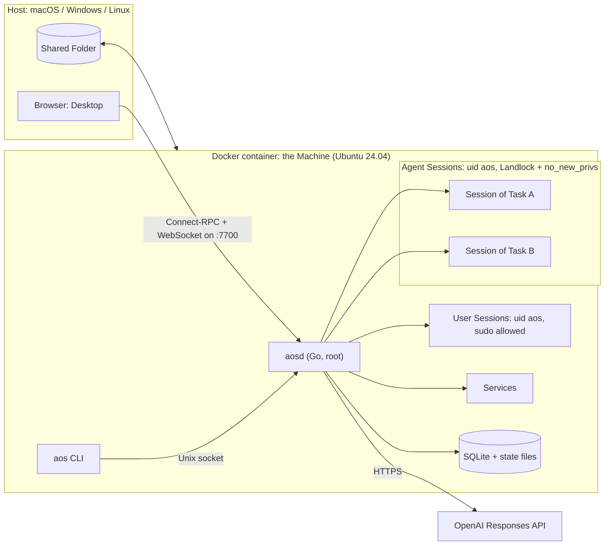
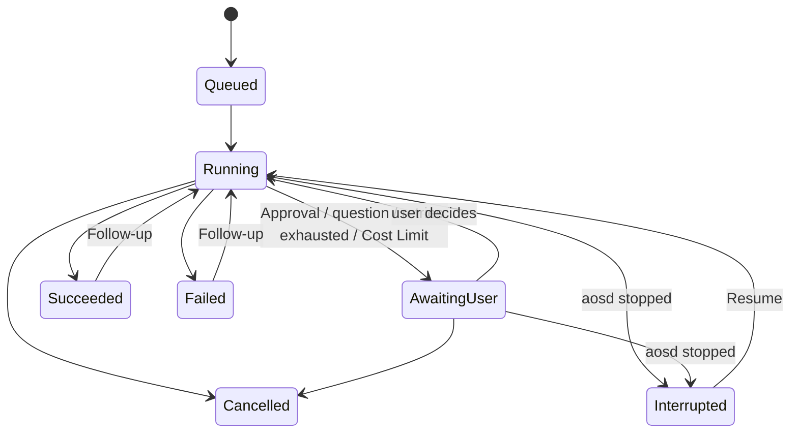

# Agentic OS — v1 Plan

**Status:** Ready for approval · 2026-09-14 · all design decisions settled · nothing is implemented yet
**Vocabulary:** every capitalised term (Machine, Task, Agent, Tool, Session, Protected Path, Checkpoint, Replay, …) is defined in [CONTEXT.md](../CONTEXT.md).
**Decisions:** the hard-to-reverse ones are recorded in [docs/adr/](adr/).

---

## 1. Goal

A single `docker compose up --build` gives the user an Ubuntu Machine in which OpenAI-powered Agents carry out everyday computer work: moving files, installing software, downloading, running Services. The user watches and steers them from a terminal (`cli` Mode) or from a macOS-like Desktop in the browser (`ui` Mode). It must feel **fast and smooth**, must **never destroy important data without asking**, and must work on **macOS, Windows and Linux Hosts**.

## 2. Scope

**In v1**

- One Go binary `aosd`: Agent runtime, Tools, Sessions, policy, API, Service supervisor, embedded Desktop.
- `aos` CLI inside the container: interactive chat and one-shot `aos run`.
- The Desktop: menu bar, Dock, windows, Spotlight, Notification Center, light and dark themes; apps Finder, Terminal, Agent, TextEdit, Preview, Activity Monitor, Software, System Settings, Trash, Downloads.
- Protection: Autonomy levels, Approvals, Protected Paths (enforced by Landlock), Trash, Audit Log.
- Software: Install Ledger, Checkpoints, Restore, Replay at startup.
- Services with port forwarding to the Host.
- Machine Profile, Memory, Follow-ups, Resume, Retry guard, optional Cost Limit.

**Not in v1** (candidates for v2)

- Linux GUI apps streamed into a Desktop window (ADR-0001)
- A headless browser Tool for JavaScript-heavy sites
- Sub-tasks (the data model allows them; not exposed)
- Host-side CLI (the API already supports it)
- Providers other than OpenAI (Chat Completions adapter)
- Multiple users
- Backup/export of the home volume
- Mission Control / Spaces
- Localisation

## 3. Architecture



**What happens in one Task:**

1. The user submits a Task from the Desktop or the CLI.
2. `aosd` queues it and starts an Agent with its own Session.
3. The Agent streams a response from OpenAI and requests Tool calls.
4. Policy checks each call: Protected Paths, then Autonomy, then grants. If needed, the Task becomes Awaiting User.
5. Approved calls run, confined by the sandbox. Their results go back to the model.
6. Every step is published on the event stream, which the Desktop and CLI render live, and is written to SQLite and the Audit Log.

## 4. Components

### 4.1 `aosd` modules (Go packages under `internal/`)

| Package | Responsibility |
|---|---|
| `api` | Connect-RPC handlers, Session WebSocket, uploads/downloads, authentication, Host/Origin checks, serving embedded Desktop assets |
| `events` | In-process publish/subscribe bus feeding the event stream; every state change goes through it |
| `task` | Task state machine, queue, `AOS_MAX_TASKS` slots, Follow-ups, Resume, cancellation |
| `agent` | Agent loop: context assembly, streaming, parallel Tool calls, Retry guard, usage and cost accounting |
| `llm` | Provider interface; `openai` implementation (Responses API); `fake` replay provider for tests |
| `tool` | Tool registry, JSON schemas, risk classification, dispatch |
| `policy` | Autonomy, Protected Paths, Approvals, Task-scoped grants, shell command analysis |
| `sandbox` | Landlock rulesets, `no_new_privs`, capability detection and fallback |
| `session` | PTY Sessions, command framing, background processes, attach/watch |
| `files` | File operations, Trash, file watching (fsnotify, plus polling for the Shared Folder) |
| `software` | Install Ledger; apt, pipx and npm adapters; Checkpoints; Restore; Replay |
| `service` | Service supervisor, restart policies, logs, listening-port discovery |
| `proxy` | Forwarding Services to the Host by subdomain and by path |
| `profile` | Machine Profile builder; Memory store |
| `metrics` | CPU, memory, disk and process sampling for Activity Monitor |
| `audit` | Append-only Audit Log |
| `store` | SQLite (WAL mode, pure-Go driver), embedded migrations |

**Main libraries:**

| Purpose | Library |
|---|---|
| OpenAI | `github.com/openai/openai-go` |
| API (Connect-RPC) | `connectrpc.com/connect` |
| WebSocket | `github.com/coder/websocket` |
| PTY | `github.com/creack/pty` |
| File watching | `github.com/fsnotify/fsnotify` |
| Landlock | `github.com/landlock-lsm/go-landlock` |
| SQLite | `modernc.org/sqlite` |
| Shell command parsing | `mvdan.cc/sh/v3` |
| Web page to text | `go-shiori/go-readability`, `JohannesKaufmann/html-to-markdown` |
| CLI | `spf13/cobra` + `charmbracelet/bubbletea` |

### 4.2 `aos` CLI

| Command | Purpose |
|---|---|
| `aos` | Interactive chat: live steps, Approval prompts, Ctrl-C cancels the current Task |
| `aos run "<task>" [--autonomy auto] [--json]` | One-shot, for scripts; non-interactive rules in §7.4 |
| `aos tasks` · `aos show <id>` | List Tasks · show a Task's steps |
| `aos follow-up <id> "<text>"` · `aos resume <id>` | Continue a finished Task · resume an Interrupted one |
| `aos cancel <id>` · `aos stop --all` | Cancel one Task · stop every Agent |
| `aos attach <id>` | Watch or type into a Task's Session |
| `aos approve <id>` · `aos deny <id>` | Decide an Approval (refused when called from an Agent Session) |
| `aos trash list\|restore\|empty` | Trash |
| `aos software list` · `aos checkpoint list\|create\|restore` | Install Ledger and Checkpoints |
| `aos service list\|logs\|start\|stop` | Services |
| `aos protect\|unprotect <path>` · `aos memory list\|add\|forget` | Protected Paths · Memory |
| `aos desktop-url` | Print a one-time sign-in link for the Desktop |
| `aos doctor` | Mode, Landlock status, API key present, versions, volumes |

### 4.3 Desktop

**Stack:** React + Vite + TypeScript, Zustand for state, `@connectrpc/connect-web` generated clients, `@xterm/xterm` with the WebGL renderer, CodeMirror 6, pdf.js.

**Shell**

- **Menu bar:** AOS menu, menus of the active app, Agent status icon with a badge for pending Approvals, Control Center (theme, Stop all Agents), clock.
- **Dock:** magnification, running indicators, Downloads stack, Trash.
- **Window manager:** traffic-light buttons, focus and stacking order, minimise and zoom animations, layout saved on the server.
- **Spotlight:** find apps and files, or start a Task.
- **Notification Center:** Approvals and finished Tasks.
- **Theme and wallpaper:** light and dark themes, wallpaper.

**Apps**

| App | v1 capabilities |
|---|---|
| Finder | Sidebar (Home, Shared, Downloads, Trash); icon, list and column views; drag and drop; upload/download to the Host; Quick Look via Preview; 🔒 Protect; right-click "Ask Agent…" |
| Terminal | Tabs of User Sessions; "Watch" opens an Agent's Session |
| Agent | Task list, live step feed, chat and Follow-ups, Approvals, cancel, Resume, tokens and cost, Audit Log browser |
| TextEdit | CodeMirror 6 editor with syntax highlighting |
| Preview | Images, PDF, audio, video |
| Activity Monitor | Processes, CPU, memory, disk, network; running Agents; Services and their ports |
| Software | Install Ledger, Checkpoints, Restore, Replay progress |
| System Settings | API key (masked), model, Autonomy, Protected Paths, Memory, keyboard shortcuts, appearance, Mode and Landlock status |
| Trash | Browse, restore, empty |

**Rules for smoothness** (enforced by review and by the performance tests in §17)

1. Dragging, resizing and Dock magnification never cause a React re-render. Pointer events update `transform: translate3d(...)` directly on the DOM inside `requestAnimationFrame`; the store is updated once, on pointer-up.
2. Animations touch only compositor-friendly properties (`transform`, `opacity`) through the Web Animations API.
3. Each app is its own lazily loaded chunk. The first load of the shell is under 150 KB gzipped.
4. Event-stream updates are batched to one store commit per animation frame.
5. Long lists (Finder, Activity Monitor, Audit Log) are virtualised.
6. Terminal output goes straight into xterm.js, never through React state.

**Appearance**

- A macOS Sonoma/Sequoia-style look, themed with CSS custom properties.
- Frosted "vibrancy" panels, using a single `backdrop-filter` blur layer per surface.
- **Optional "Liquid Glass" appearance** (macOS Tahoe style: refraction and layered translucency), off by default. It switches itself off, with a notification, if frame times exceed budget.
- Follows the Host's `prefers-color-scheme`, with a manual override.
- System font stack (SF on macOS Hosts), with bundled Inter as the fallback on Windows and Linux.
- **Assets:**
  - Original macOS-style SVG app icons (rounded-square shape, gradients, depth) and gradient wallpapers, drawn for this project.
  - All icons, wallpapers and sounds live in `desktop/src/assets/` and are listed in one `manifest.json`. Replacing them is drop-in.
  - No Apple asset files are downloaded into the repo.

**Keyboard**

- The Host OS is detected and the default shortcuts differ per Host:

  | Action | macOS | Linux | Windows |
  |---|---|---|---|
  | Spotlight | ⌥Space | Alt+Space | Ctrl+Space |
  | Close window | ⌥W | Alt+W | Alt+W |
  | Switch window | ⌥` | Alt+` | Alt+` |

- All shortcuts can be remapped in System Settings.
- "Immersive mode" uses Fullscreen plus the Keyboard Lock API where supported (Chromium) to capture more of the reserved shortcuts.

**Sync:** all state comes from the server, so several browser tabs stay consistent. Window layout is saved on the server (debounced) and restored on reload.

## 5. Repository layout

```
agentic-os/
├── compose.yaml
├── compose.override.example.yaml   # copy to compose.override.yaml to publish extra ports
├── .env.example
├── .gitattributes                  # force LF for scripts (Windows checkouts)
├── docker/
│   ├── Dockerfile
│   └── rootfs/                     # apt config, sudoers, bash rc for Sessions, rm shim
├── proto/aos/v1/*.proto
├── buf.yaml · buf.gen.yaml
├── gen/                            # generated Go + TS (committed; CI checks it is fresh)
├── cmd/
│   ├── aosd/
│   └── aos/
├── internal/                       # packages listed in §4.1
├── desktop/                        # Vite app
│   └── src/{shell,apps/<app>,lib,assets/manifest.json}
├── tools/
│   ├── ci/                         # `go run ./tools/ci`: every check, runs locally and in GitHub Actions
│   └── hostcheck/                  # checks behind `aos doctor --host-check` (Host acceptance report)
├── .github/workflows/              # thin wrappers around tools/ci
├── tests/
│   ├── e2e/                        # Playwright
│   ├── perf/                       # frame-time and latency checks
│   └── live/                       # real-model evaluation Tasks
├── testdata/cassettes/             # recorded model conversations for the fake provider
├── CONTEXT.md
└── docs/{PLAN.md,adr/}
```

## 6. Container and Compose

### 6.1 Dockerfile stages

| Stage | Base | What it does |
|---|---|---|
| `desktop-build` | `node:24-slim` | `npm ci && vite build`. Built **only** for the `ui` target. |
| `go-base` | `golang` (pinned) | Module download with BuildKit cache mounts |
| `aosd-cli` | `go-base` | `CGO_ENABLED=0`, builds `aosd` and `aos` for `TARGETARCH` without the Desktop |
| `aosd-ui` | `go-base` | Same, plus `go:embed` of `desktop-build` output (build tag `desktop`) |
| `machine` | `ubuntu:24.04` | Baseline software (§6.3), user `aos`, sudoers, apt cache config, Session bash rc |
| **`cli`** | `machine` | + `aosd-cli` binaries |
| **`ui`** | `machine` | + `aosd-ui` binaries |

Compose passes `target: ${AOS_MODE}`. BuildKit builds only the stages that target needs, so `cli` builds never run Node. At startup, `AOS_MODE=ui` on a `cli` image fails with a clear message.

Images are built for `linux/amd64` and `linux/arm64`.

### 6.2 `compose.yaml` (shape)

```yaml
name: agentic-os
services:
  aos:
    build:
      context: .
      dockerfile: docker/Dockerfile
      target: ${AOS_MODE:-ui}
    image: agentic-os:${AOS_MODE:-ui}
    init: true
    hostname: aos
    stop_grace_period: 30s
    ports:
      - "${AOS_BIND:-127.0.0.1}:${AOS_PORT:-7700}:7700"
    environment:                    # explicit list; never env_file (it would leak the key)
      AOS_MODE: ${AOS_MODE:-ui}
      AOS_BIND: ${AOS_BIND:-127.0.0.1}
      OPENAI_MODEL: ${OPENAI_MODEL:-}  # empty → aosd's built-in default
      AOS_AUTONOMY: ${AOS_AUTONOMY:-confirm-risky}
      # … every other AOS_* / OPENAI_* variable from §6.4 except OPENAI_API_KEY
    secrets: [openai_api_key]
    volumes:
      - aos-home:/home/aos
      - aos-state:/var/lib/aos
      - aos-pkgcache:/var/cache/aos
      - ${AOS_SHARED_DIR:-./shared}:/home/aos/Shared
secrets:
  openai_api_key:
    environment: OPENAI_API_KEY
volumes:
  aos-home: {}
  aos-state: {}
  aos-pkgcache: {}
```

**Notes**

- Compose reads `.env` only to fill in `${…}` values. Environment variables are passed explicitly, so `OPENAI_API_KEY` reaches the container only as the secret file. M0.4 verifies it is absent from every process environment.
- Compose cannot add a port mapping only when an env var is set. Publishing extra ports (`AOS_PUBLISH_PORTS`) therefore lives in `compose.override.example.yaml`: copy it to `compose.override.yaml`, which Compose loads automatically on every Host.
- The home folder is a named volume for speed on every Host. Only the Shared Folder is a bind mount.

### 6.3 Baseline software in the image

- **Shell and core tools:** `bash`, coreutils, `procps`, `less`, `nano`, `vim-tiny`, `htop`, `file`, `tree`, `jq`
- **Network:** `curl`, `wget`, `ca-certificates`, `iproute2`, `iputils-ping`, `openssh-client`
- **Transfer and archives:** `git`, `rsync`, `rclone`, `zip`, `unzip`, `xz-utils`, `p7zip-full`
- **Python:** `python3`, `python3-venv`, `python3-pip`, `pipx`
- **Node.js 24 LTS** from the official binaries (Ubuntu's apt package is much older), with `npm` and `corepack`

Everything else is installed on demand and recorded in the Install Ledger.

**Image size targets:** `cli` < 450 MB, `ui` < 500 MB.

### 6.4 Environment variables (`.env.example`)

| Variable | Default | Purpose |
|---|---|---|
| `AOS_MODE` | `ui` | `cli` or `ui`; selects the build target and runtime behaviour |
| `OPENAI_API_KEY` | — | Delivered to `aosd` as a secret file. Can also be set later in System Settings. |
| `OPENAI_MODEL` | `gpt-5.6-terra` | Model for Agents. Precedence: System Settings > `OPENAI_MODEL` > built-in default. |
| `OPENAI_REASONING_EFFORT` | unset | Optional reasoning-effort hint |
| `OPENAI_BASE_URL` | unset | Optional endpoint override |
| `AOS_PORT` | `7700` | Host port for the Desktop and API |
| `AOS_BIND` | `127.0.0.1` | Host interface; anything else prints a network-exposure warning |
| `AOS_ACCESS_TOKEN` | generated | Overrides the generated API token (ADR-0007) |
| `AOS_AUTONOMY` | `confirm-risky` | `auto` \| `confirm-risky` \| `confirm-all` |
| `AOS_MAX_TASKS` | `3` | Tasks running at once |
| `AOS_MAX_RETRIES` | `3` | Retry guard (§8.3) |
| `AOS_TASK_COST_LIMIT_USD` | unset | Optional per-Task Cost Limit |
| `AOS_DAILY_COST_LIMIT_USD` | unset | Optional daily Cost Limit |
| `AOS_REQUIRE_LANDLOCK` | `false` | Refuse to start on Hosts without Landlock |
| `AOS_UID` / `AOS_GID` | `1000` | Match the Linux Host user for Shared Folder ownership |
| `AOS_SHARED_DIR` | `./shared` | Host path of the Shared Folder (Windows paths accepted) |
| `AOS_PUBLISH_PORTS` | unset | Port range for `compose.override.yaml` |
| `AOS_TRASH_RETENTION_DAYS` | `30` | Trash expiry |
| `AOS_TRASH_MAX_GB` | `5` | Trash size cap |
| `TZ` | `UTC` | Machine timezone |

There is deliberately **no step limit**.

## 7. Security model

### 7.1 Who runs what

| Actor | uid | Confinement | `sudo` |
|---|---|---|---|
| `aosd` | root | none | n/a |
| Agent Sessions and everything they spawn | `aos` | Landlock + `no_new_privs` | **No**: the kernel ignores setuid under `no_new_privs` |
| User Sessions (Desktop Terminal, `docker compose exec`) | `aos` | none | Yes, NOPASSWD |
| Services | `aos` by default, root only via an approved Privileged Tool | Same confinement as whoever created them | as creator |

### 7.2 Landlock ruleset for Agent Sessions (to be validated in M0)

- **Read and execute:** everything except `/run/secrets` and `/var/lib/aos`.
- **Write, create and remove:** the home folder and the Shared Folder **excluding Protected Paths**, plus `/tmp` and `/var/tmp`.
- **Process isolation:** a confined process cannot ptrace an unconfined one. On kernels with Landlock ABI ≥ 6, signals and abstract Unix sockets are also scoped, so Agents cannot signal or reach User Sessions or `aosd`.
- **Open problem:** Landlock grants access to a directory tree and cannot carve an exception out of it. "All of home except `~/.ssh`" must be built from per-entry grants. M0 decides between re-sandboxing a Session when home's top-level layout changes, or giving each command its own ruleset.

### 7.3 Protected Paths (defaults, editable in System Settings)

- `/etc`, `/usr`, `/bin`, `/sbin`, `/lib*`, `/boot`, `/var/lib`
- `~/.ssh`, `~/.gnupg`, `~/.config`, `~/.bashrc`, `~/.profile`, and any `.env` file
- The whole Shared Folder
- AOS's own state: `/var/lib/aos`
- Paths the user locks (🔒 in Finder, `aos protect`)
- Git working trees with uncommitted changes (checked when a Tool targets them)

### 7.4 Policy check for every Tool call

1. **Touches a Protected Path?** Approval, at every Autonomy level. With nobody to ask (`aos run` without a TTY): deny.
2. **Is it a Risky Action?** This covers Privileged Tools, `delete`, overwrites, uploads, `remove_package`, and destructive shell commands found by `mvdan.cc/sh` analysis.
   - `auto`: allow.
   - `confirm-risky`: Approval.
   - `confirm-all`: every call needs Approval.
   - Non-interactive: deny, unless `--autonomy auto` was passed.
3. **Is there a matching Task-scoped grant** ("Allow for the rest of this Task": same Tool, same folder)? Allow. Grants never cover Protected Paths.
4. **Is Landlock unavailable?** `auto` is treated as `confirm-risky`.

Shell analysis is only an early warning so the Agent can ask first. Landlock is the actual enforcement.

### 7.5 Approvals cannot come from Agents

- **TCP API:** requires the access token, which is stored under `/var/lib/aos` and unreadable to Agents.
- **Unix socket** (`/run/aos/aosd.sock`): `aosd` reads the caller's `SO_PEERCRED` and rejects any process whose `/proc/<pid>/status` shows `NoNewPrivs: 1`, meaning Agent-confined.
- **Unexpected actors:** settings changes and Approval decisions from anything other than the Desktop or a User Session are refused and written to the Audit Log.

### 7.6 Access from the Host (ADR-0007)

- **Token:** generated on first start. `docker compose up` logs and `aos desktop-url` print `http://localhost:7700/#code=<one-time>`. The Desktop exchanges the code for an HttpOnly, SameSite=Strict cookie.
- **Request checks:** every request's `Host` must be `localhost`, `127.0.0.1` or `<port>.localhost`, which defeats DNS rebinding. `Origin` must match on RPC and WebSocket upgrades. No CORS.
- **Path-forwarded Services** (`/port/<n>/`) are served with `Content-Security-Policy: sandbox …` without `allow-same-origin`. They get an opaque origin and cannot use the Desktop's cookie.

### 7.7 API key

- **Delivery:** a Compose secret sourced from the Host's `OPENAI_API_KEY`, copied at startup into `/var/lib/aos/keys/openai` (root, mode 0400).
- **Where it's used:** only `aosd`'s `llm` package reads it. The UI shows `sk-…abcd`.
- **Replacing it:** possible from System Settings.

### 7.8 Trash

- **Standard layout:** the freedesktop.org Trash specification, one Trash per filesystem, so deleting is always an instant rename:
  - `~/.local/share/Trash` for the home volume
  - `Shared/.Trash-<uid>` for the Shared Folder (a hidden folder, visible on the Host)
- **Agent `rm`:** an `rm` shim early in Agent `PATH` sends deletions to Trash. `/tmp`, `/var/tmp`, `node_modules`, `__pycache__`, `.cache` and build outputs are deleted permanently.
- **Expiry:** after `AOS_TRASH_RETENTION_DAYS`, or oldest-first above `AOS_TRASH_MAX_GB`.
- **Emptying:** only the user can empty the Trash.

### 7.9 Audit Log

Every Tool call is recorded with: Task, Tool, arguments (secrets redacted), policy decision, who approved, result summary, duration and time. It is append-only and kept forever. Full step output is kept for 90 days.

## 8. Agent runtime

### 8.1 Task states



- **Concurrency:** `AOS_MAX_TASKS` Running at once; the rest are Queued. Privileged Tool calls are serialised across all Tasks.
- **Resume:** a new Agent run gets the transcript plus the note "the Machine restarted; verify state before continuing".
- **Cancel:** SIGINT to the Session's process group, then SIGKILL after 5 s. A package operation in progress is allowed to finish first. Afterwards the user is offered a Restore to the Checkpoint taken before the Task.

### 8.2 The loop

1. **Assemble the model input**, stable parts first so OpenAI's prompt caching works:
   - System prompt and Tool schemas (never change within a version)
   - Memory
   - Machine Profile
   - Task transcript
2. **Stream** the Responses API output. Text deltas go to the event stream immediately.
3. **Run Tool calls in parallel when safe:**
   - Read-only calls always run in parallel.
   - Calls that change the same path are serialised.
   - Privileged Tools are serialised globally.
4. **Shape results before returning them:**
   - Command output: first 2 KB + last 6 KB, with a pointer to the full output, which the Agent can page through with `read_output`.
   - Web pages: converted to Markdown and trimmed.
5. **Repeat** until the model produces a final answer, then mark the Task Succeeded or Failed with a summary.

**Context:** the local transcript in SQLite is the source of truth. `previous_response_id` is used when valid, as an optimisation; otherwise a compacted transcript is sent.

### 8.3 Retry guard (`AOS_MAX_RETRIES`, default 3)

- **Step retries:** a counter per step tracks consecutive failures of the same goal (same Tool, and for commands the same program). At the limit, the Task becomes **Awaiting User** with a summary of what was tried; the user can say "try another way", add a hint, or cancel.
- **Loop detection:** an identical Tool call repeated `AOS_MAX_RETRIES` times in a row counts as retries, even if each "succeeded". This catches endless polling or re-downloading.
- **Transport retries:** OpenAI rate limits, 5xx errors and timeouts are retried with exponential backoff and jitter up to the limit, then the Task becomes Awaiting User.
- **Never:** automatic re-runs of a whole Task.

### 8.4 Usage and Cost Limit

- **Usage:** tokens from every response are stored per Task and per day.
- **Cost:** estimated from `/var/lib/aos/prices.yaml`, which is user-editable because prices change.
- **Limits:** if `AOS_TASK_COST_LIMIT_USD` or `AOS_DAILY_COST_LIMIT_USD` is set and reached, the Task becomes Awaiting User ("continue?").
- **Display:** the Agent app and `aos show` display usage live.

### 8.5 Machine Profile and Memory

- **Machine Profile** (< 1 KB, rebuilt on change): Ubuntu version and architecture, Mode, Landlock status, installed software from the Ledger, running Services and ports, key folders, and hints (e.g. "avoid heavy work in `~/Shared`: slow on this Host").
- **Memory:** the `remember` Tool only *proposes* an entry. It is saved when the user accepts it, or directly when the user says "remember …". Entries are editable in System Settings.

## 9. Tool catalogue

"Risky" means it needs Approval under `confirm-risky`. Protected Paths always need Approval.

| Tool | Group | Risky? | Notes |
|---|---|---|---|
| `run_command` | Session | Depends on analysis | Timeout (default 10 min); `background: true` for long jobs |
| `send_input` | Session | No | For interactive prompts |
| `read_output` | Session | No | Page through full or background output |
| `stop_process` | Session | No | Only the Task's own processes |
| `list_dir` · `read_file` · `file_info` · `search_files` | Files | No | `read_file` supports line ranges; search by name or content |
| `write_file` · `edit_file` | Files | Yes, if overwriting an existing file | `edit_file` applies a patch |
| `move` · `copy` | Files | Yes, if overwriting | |
| `delete` | Files | Yes | Goes to Trash |
| `install_package` | Software (Privileged) | Yes | apt (root via `aosd`), pipx, npm global (user prefix); recorded in the Ledger; automatic Checkpoint before the first install in a Task |
| `remove_package` | Software (Privileged) | Yes | Recorded in the Ledger |
| `run_privileged_command` | Software (Privileged) | Yes | Runs as root, outside the sandbox |
| `manage_service` | Software | create/remove/root: yes · status/logs: no | §12 |
| `download` | Internet | No | Resumable, progress events, `~/Downloads` by default |
| `http_request` | Internet | Only when sending a body (upload) | HTML converted to readable Markdown |
| `web_search` | Internet | No | OpenAI hosted tool |
| `open_in_desktop` · `notify` | Desktop | No | Do nothing in `cli` Mode |
| `ask_user` | Coordination | — | Makes the Task Awaiting User with a question |
| `remember` | Coordination | — | Proposal; the user accepts |
| `create_checkpoint` | Coordination | No | |

## 10. Sessions

**How commands run**

- **Shell:** a PTY (`creack/pty`) running `bash` with an AOS rc file.
- **Output framing:** each command is wrapped with a random nonce and OSC 133-style markers, so `aosd` knows exactly where its output starts and ends and what its exit code was.
- **Background commands:** tracked by `aosd` with a ring buffer plus an output file.
- **Non-interactive defaults:** `DEBIAN_FRONTEND=noninteractive`, `GIT_TERMINAL_PROMPT=0`, `PIP_NO_INPUT=1`, `npm_config_yes=true`, `PAGER=cat`.
- **Interactive prompt detection:** no output for 3 s and a last line that looks like a prompt means the Agent is told the command is waiting and can use `send_input`.

**Watching and typing in**

- Any number of viewers (Desktop "Watch", `aos attach`).
- If the user types into an Agent's Session, the Agent is told what was typed.

**Transport**

- Binary WebSocket frames for output.
- Input and resize are small control frames.
- Backpressure pauses reading from the PTY when a slow client falls behind.

## 11. Software

**Install Ledger entry:** manager (`apt` | `pipx` | `npm`), package, exact version, action (install/remove), Task, time.

**Per package manager**

- **apt:**
  - Ubuntu's `docker-clean` apt config is removed, and `APT::Keep-Downloaded-Packages` is enabled, with archives kept in the `aos-pkgcache` volume.
  - Installs pin exact versions.
- **pipx:** `PIPX_HOME` lives in the home volume. Recorded so a Restore can undo it.
- **npm global:** the prefix is `~/.local`, the cache is in `aos-pkgcache`. Recorded.

**Checkpoint** = a Ledger position, plus copies of every file under `/etc` that changed afterwards.
- `aosd` hashes `/etc` before and after each Privileged Tool call (a few ms) and stores changed files under `/var/lib/aos/checkpoints/<id>/`.
- Created automatically before the first software change in a Task, or manually.

**Restore:**
1. Create a "Before Restore" Checkpoint, so a Restore can itself be undone.
2. Compute the difference between the Ledger now and at the target Checkpoint.
3. Remove and install packages to match.
4. Write back the saved `/etc` files.
5. Log everything in the Audit Log.

**Replay at startup (in the background):**
- Compare `dpkg` state with the Ledger.
- Install from the cache, offline and version-exact.
- If a version is unavailable, install the latest and notify the user. If the image already has a newer version, skip it.
- Show progress in the menu bar and in `aos doctor`.
- Tasks may start meanwhile. Agents see "Replay in progress", and new installs wait for Replay to finish.

## 12. Services and port forwarding

- **Service definition:** name, command, working directory, env, user, autostart, restart policy (`always` | `on-failure` | `never`), confinement inherited from the creator. Stored in SQLite; started at boot after Replay.
- **Logs:** ring buffer in memory plus a rotated file. Visible in Activity Monitor and via `aos service logs`.
- **Port discovery:** `/proc/net/tcp{,6}` is scanned every 2 s for listening sockets, feeding Activity Monitor and the Desktop's "Open" buttons.
- **Forwarding:**
  - `http://<port>.localhost:7700`: `aosd` routes by `Host` header to `127.0.0.1:<port>`, including WebSockets. Used by Chrome, Edge and Firefox.
  - `http://localhost:7700/port/<port>/`: prefix stripped, CSP sandbox applied. Used automatically in Safari. Apps that need their own cookies or localStorage may not work in this mode.
  - Published ports via `compose.override.yaml`: full fidelity in every browser, needs a restart.
- **Low ports:** Docker containers normally allow unprivileged binding to ports below 1024 (verified in M0), so nginx on port 80 works as `aos`.

## 13. API (Connect-RPC, `proto/aos/v1`)

| Service | RPCs |
|---|---|
| `AuthService` | `ExchangeLoginCode` |
| `TaskService` | `CreateTask`, `ListTasks`, `GetTask`, `SendFollowUp`, `CancelTask`, `ResumeTask`, `StopAll` |
| `ApprovalService` | `ListPending`, `Decide` (allow once / allow for Task / deny) |
| `EventService` | `Subscribe` (server stream): `TaskChanged`, `TaskStep`, `TextDelta`, `AwaitingUser`, `FileChanged`, `DownloadProgress`, `MetricsSample`, `ServiceChanged`, `ReplayProgress`, `Notification` |
| `FileService` | `List`, `Stat`, `Read`, `Write`, `Move`, `Copy`, `Delete`, `Protect`, `Unprotect` |
| `TrashService` | `List`, `Restore`, `Empty` |
| `SoftwareService` | `ListLedger`, `ListCheckpoints`, `CreateCheckpoint`, `Restore` |
| `SupervisorService` | `ListServices`, `Start`, `Stop`, `StreamLogs` |
| `SessionService` | `Create`, `List`, `Close` (I/O via WebSocket) |
| `SettingsService` | `Get`, `Update`, `SetApiKey`, `ListMemory`, `UpdateMemory`, `GetDesktopState`, `SaveDesktopState` |
| `SystemService` | `Info` (Mode, versions, Landlock, Host hints), `Processes`, `Audit` |

**Plain HTTP routes:**
- `GET /` serves the Desktop.
- `POST /upload` accepts multipart uploads (browsers can't stream uploads over Connect).
- `GET /files/raw?path=` serves file downloads and media streaming, with Range support.
- `GET /ws/session/<id>` is the Session WebSocket.
- `/port/<n>/…` and `<n>.localhost` handle forwarding.

## 14. Storage

- **SQLite at `/var/lib/aos/aos.db`:**
  - WAL mode, a single writer goroutine, migrations embedded in the binary.
  - Tables: `tasks`, `task_steps`, `approvals`, `grants`, `audit_log`, `usage`, `ledger_entries`, `checkpoints`, `checkpoint_files`, `memories`, `protected_paths`, `services`, `settings`, `desktop_state`, `notifications`.
- **Files under `/var/lib/aos/`:** `outputs/` (full command output, 90 days), `checkpoints/`, `keys/`, `token`, `prices.yaml`.

## 15. Cross-Host support

| | macOS Host | Windows Host | Linux Host |
|---|---|---|---|
| Runtime | Docker Desktop (Apple Silicon, Intel) | Docker Desktop, WSL2 backend | Docker Engine; Podman/rootless: best effort |
| Landlock | ✅ confirmed (linuxkit kernel) | ✅ in WSL2 kernel config | Depends on distro and kernel; fallback per ADR-0004 |
| Shared Folder ownership | Automatic | Automatic | `AOS_UID`/`AOS_GID` applied at startup (re-owns home only when changed) |
| Shared Folder live updates | fsnotify + 2 s polling | 2 s polling (Windows changes aren't reliably seen) | fsnotify + 2 s polling |
| Service subdomains | Chrome/Edge/Firefox ✅, Safari → path mode | ✅ | ✅ |
| Reserved shortcuts | ⌘Space, ⌘Tab, ⌘W, ⌘Q | Alt+Space, Alt+Tab, Alt+F4, Win, Ctrl+W | Super, Alt+Tab, Ctrl+W |
| Start command | `docker compose up --build` (zsh/bash) | same (PowerShell/cmd) | same |
| Verified by | Me, during every milestone | You, via `aos doctor --host-check` + manual Desktop checklist | You, same |

## 16. Performance targets

| Target | Value | How it is measured |
|---|---|---|
| `docker compose up` to usable (after build) | < 5 s | CI timer from container start to `SystemService.Info` OK and Desktop first paint |
| Window drag and animations | 60 fps (p95 frame < 16.7 ms) | Playwright + Chrome tracing on a scripted drag |
| Terminal keystroke echo | < 30 ms p95 | Input-to-render timing in the e2e perf test |
| Tool dispatch overhead | < 10 ms p95 | Go benchmark: policy + sandbox + framing around `true` |
| First visible Agent step | < 1 s after submit | Time to first `TextDelta` or `TaskStep` (real-model live suite) |
| `aosd` idle memory | < 50 MB RSS | `aos doctor` + CI assertion |
| Image size | `cli` < 450 MB · `ui` < 500 MB | CI assertion on `docker image inspect` |
| Desktop initial bundle | < 150 KB gzipped | Vite build size check |

A CI run that misses any deterministic target fails.

## 17. Testing strategy

1. **Go unit tests** per package.
   - Policy decision tables.
   - Shell analysis corpus.
   - Retry guard and Cost Limit logic.
   - Ledger diff for Restore.
2. **Agent-loop tests with the `fake` provider:**
   - Recorded model conversations ("cassettes") replay deterministically, at no cost.
   - A `-record` flag re-captures them with a real key.
3. **Container integration tests** (the real image, via testcontainers):
   - Landlock guard: a Python script cannot delete `~/.ssh/id_ed25519`, and `sudo` fails in Agent Sessions.
   - Trash round-trip.
   - Replay yields identical versions offline.
   - Services come back after a restart.
   - Forwarding works, including WebSockets.
   - The API rejects missing tokens, bad Origins and Agent callers on the socket.
4. **Playwright e2e** for the Desktop against `aosd` with the fake provider: Finder operations, Approval pop-up flow, Terminal, Software Restore.
5. **Performance tests** (§16) in CI.
6. **Live evaluation suite:** real Tasks run manually with a real key. Each is graded by inspecting Machine state, never the Agent's own claims. Examples:
   - "install htop"
   - "download and unzip X into ~/Downloads/x"
   - "start a static site Service on port 3000"
   - "move all PDFs from Shared to ~/Documents"
7. **Where tests run:**
   - All checks run through `go run ./tools/ci`, locally on the macOS Host. GitHub Actions calls the same script once the remote repo exists.
   - Windows and Linux Hosts are tested by you with `aos doctor --host-check` plus a short manual Desktop checklist.

## 18. Milestones

### M0 — Prototypes (de-risk before building)

| # | Prototype | Passes when |
|---|---|---|
| 0.1 | Landlock ruleset | On the macOS Host, an Agent Session: writes anywhere in home except Protected Paths (including new top-level folders); cannot modify `~/.ssh/*` or the Shared Folder, even via a Python script; cannot read `/run/secrets` or `/var/lib/aos`; `sudo` fails. A User Session is unaffected. |
| 0.2 | Session framing | 1,000 mixed commands (binary output, no trailing newline, interactive prompts, background jobs) all framed with correct exit codes; overhead < 10 ms p95 |
| 0.3 | Replay from cache | 10 apt packages reinstalled offline on a fresh container at exact versions |
| 0.4 | Compose secret | Secret file's owner and mode inside the container confirmed; key absent from `/proc/*/environ`; behaviour when `OPENAI_API_KEY` is unset understood |
| 0.5 | Forwarding | On the macOS Host: subdomain works in Chrome, Edge and Firefox; path mode + CSP sandbox works in Safari; override file publishes ports |
| 0.6 | Build | `docker compose up --build` from zsh on the macOS Host; `cli` target never runs Node; image sizes within targets on arm64 (amd64 built via buildx emulation for the size check) |
| 0.7 | Low ports | Unprivileged `aos` can bind port 80 in the container |
| 0.8 | Host check | `aos doctor --host-check` runs M0.1, 0.2, 0.4, 0.5 (except the browser part) and 0.7 inside the container and prints a pass/fail report you can run on Windows and Linux Hosts |

**Output:** a short findings note. ADR-0004's ruleset section is finalised. Windows and Linux results come from you running the host check; any failure found there is triaged before M1 starts, if it arrives by then.

### M1 — `aosd` core + CLI Mode

- **Building blocks:** `store`, `events`, `task`, `agent`, `llm/openai`, `llm/fake`, `sandbox`, `session`, `files` + Trash, `policy`, `audit`, `api` (auth, Task/Approval/Event/File/Trash/Session/System services).
- **Tools:** Session, Files, Internet, Coordination (except Checkpoint).
- **CLI:** `aos` interactive and `aos run`, with Approvals in the terminal.
- **Compose:** `AOS_MODE=cli` end to end.

**Accepted when** all of the following hold, with `AOS_MODE=cli docker compose up --build`:
- `aos run "download <url> and extract it to ~/Downloads/x"` succeeds.
- A delete inside a Protected Path triggers an Approval.
- The same delete attempted by a script is blocked by the kernel.
- Cancelling works.
- The Audit Log shows every step.
- Integration tests for the above pass.

### M2 — Machine features

- Install Ledger, Checkpoints, Restore, Replay.
- Services, port discovery, forwarding.
- Machine Profile, Memory, Follow-ups, Resume.
- Retry guard, usage tracking, Cost Limits.
- CLI commands for all of the above.

**Accepted when:**
- "install nginx and serve ~/site on port 8081" works end to end.
- After `docker compose down && up`, nginx is reinstalled (offline) and the Service is running and reachable at `8081.localhost:7700`.
- Restoring to the pre-Task Checkpoint removes nginx and its config.
- Killing `aosd` mid-Task leaves the Task Interrupted and Resumable.
- A deliberately failing step pauses after 3 Retries.

### M3 — Desktop basics

- Vite app embedded via the `ui` target.
- Sign-in via one-time link.
- Window manager, menu bar, Dock, Spotlight, Notification Center.
- Light and dark themes; Host-aware shortcuts.
- Finder and Terminal (User Sessions + Watch).
- Approval pop-ups.

**Accepted when:**
- Everything from M1/M2 can be driven from the Desktop.
- Performance tests pass for drag fps and keystroke echo.
- Two browser tabs stay in sync.
- Reload restores the window layout.

### M4 — Desktop apps

- Agent app (live feed, Follow-ups, Audit Log, usage).
- TextEdit, Preview, Activity Monitor (with Services and ports), Software (Ledger, Checkpoints, Replay progress), System Settings (all settings from §6.4 that are safe to change at runtime, Protected Paths, Memory, API key, shortcuts), Trash, Downloads stack.
- `open_in_desktop` and `notify` Tools.
- Finder "Ask Agent…" and 🔒 Protect.

**Accepted when:** every app works against the fake provider in Playwright, and the live suite passes in `ui` Mode.

### M5 — Hardening and release

- All §16 targets enforced in CI.
- Cross-Host checklist: run by me on the macOS Host; by you on Windows and Linux Hosts, using `aos doctor --host-check` plus a short manual Desktop checklist.
- No-Landlock fallback tested by simulating an unsupported kernel (forcing the capability probe to fail), and by you on an older Linux Host if available.
- Security review (auth, Origin/Host checks, sandbox escapes, secret handling).
- README quick start and troubleshooting (`aos doctor` output explained).

**Accepted when:** a fresh user on each Host goes from `git clone` to a finished Task in the Desktop by following only the README.

## 19. Risks

| Risk | Mitigation |
|---|---|
| Landlock can't express "home except Protected Paths" cleanly | M0.1 first; fallbacks are per-command rulesets or re-sandboxing Sessions on layout change |
| No step limit leads to runaway token spend | Retry guard, loop detection, visible live usage, optional Cost Limits; README recommends setting a daily limit |
| Model quality varies by model and version | Live evaluation suite graded on Machine state; model is configurable |
| Apps break in Safari path-forwarding mode | Documented; `compose.override.yaml` published ports as a full-fidelity escape hatch |
| Replay is slow with a large Ledger | Offline cache, runs in the background, doesn't block Tasks |
| Windows Shared Folder is slow and doesn't report changes | Polling; Machine Profile steers heavy work into the home volume |
| Agents interfering with User Sessions (same uid) | Landlock ptrace restriction; signal and socket scoping on ABI ≥ 6; covered by integration tests |

## 20. Decision log

| Decision | Where |
|---|---|
| Browser-built Desktop, not a streamed Linux desktop | [ADR-0001](adr/0001-browser-built-desktop.md) |
| Single Go binary, not Rust | [ADR-0002](adr/0002-go-single-binary.md) |
| Install Ledger + Checkpoints instead of persisting system folders | [ADR-0003](adr/0003-install-ledger-and-checkpoints.md) |
| Unprivileged, Landlock-confined Agents in one container | [ADR-0004](adr/0004-privilege-separation-with-landlock.md) |
| `aosd` supervises Services (no systemd) | [ADR-0005](adr/0005-aosd-supervises-services.md) |
| Connect-RPC + Session WebSocket | [ADR-0006](adr/0006-connect-rpc-plus-session-websocket.md) |
| API always authenticated, even on localhost | [ADR-0007](adr/0007-api-always-authenticated.md) |

## 21. Pending decisions

None. The next step is plan approval, then M0.

## 22. Working agreement

| Topic | Agreement |
|---|---|
| Start | Nothing is implemented until you approve this plan |
| Review points | M0: one review at the end, using the findings note. M1–M5: I stop at the end of each milestone for review and a demo against its acceptance criteria. Anytime: I stop immediately if a finding forces a change to this plan or an ADR. |
| Version control | `git init` at the start of M0. Small commits, one logical change each. A private GitHub repo with Actions once you create it or log in to `gh`. Nothing is pushed without asking. |
| Checks | `go run ./tools/ci` is the single entry point (lint, unit, integration, e2e, perf, image-size); CI only wraps it |
| Hosts | I develop and verify on your macOS Host (Apple Silicon; Docker Desktop with 8 CPUs, 8 GB). You test Windows and Linux Hosts with `aos doctor --host-check` and report results. |
| Local toolchain | Installed on the macOS Host: Go 1.27.1, buf 1.73.0, golangci-lint 2.13.2. The Dockerfile pins the same Go minor version. Linux-only behaviour (Landlock, PTY Sessions, apt) is always exercised inside Docker. |
| Model | `aosd`'s built-in default is `gpt-5.6-terra`. `OPENAI_MODEL` overrides it when set, and System Settings overrides both. Test conversations are recorded with the default model. |
| API key for development | You put it in your local `.env` (git-ignored) yourself, with a spending cap on the OpenAI project; I never handle the key. Actual spend is reported after each live run or recording session. |
| Desktop assets | Original macOS-style SVG icons and wallpapers in one folder with a manifest; swappable for your own |
| macOS look | Sonoma/Sequoia style by default; optional Liquid Glass appearance that turns itself off when frames drop |
